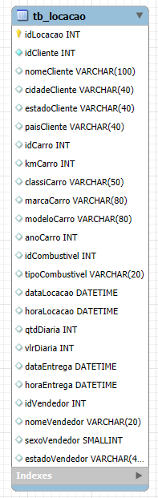
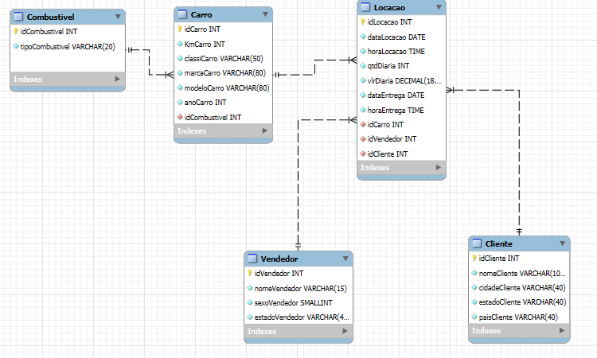
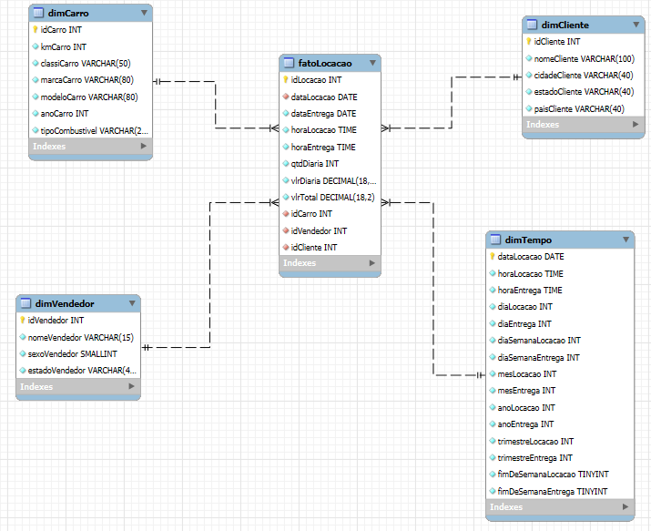

#  Objetivo do Desafio

O objetivo deste desafio foi aplicar conceitos de modelagem de dados, divididos em duas etapas:

##  Etapas do Desafio

- **Etapa 1:** Aplicar as três formas normais à tabela `tb_locacao`, criar scripts `.sql` com a definição das estruturas e gerar o diagrama do modelo relacional.
- **Etapa 2:** A partir do modelo relacional, construir um modelo dimensional, adequado para análises.

---

##  Tabela Original

A tabela original `tb_locacao` foi fornecida no seguinte formato:



---

##  Etapa 1 – Modelo Relacional

###  Passos Realizados

1. **Identificação das entidades:** Cliente, Carro, Vendedor, Combustível e Locação.
2. **Aplicação das Formas Normais:**
   - **1FN:** Colunas atômicas e eliminação de grupos repetitivos.
   - **2FN:** Separação de atributos que não dependem da chave primária.
   - **3FN:** Eliminação de dependências transitivas.
3. **Definição de chaves primárias e estrangeiras.**
4. **Criação do modelo relacional normalizado.**

###  Modelo Relacional



####  Exemplo de Criação de Tabela
```sql
CREATE TABLE Carro (
    idCarro INT PRIMARY KEY NOT NULL,
    kmCarro INT NOT NULL,
    classiCarro VARCHAR(50) NOT NULL,
    marcaCarro VARCHAR(80) NOT NULL,
    modeloCarro VARCHAR(80) NOT NULL,
    anoCarro INT NOT NULL,
    idCombustivel INT NOT NULL,
    FOREIGN KEY (idCombustivel) REFERENCES Combustivel(idCombustivel)
);
```
*Exemplo de criação da tabela `Carro`, com chave estrangeira para garantir integridade referencial.*

####  Exemplo de Inserção
```sql
INSERT OR IGNORE INTO Carro (idCarro, kmCarro, classiCarro, marcaCarro, modeloCarro, anoCarro, idCombustivel)
SELECT DISTINCT idCarro, kmCarro, classiCarro, marcaCarro, modeloCarro, anoCarro, idCombustivel
FROM tb_locacao;
```
*Inserção de dados distintos a partir da tabela `tb_locacao`, evitando duplicações.*

 **Scripts completos disponíveis em:** [`etapa-1`](./etapa-1/)

---

##  Etapa 2 – Modelo Dimensional

###  Passos Realizados

1. **Criação das tabelas dimensão:**
   - `dimCarro`
   - `dimCliente`
   - `dimVendedor`
   - `dimTempo`

2. **Criação da tabela fato `fatoLocacao`, com as métricas:**
   - `vlrDiaria`
   - `qtdDiaria`
   - `vlrTotal` (`qtdDiaria * vlrDiaria`)
   - `horaLocacao`, `horaEntrega`

3. **Relacionamentos definidos via chaves estrangeiras entre as tabelas.**

###  Modelo Dimensional



####  Exemplo de Criação
```sql
CREATE TABLE dimCliente(
    idCliente INT PRIMARY KEY,
    nomeCliente VARCHAR(100),
    cidadeCliente VARCHAR(40),
    estadoCliente VARCHAR(40),
    paisCliente VARCHAR(40)
);
```
*Exemplo de criação da tabela `dimCarro`, que representa informações detalhadas do carro. Inclui todos os atributos relevantes e incorpora o tipo de combustível como um campo já resolvido, pronto para análise no modelo dimensional.*


####  Exemplo de Inserção na `dimCarro`
```sql
INSERT INTO dimCarro (idCarro, kmCarro, classiCarro, marcaCarro, modeloCarro, anoCarro, tipoCombustivel)
SELECT DISTINCT idCarro, kmCarro, classiCarro, marcaCarro, modeloCarro, anoCarro, tipoCombustivel
FROM Carro ca
INNER JOIN Combustivel co ON ca.idCombustivel = co.idCombustivel;
```
*Exemplo de inserção na `dimCarro`, utilizando um `INNER JOIN` com a tabela `Combustivel` para trazer o campo `tipoCombustivel`. O uso de `SELECT DISTINCT` garante que apenas registros únicos sejam inseridos, evitando duplicidades na dimensão.*


 **Scripts completos disponíveis em:** [`etapa-2`](./etapa-2/)

---

##  Destaques Técnicos

###  Construção da `dimTempo`

A tabela `dimTempo` foi criada com base nas colunas `dataLocacao` e `dataEntrega`, extraindo atributos temporais úteis para análise.

####  Extrações com `SUBSTR` + `CAST`

As datas estavam no formato `yyyymmdd` e como `TEXT`, por isso utilizei `SUBSTR` para fatiar e `CAST` para converter em `INT`:

```sql
CAST(SUBSTR(dataLocacao, 1, 4) AS INT),  -- Ano
CAST(SUBSTR(dataLocacao, 5, 2) AS INT),  -- Mês
CAST(SUBSTR(dataLocacao, 7, 2) AS INT)   -- Dia
```

####  Cálculo do Dia da Semana com `STRFTIME`

Utilizei `STRFTIME('%w', ...)` para retornar o dia da semana:

- `0` → domingo  
- `6` → sábado  
- `1–5` → segunda a sexta

```sql
STRFTIME('%w', DATE(SUBSTR(dataLocacao, 1, 4) || '-' || SUBSTR(dataLocacao, 5, 2) || '-' || SUBSTR(dataLocacao, 7, 2)))
```
*Exemplo de uso da função `STRFTIME` em conjunto com `SUBSTR` e `DATE` para identificar o dia da semana a partir de uma data armazenada como texto no formato `yyyymmdd`. A data é reformatada para `yyyy-mm-dd` e, em seguida, o `STRFTIME('%w')` retorna um número de 0 a 6, representando de domingo a sábado, respectivamente.*


####  Identificação de Fim de Semana com `CASE WHEN`

Com base no valor retornado pelo `STRFTIME`, foi possível identificar finais de semana:

```sql
CASE
  WHEN STRFTIME('%w', DATE(SUBSTR(dataLocacao, 1, 4) || '-' || SUBSTR(dataLocacao, 5, 2) || '-' || SUBSTR(dataLocacao, 7, 2))) IN ('0', '6')
  THEN 1
  ELSE 0
END
```
*Exemplo de uso da cláusula `CASE WHEN` para identificar se a data corresponde a um fim de semana. A data é convertida para o formato `yyyy-mm-dd`, o `STRFTIME('%w')` retorna o dia da semana, e se o valor for `'0'` (domingo) ou `'6'` (sábado), o resultado será `1` indicando fim de semana; caso contrário, retorna `0`. Ideal para análises sazonais e comportamentais baseadas em dias da semana.*


###  Cálculo de Valor Total Gasto
```sql
vlrTotal = qtdDiaria * vlrDiaria
```


