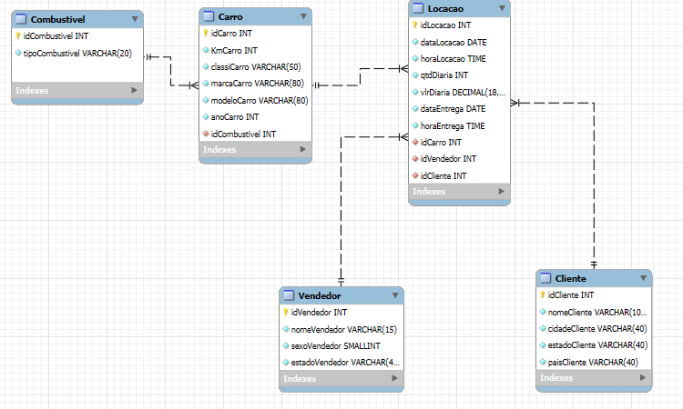
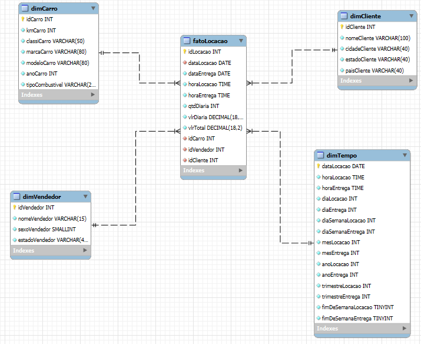

#  Objetivo do Desafio

O objetivo deste desafio foi trabalhar com modelagem de dados, dividido em duas etapas:

## Etapa 1

Na etapa 1 recebemos uma tabela chamada tb_locacao, e o nosso objetivo era aplicar as formas normais e depois criar um modelo relacional.

## Etapa 2 

Na etapa 2 o nosso objetivo era criar um modelo Dimensional a partir do modelo relacional que fizemos na etapa 1.

A tabela original recebida foi esta daqui 

## Passo a passo etapa 1

- Identifiquei as entidades envolvidas (Cliente, Carro, Vendedor, Combustível, Locação)
- Modelei as tabelas com suas respectivas colunas
- Apliquei normalização (até 3FN) para evitar redundâncias
- Defini **chaves primárias e estrangeiras** para manter integridade referencial

Assim ficou o modelo relacional 

## O codigo utilizado para a criação e população das tabelas esta em [etapa-1](./etapa-1)

## Passo a passo etapa 2

Criei **tabelas dimensão** para representar as entidades envolvidas: `dimCarro`, `dimCliente`, `dimVendedor` e `dimTempo`
- Decidi criar a `dimTempo` com base nas datas de locação e entrega, para permitir consultas analíticas por dia, mês, ano, dia da semana, trimestre e fim de semana.
- Modelei a tabela fato `fatoLocacao`, contendo métricas relevantes como: `vlrDiaria`, `qtdDiaria` e `vlrTotal`
- Adicionei **chaves estrangeiras** na `fatoLocacao`, referenciando cada uma das dimensões, garantindo integridade dos relacionamentos

Assim ficou o modelo dimensional 

## O codigo utilizado para a criação e população das tabelas esta em [etapa-2](./etapa-2)

## Destques
- A `dimTempo` foi toda construida a partir de `dataLocacao` e `dataEntrega`, utilizano :
    - `substr`: para extrair partes da data (`ano`, `mês`, `dia`)
    - `strftime`: para calcular o dia da semana
    - `CASE WHEN`: para identificar fins de semana (0 para não, 1 para sim)

- A `fatoLocacao` traz calculo de `valor total` feito a partir de outras duas colunas (qtdDiaria * vlrDiaria)

