#  Resumo da Sprint 1 — Fundamentos de SQL e Data & Analytics

Durante a Sprint 1, aprofundei meus conhecimentos em **SQL** e conheci os principais fundamentos do mundo de **Data & Analytics**, compreendendo como os dados são estruturados, processados e utilizados para gerar valor nos negócios.

---

##  Aprendizado em SQL

Comecei aprendendo os **comandos básicos** como `SELECT`, `WHERE`, `ORDER BY`, `LIMIT` e `DISTINCT`.

Logo depois, estudei os **operadores aritméticos**, **de comparação** e **lógicos**, entendendo como usá-los para montar filtros e expressões mais precisas.

Com as **funções agregadas** (`SUM`, `AVG`, `COUNT`, etc.) e comandos como `GROUP BY` e `HAVING`, aprendi a gerar análises mais completas.

Também explorei os **JOINS** (`INNER`, `LEFT`, `RIGHT`, `FULL`) e como cruzar dados de tabelas diferentes, além de utilizar **UNION** e **subqueries** para consultas mais avançadas.

Aprofundei também o uso de **funções de conversão**, **condicionais**, **tratamento de texto** e **manipulação de datas**, além de entender como **inserir, atualizar e excluir dados e tabelas** com segurança.

---

##  Fundamentos de Data & Analytics

Com os materiais de Data & Analytics, tive uma visão mais ampla e estratégica do mundo dos dados.

Aprendi o que é **Big Data** e seus 5Vs (Volume, Velocidade, Variedade, Variabilidade e Complexidade), além da importância do **Hadoop**, **Spark** e **bancos NoSQL**.

Compreendi a diferença entre **dados estruturados, semiestruturados e não estruturados**, e o papel do **Data Lake** como repositório flexível de dados brutos.

Estudei também o funcionamento de **Data Warehouses**, a **modelagem dimensional** com tabelas fato e dimensão, e os tipos de atualização histórica com **SCDs**.

Aprofundei ainda os conceitos de **processamento de dados** (Batch e Stream), e entendi como o **BI**, a **mineração de dados**, o **Machine Learning** e o uso de **APIs** ajudam a transformar dados em valor.

---

#  Desafio

- O arquivo desenvolvido e utilizado para a realização do desafio desta sprint está disponível na pasta Desafio, e a documentação completa pode ser consultada em seu respectivo `README.md`:
  - 📂 [Pasta Desafio](./Desafio/)
  - 📄 [README.md do Desafio](./Desafio/README.md)

---

#  Exercícios

A seguir, os links para os exercícios realizados durante esta sprint, com suas respectivas evidências:

1. [Exercício 1](./Exercicios/Linguagem_SQL_EXERCICIOS_1/ex1.sql)  
2. [Exercício 2](./Exercicios/Linguagem_SQL_EXERCICIOS_1/ex2.sql)  
3. [Exercício 3](./Exercicios/Linguagem_SQL_EXERCICIOS_1/ex3.sql)  
4. [Exercício 4](./Exercicios/Linguagem_SQL_EXERCICIOS_1/ex4.sql)  
5. [Exercício 5](./Exercicios/Linguagem_SQL_EXERCICIOS_1/ex5.sql)  
6. [Exercício 6](./Exercicios/Linguagem_SQL_EXERCICIOS_1/ex6.sql)  
7. [Exercício 7](./Exercicios/Linguagem_SQL_EXERCICIOS_1/ex7.sql)  
8. [Exercício 8](./Exercicios/Linguagem_SQL_EXERCICIOS_1/ex8.sql)  
9. [Exercício 9](./Exercicios/Linguagem_SQL_EXERCICIOS_1/ex9.sql)  
10. [Exercício 10](./Exercicios/Linguagem_SQL_EXERCICIOS_1/ex10.sql)  
11. [Exercício 11](./Exercicios/Linguagem_SQL_EXERCICIOS_1/ex11.sql)  
12. [Exercício 12](./Exercicios/Linguagem_SQL_EXERCICIOS_1/ex12.sql)  
13. [Exercício 13](./Exercicios/Linguagem_SQL_EXERCICIOS_1/ex13.sql)  
14. [Exercício 14](./Exercicios/Linguagem_SQL_EXERCICIOS_1/ex14.sql)  
15. [Exercício 15](./Exercicios/Linguagem_SQL_EXERCICIOS_1/ex15.sql)  
16. [Exercício 16](./Exercicios/Linguagem_SQL_EXERCICIOS_1/ex16.sql) 

17. [Exercício exportação de dados](./Exercicios/Linguagem_SQL_EXERCICIOS_2/exportação_dados_1.sql)
- Arquivo `CSV` do Exercício 17: [Arquivo CSV](./Exercicios/Linguagem_SQL_EXERCICIOS_2/exportação_dados_1.csv)

18. [Exercício exportação de dados](./Exercicios/Linguagem_SQL_EXERCICIOS_2/exportação_dados_2.sql)
- Arquivo `CSV` do Exercício 18: [Arquivo CSV](./Exercicios/Linguagem_SQL_EXERCICIOS_2/exportação_dados_2.csv)

### [Link para pasta de Exercicios](./Exercicios/)

#  Evidencias

 seguir são apresentadas as evidências dos exercícios realizados durante esta sprint:

###  Exercício 1

Neste exercício, desenvolvi uma query para listar **todos os livros publicados após 2014**, ordenando os resultados pela coluna `cod`. A query utiliza a cláusula `WHERE` para filtrar as datas a partir de 2015:

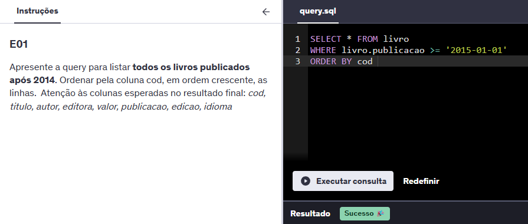

---

###  Exercício 2

Neste exercício, a query retorna os 10 livros mais caros, ordenando pela coluna `valor` de forma decrescente. Resultado obtido com sucesso:

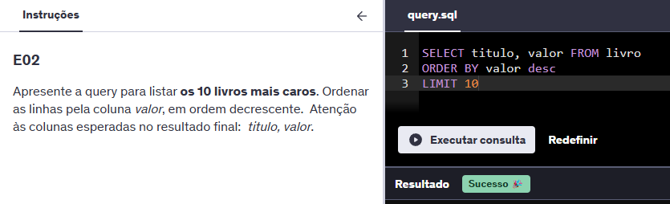

---

###  Exercício 3

Aqui foi necessário listar as 5 editoras com mais livros na biblioteca, usando `LEFT JOIN` e `GROUP BY`. A imagem abaixo mostra o resultado correto:

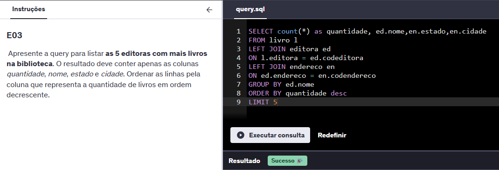

---

###  Exercício 4

Neste exercício, apresentamos a quantidade de livros por autor, utilizando `LEFT JOIN` e `GROUP BY`. Resultado conforme esperado:

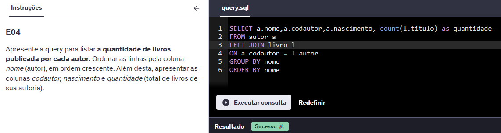

---

###  Exercício 5

A query listou autores que publicaram por editoras **fora da região sul** do Brasil, utilizando `NOT IN` na cláusula `WHERE`:

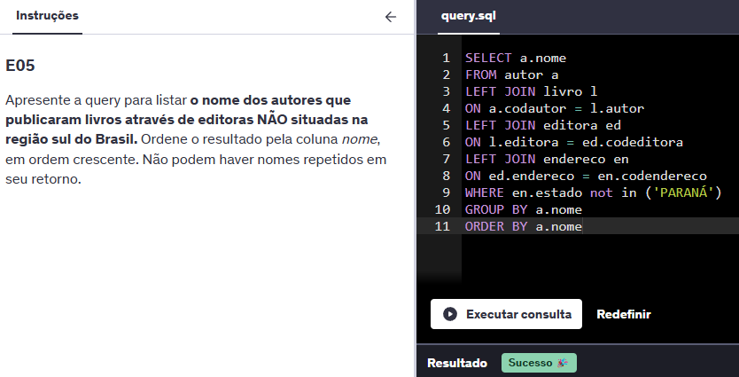

---

###  Exercício 6

Neste exercício, filtramos o autor com **maior número de livros publicados**, utilizando `ORDER BY DESC` com `LIMIT 1`:

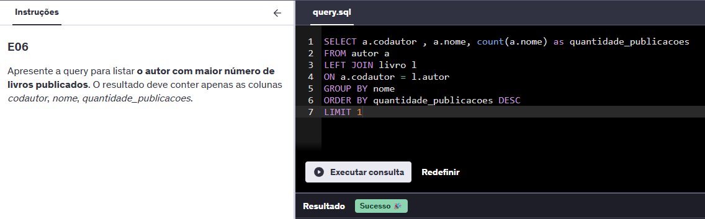

---

###  Exercício 7

Por fim, foi solicitado listar os autores **sem publicações**, utilizando `FULL JOIN` e `ISNULL`:

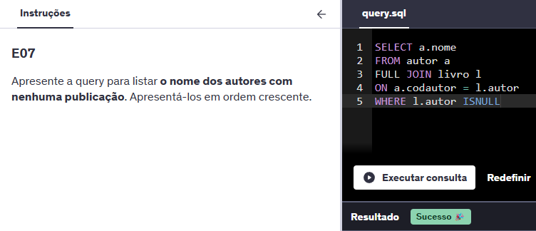

###  Exercício 8

A query foi construída para retornar o **código e nome do vendedor com maior número de vendas concluídas**, utilizando `LEFT JOIN`, `GROUP BY`, `ORDER BY` e `LIMIT`:

---

###  Exercício 9

Neste exercício, foi solicitado listar o **produto mais vendido** entre duas datas específicas, com status “Concluído”. A query filtra por `BETWEEN` e agrupa por nome do produto:

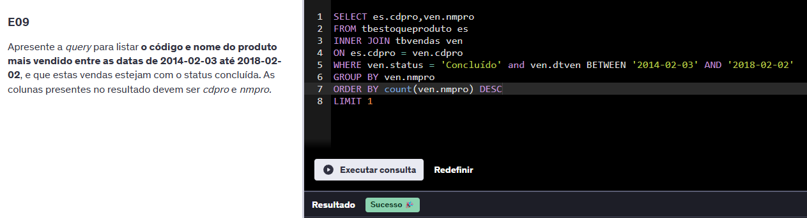

---

###  Exercício 10

Aqui calculei a **comissão de cada vendedor** com base na soma do valor total de vendas multiplicado pelo percentual de comissão, usando `ROUND` para formatar o resultado:

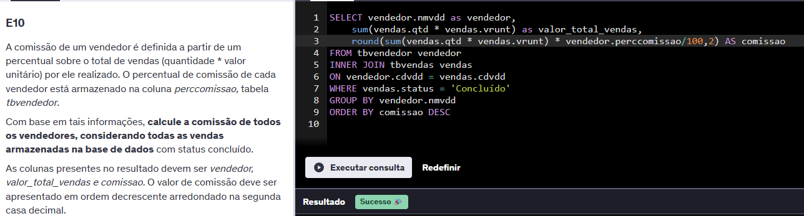

---

###  Exercício 11

A query retorna o **cliente com maior gasto** na loja, somando o total gasto por cliente e ordenando de forma decrescente:

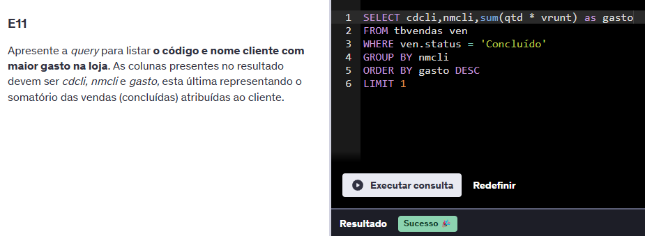

---

###  Exercício 12

Foi solicitado listar os **dados dos dependentes do vendedor com menor valor total em vendas**, utilizando múltiplos `JOINs` e `GROUP BY` com ordenação crescente:

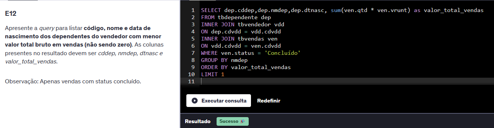

---

###  Exercício 13

Neste exercício, identifiquei os **10 produtos menos vendidos** por canais específicos (E-Commerce ou Matriz), agrupando e somando as quantidades vendidas:

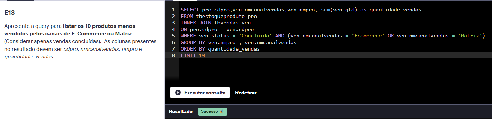

---

###  Exercício 14

A query calcula o **gasto médio por estado da federação**, com os dados de vendas concluídas e média arredondada para duas casas decimais:

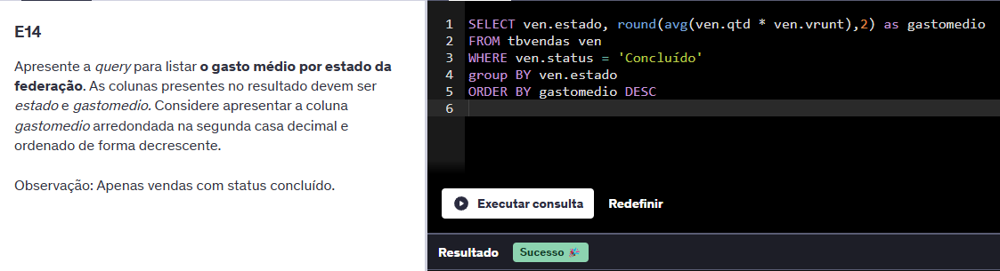

---

###  Exercício 15

Aqui foi necessário **listar os códigos de vendas deletadas**, ordenando os resultados de forma crescente:

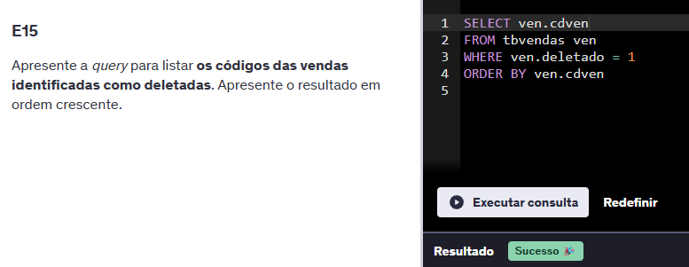

---

###  Exercício 16

Por fim, a query retorna a **quantidade média vendida de cada produto agrupada por estado**, com resultado arredondado na quarta casa decimal e ordenação dupla:

### [Link para pasta de Imagens Execucao](./Exercicios/Imagens_Execucao/)

---

##  Caminhos para as pastas da Sprint

- [ Certificados](./Certificados/)
- [ Desafio](./Desafio/)
- [ Evidências](./Evidencias/)
- [ Exercícios](./Exercicios/)