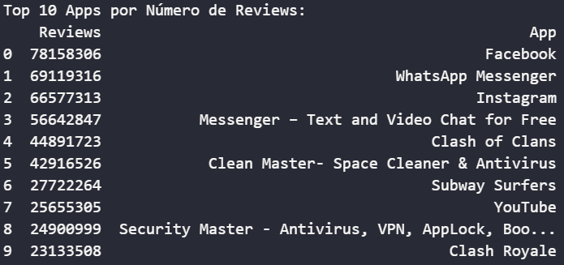

#  Objetivo do Desafio

O objetivo deste desafio é a prática de Python combinando conhecimentos adquiridos no PB

---

##  Estrutura do Projeto

- **Dataset**: `googleplaystore.csv`
- **Ferramentas Utilizadas**:
  - Python 3
  - Pandas
  - Matplotlib

---

##  Passo a Passo do Código

###  Importação de Bibliotecas

```python
import pandas as pd
import matplotlib.pyplot as plt
```

- `pandas` é utilizado para manipulação de dados tabulares.
- `matplotlib.pyplot` é usado para criar visualizações gráficas.

---

###  Carregamento do Dataset

```python
url = 'googleplaystore.csv'
df = pd.read_csv(url)
```

- O arquivo CSV é carregado em um DataFrame chamado `df`.

---

###  Visualização Inicial

```python
df.info()
```
- Visualização da estrutura do DataFrame: Tipos de dados, valores e memoria utilizada


```python
df.head()
```
- Visualização das primeiras linhas do DataFrame para ter uma noção dos dados.


---

###  Remoção de Duplicatas

```python
df.drop_duplicates(subset='App', keep='first', inplace=True)
```

- Remove entradas duplicadas baseadas no nome do app, mantendo apenas a primeira ocorrência.

---

###  Correção de Dados Inconsistentes

```python
df[df['Reviews'] == '3.0M']
df.drop(10472, inplace=True)
```

- Na hora de fazer a conversao de tipos identifiquei e removi uma linha específica com dados inconsistentes na coluna.

---

###  Conversão de Tipos de Dados

```python
df['Reviews'] = df['Reviews'].astype(int)
df['Installs'] = df['Installs'].str.replace(',','').str.replace('+','').astype(int)
df['Price'] = df['Price'].str.replace('$','').astype(float)
df['Last Updated'] = pd.to_datetime(df['Last Updated'], format='%B %d, %Y')
```

- **`Reviews`**: de texto para inteiro.
- **`Installs`**: remove vírgulas e "+" antes de converter para inteiro.
- **`Price`**: remove o símbolo "$" e converte para `float`.
- **`Last Updated`**: transforma a data para o formato padrão de datetime.

---

###  Limpeza de Strings

```python
for col in df.select_dtypes(include='object').columns:
    df[col] = df[col].str.strip()
    if col != 'App':
        df[col] = df[col].str.lower().str.title()
```

- Remove espaços em branco nas extremidades de strings.
- Padroniza strings para formato "Title Case", exceto para o nome do app.

---
## Graficos

Para a criação dos gráficos de barras, foi utilizada a seguinte lógica:

```python
plt.figure(figsize=(largura, altura))
```
- Define o tamanho da figura do gráfico.
- Exemplo: `figsize=(10, 6)` define uma figura com largura 10 e altura 6.

```python
plt.bar(eixo_x, eixo_y)
```
- Cria um gráfico de barras verticais.
  - `eixo_x`: categorias (nomes, grupos, etc).  
  - `eixo_y`: valores numéricos.

```python
plt.xticks(rotation=grau)
```
- Rotaciona os rótulos do eixo X para melhor visualização.

```python
plt.title('Título do gráfico')
```
- Define o título que aparece acima do gráfico.

```python
plt.ylabel('Nome do eixo Y')
```
- Define o nome do eixo vertical (Y), indicando o que os valores representam.

```python
plt.grid(axis='y', linestyle='--', alpha=0.7)
```
- Adiciona uma grade no gráfico para facilitar a visualização dos valores.
  - `axis='y'`: aplica a grade apenas no eixo Y.  
  - `linestyle='--'`: usa linhas tracejadas.  
  - `alpha=0.7`: define a transparência da grade.

```python
plt.gca().invert_yaxis()
```
- Inverte a ordem dos valores no eixo Y, útil para mostrar o maior valor no topo.

```python
plt.tight_layout()
```
- Ajusta automaticamente o layout para evitar sobreposição entre elementos do gráfico (título, eixos, rótulos, etc).

```python
plt.show()
```
- Exibe o gráfico.

---

###  Gráfico de Pizza

```python
plt.pie(dados, labels=rotulos, autopct='%1.1f%%', startangle=ângulo_inicial,
         wedgeprops=dict(edgecolor='white', linewidth=1))
```
- Cria um gráfico de pizza.
  - `dados`: valores numéricos.  
  - `labels`: rótulos de cada fatia.  
  - `autopct='%1.1f%%'`: mostra os percentuais com uma casa decimal.  
  - `startangle`: ângulo inicial de rotação do gráfico.  
  - `wedgeprops`: define as bordas das fatias (ex: borda branca com espessura 1).

```python
plt.text(pos_x, pos_y, 'Texto explicativo',
         fontsize=tamanho, bbox=dict(facecolor='cor_fundo', edgecolor='cor_borda', boxstyle='formato'))
```
- Insere um texto personalizado dentro ou fora do gráfico.  
- `bbox`: define o estilo da "caixinha" com cor de fundo, borda e formato (ex: `round`, `square`).

```python
plt.axis('equal')
```
- Garante que o gráfico seja exibido em formato perfeitamente circular, evitando deformações.


---
## Perguntas e Respostas do desafio

### 2 - Faça um grafico de barras contendo os top 5 apps por numero de instalaçoes.

```python
top_apps_por_instalacao = df[['App','Installs']].sort_values('Installs', ascending=False).head(5)

plt.figure(figsize=(10,6))
plt.bar(top_apps_por_instalacao['App'], top_apps_por_instalacao['Installs'])
plt.xticks(rotation=75)
plt.title('Top 5 Apps por Número de Instalações')
plt.ylabel('Instalações')
plt.show()
```
- Filtra os 5 apps mais instalados.
- Cria um gráfico de barras verticais (bar) para exibir:
  - O nome dos aplicativos no eixo X
  - O número de instalações no eixo Y.
- Adiciona título e rótulo do eixo Y para contextualizar o gráfico.


### 3 - Faça um grafico de pizza mostrando as categorias de apps existentes no dataset de acordo com a frequencia em que elas aparecem

```python
categorias_existentes = df['Category'].value_counts()
percentuais = categorias_existentes / categorias_existentes.sum()
categorias_maiores = percentuais[percentuais >= 0.03]
outros = percentuais[percentuais < 0.03].sum()
categorias_final = categorias_maiores.copy()
categorias_final['Outros'] = outros
```
- Conta quantas vezes cada categoria aparece
- Calcula o percentual (proporção) de cada categoria em relação ao total de categorias
- Agrupa categorias com menos de 3% no grupo “Outros”.


```python
num_categorias_agrupadas = (percentuais < 0.03).sum()

plt.figure(figsize=(10,10))
plt.pie(categorias_final, labels=categorias_final.index, autopct='%1.1f%%', startangle=140,wedgeprops=dict(edgecolor='white', linewidth=1))
plt.title('Distribuição das Categorias de Apps ')
plt.text(-1.5, -1.3, f'{num_categorias_agrupadas} categorias com menos de 3% foram agrupadas em "Outros".',
         fontsize=12, bbox=dict(facecolor='white', edgecolor='black', boxstyle='round,pad=0.5'))
plt.axis('equal')
plt.show()
```
- Conta quantas categorias possuem menos de 3% de representatividade e salva esse valor em num_categorias_agrupadas.
- Cria um gráfico de pizza (pie chart) para representar visualmente a distribuição das categorias:
 - Cada fatia representa uma categoria.
 - Percentuais são exibidos diretamente nas fatias
- Adiciona uma anotação no gráfico indicando quantas categorias pequenas foram agrupadas no "Outros".


### 4 - Mostre qual o app mais caro existente no dataset

```python
app_mais_caro = df[['App', 'Price']].sort_values(by='Price', ascending=False).iloc[0]
print(f"O app mais caro é '{app_mais_caro['App']}' custando ${app_mais_caro['Price']}")
```
- Ordena os apps por preço em ordem decrescente.
- Exibe o nome e valor do app mais caro.


### 5 - Mostre quantos apps são classificados como 'Mature 17+'

```python
mature_apps = df[df['Content Rating'] == 'Mature 17+']
print(f"Existem {mature_apps.shape[0]} apps classificados como 'Mature 17+'")
```
- Filtra os apps com classificação etária 17+.
- Mostra o total.


### 6 - Mostre o top 10 apps por número de reviews bem como o respectivo numero de reviews. Ordene a lista de forma decrescente por número de reviews

```python
top_10_apps_reviews = df.loc[:,['Reviews','App']].sort_values(by='Reviews', ascending=False).head(10).reset_index(drop=True)
print("Top 10 Apps por Número de Reviews:")
print(top_10_apps_reviews)
```
- Ordena os apps com mais avaliações.
- Exibe os 10 principais com número de reviews.



### 7 - Crie pelo menos mais 2 calculos sobre o dataset e apresente um em formato de lista e outro em formato de valor

### 7.1 Cálculo do tempo médio em dias desde a última atualização dos apps.

```python
tempo_medio_atualizacao = (df['Last Updated'].max() - df['Last Updated']).mean()
print(f'Tempo médio desde a última atualização: {tempo_medio_atualizacao.days} dias')
```
- Identifica a atualização mais recente registrada no dataset.
- Para cada aplicativo, calcula quantos dias se passaram desde a data mais recente até sua própria última atualização.
- Obtém o tempo médio (em dias) desde a última atualização considerando todos os aplicativos.


### 7.2 Receita Potencial por Categoria

```python
df['Receita'] = df['Price'] * df['Installs']
receita_categoria = df[df['Type'] == 'Paid'].groupby('Category')['Receita'].sum().sort_values(ascending=False).head(10)

print("Top 10 Categorias com Maior Receita Potencial:")
print(receita_categoria)
```
- Cria coluna de receita: preço * instalações.
- Agrupa por categoria e soma a receita dos apps pagos.


### 7.3 Cálculo do tempo médio de dias desde a última atualização por categoria de app.

```python
df['Dias_desde_atualizacao'] = (df['Last Updated'].max() - df['Last Updated']).dt.days
tempo_medio_categoria = df.groupby('Category')['Dias_desde_atualizacao'].mean().sort_values(ascending=False)
print(tempo_medio_categoria.head(10))
```
- Identifica a atualização mais recente registrada no dataset.
- Para cada aplicativo, calcula quantos dias se passaram desde a data mais recente até sua própria última atualização.
- Cria nova coluna com dias desde a última atualização
- Agrupa por categoria e calcula a média de tempo desde atualização.


### 8 - Crie pelo menos outras 2 formas graficas de exibição dos indicadores acima utilizando a biblioteca matplotlib

### 8.1 Gráfico: Tempo Médio de Atualização por Categoria

```python
plt.figure(figsize=(12, 6))
tempo_medio_categoria_sorted = tempo_medio_categoria.sort_values(ascending=False)

plt.plot(tempo_medio_categoria_sorted.index, tempo_medio_categoria_sorted.values, marker='o' , color='green')
plt.xticks(rotation=90)
plt.ylabel('Dias desde última atualização (média)')
plt.title('Tempo Médio de Atualização por Categoria')
plt.grid(axis='y', linestyle='--', alpha=0.7)
plt.tight_layout()
plt.show()
```
- Organiza as categorias em ordem decrescente de tempo médio desde a última atualização.
- Cria um gráfico de linha onde:
  - O eixo X representa as categorias,
  - O eixo Y representa a média de dias sem atualização.
- Inclui grade horizontal para facilitar a leitura dos valores.


### 8.2 Receita Potencial por Categoria

```python
receita_categoria_milhoes = receita_categoria / 1000000

plt.figure(figsize=(10, 6))
receita_categoria_milhoes.plot(kind='barh', color='skyblue')
plt.xlabel('Receita Potencial (em milhões de USD)')
plt.ylabel('Categoria')
plt.title('Top 10 Categorias com Maior Receita Potencial')
plt.gca().invert_yaxis()


ticks = [round(x, 1) for x in plt.xticks()[0]]
plt.xticks(ticks, [f'{t}M' for t in ticks])

plt.grid(axis='x', linestyle='--', alpha=0.8)
plt.show()
```
- Converte os valores de receita para milhões de dólares para facilitar a leitura.
- Cria um gráfico de barras horizontais (barh) para visualizar as categorias com maior receita.
- Define os eixos:
  - Eixo X: Receita potencial (em milhões de dólares),
  - Eixo Y: Nome das categorias.
- Inverte a ordem do eixo Y (invert_yaxis()) para que a maior receita fique no topo do gráfico.
- Ajusta manualmente os ticks do eixo X para mostrar os valores em milhões, como 1.0M, 2.0M, etc.
- Adiciona uma grade horizontal no fundo para melhor leitura dos valores.


