# Resumo da Sprint 2 - Python 3 e Ciência de Dados

Durante a Sprint 2, me aprofundei nos fundamentos de **Python 3**, explorando desde conceitos básicos até programação orientada a objetos e funcional. Também iniciei meus estudos em **Ciência de Dados**, conhecendo ferramentas essenciais como **Pandas**, **NumPy** e **Matplotlib**.

---

## Aprendizado em Python 3

Comecei configurando o ambiente de desenvolvimento e aprendendo os **tipos básicos** de dados em Python: `int`, `float`, `str`, `bool`.

Trabalhei com:
- **Variáveis**, **comentários** e boas práticas de escrita de código.
- **Operadores**:
  - Aritméticos
  - Relacionais
  - Lógicos
  - De atribuição
  - Unários e ternários
- **Funções built-in** e **conversão de tipos** (`int()`, `float()`, `str()`, etc.).

Explorei as principais estruturas de dados:
- **Strings**
- **Listas**
- **Dicionários**
- **Tuplas**

Estudei as **estruturas de controle**:
- Condicionais: `if`, `elif`, `else`, `match-case`.
- Laços: `for`, `while`, `for-else`, com controle de fluxo (`break`, `continue`).

Aprendi sobre **manipulação de arquivos**:
- Leitura e escrita com `open`.
- Uso do `with` para gerenciamento de contexto.

Dominei **list comprehensions** para criação de listas de forma concisa.

### Funções e Programação Avançada:
- Definição de **funções**.
- **Packing** e **unpacking** de argumentos.
- Conceito de **callable**.
- Princípios de **imutabilidade** em funções.

### Programação Orientada a Objetos (POO):
- Criação de **classes** e **objetos**.
- Definição de **métodos** e **atributos**.
- Conceitos de **herança** e reutilização de código.

### Programação Funcional:
- Uso de **funções anônimas** com `lambda`.
- Funções de alta ordem: `map`, `filter`, `reduce`.

---

## Introdução à Ciência de Dados

No curso introdutório de **Ciência de Dados**, conheci as ferramentas essenciais para análise e visualização de dados:

- **Pandas**:
  - Manipulação e análise de **DataFrames**.
  - **Filtragem** de dados com condições.

- **NumPy**:
  - Criação e manipulação de **arrays**.
  - Operações vetoriais e matriciais.

- **Matplotlib**:
  - Criação de **gráficos básicos** para visualização de dados.

#  Desafio

- O arquivo desenvolvido e utilizado para a realização do desafio desta sprint está disponível na pasta Desafio, e a documentação completa pode ser consultada em seu respectivo `README.md`:
  - 📂 [Pasta Desafio](./Desafio/)
  - 📄 [README.md do Desafio](./Desafio/README.md)

# Exercícios

A seguir, os links para os exercícios realizados durante esta sprint, com suas respectivas evidências:

## Exercícios Basicos

1. [Resposta Ex1.](./Exercicios/Exercicios_Basicos/ex1.py)
2. [Resposta Ex2.](./Exercicios/Exercicios_Basicos/ex2.py)
3. [Resposta Ex3.](./Exercicios/Exercicios_Basicos/ex3.py)
4. [Resposta Ex4.](./Exercicios/Exercicios_Basicos/ex4.py)
5. [Resposta Ex5.](./Exercicios/Exercicios_Basicos/ex5.py)
6. [Resposta Ex6.](./Exercicios/Exercicios_Basicos/ex6.py)
7. [Resposta Ex7.](./Exercicios/Exercicios_Basicos/ex7.py)
8. [Resposta Ex8.](./Exercicios/Exercicios_Basicos/ex8.py)
9. [Resposta Ex9.](./Exercicios/Exercicios_Basicos/ex9.py)
10. [Resposta Ex10.](./Exercicios/Exercicios_Basicos/ex10.py)
11. [Resposta Ex11.](./Exercicios/Exercicios_Basicos/ex11.py)
12. [Resposta Ex12.](./Exercicios/Exercicios_Basicos/ex12.py)
13. [Resposta Ex13.](./Exercicios/Exercicios_Basicos/ex13.py)
14. [Resposta Ex14.](./Exercicios/Exercicios_Basicos/ex14.py)

## Exercícios Avançados 1

15. [Resposta Ex15.](./Exercicios/Exercicios_Avancados_1/ex15.py)
16. [Resposta Ex16.](./Exercicios/Exercicios_Avancados_1/ex16.py)
17. [Resposta Ex17.](./Exercicios/Exercicios_Avancados_1/ex17.py)
18. [Resposta Ex18.](./Exercicios/Exercicios_Avancados_1/ex18.py)
19. [Resposta Ex19.](./Exercicios/Exercicios_Avancados_1/ex19.py)

## Exercícios Avançados 2

20. [Resposta Ex20.](./Exercicios/Exercicios_Avancados_2/ex20.py)
21. [Resposta Ex21.](./Exercicios/Exercicios_Avancados_2/ex21.py)
22. [Resposta Ex22.](./Exercicios/Exercicios_Avancados_2/ex22.py)
23. [Resposta Ex23.](./Exercicios/Exercicios_Avancados_2/ex23.py)
24.
25. [Resposta Ex25.](./Exercicios/Exercicios_Avancados_2/ex25.py)
26. [Resposta Ex26.](./Exercicios/Exercicios_Avancados_2/ex26.py)

## Exercício ETL

# Evidências

### Exercício 1

Neste exercício, desenvolvi um programa que gera uma nova lista contendo apenas **números ímpares** a partir de uma lista de inteiros.

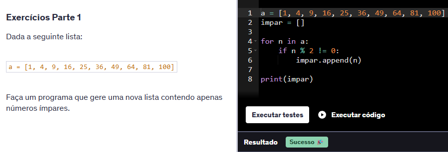

---

### Exercício 2

Neste exercício, verifiquei se cada palavra de uma lista era ou não um **palíndromo**, imprimindo uma mensagem específica para cada uma.

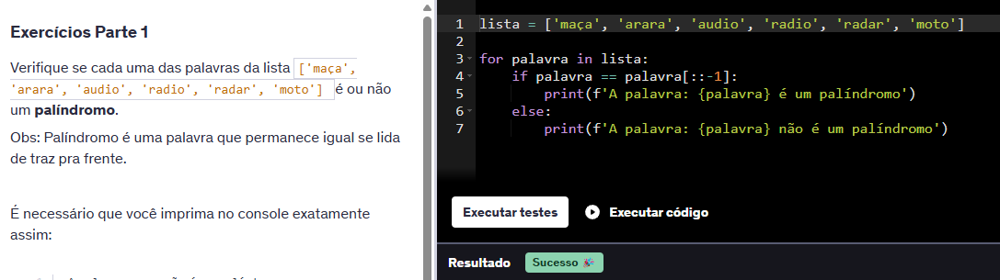

---

### Exercício 3

Neste exercício, usei listas de nomes, sobrenomes e idades para imprimir mensagens no formato:  
**"índice - primeiroNome sobreNome está com idade anos"**.

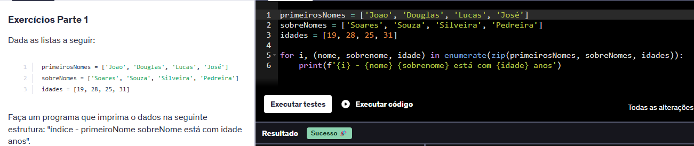

---

### Exercício 4

Neste exercício, criei uma função que recebe uma lista e retorna uma nova lista **sem elementos duplicados**.

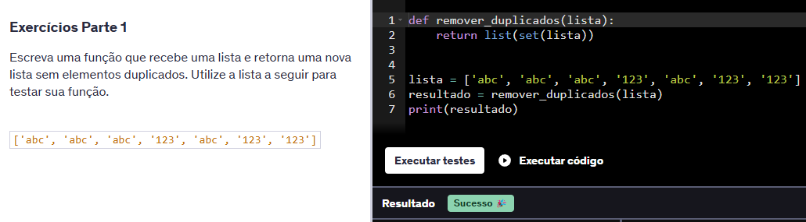

---

### Exercício 5

Neste exercício, li o conteúdo de um arquivo **JSON** chamado `person.json`, fiz o parsing e imprimi seus dados.

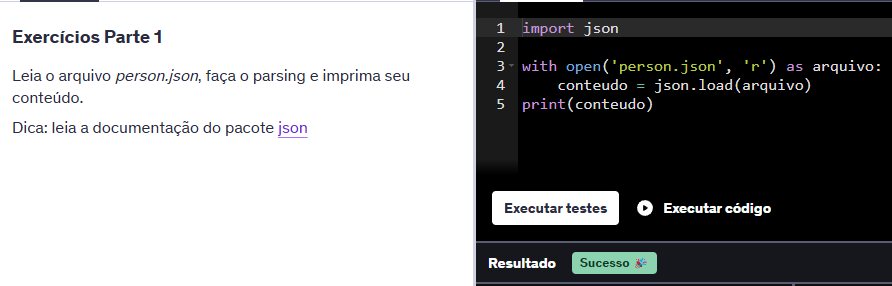

---

### Exercício 6

Neste exercício, implementei a função **`my_map`**, que aplica uma função a todos os elementos de uma lista, retornando uma nova lista com os resultados.

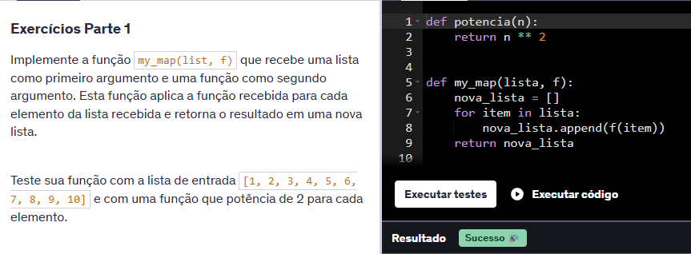

---

### Exercício 7

Neste exercício, desenvolvi um programa que lê e imprime o conteúdo de um arquivo texto chamado **`arquivo_texto.txt`**.

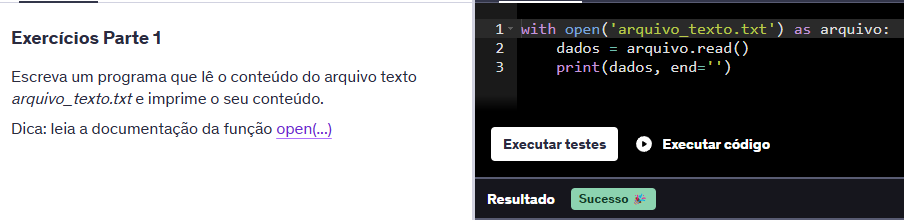

---

### Exercício 8

Neste exercício, criei uma função que recebe parâmetros **nomeados e não nomeados**, e imprime o valor de cada um.

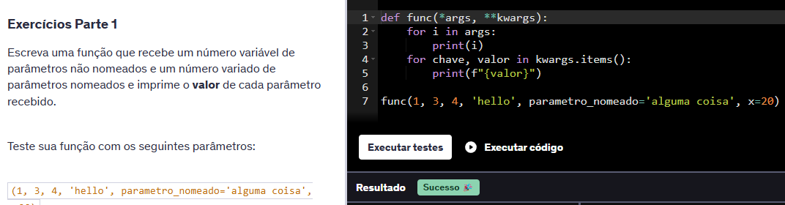

---

### Exercício 9

Neste exercício, implementei a classe **`Lampada`**, que permite ligar, desligar e verificar o estado da lâmpada (ligada/desligada).

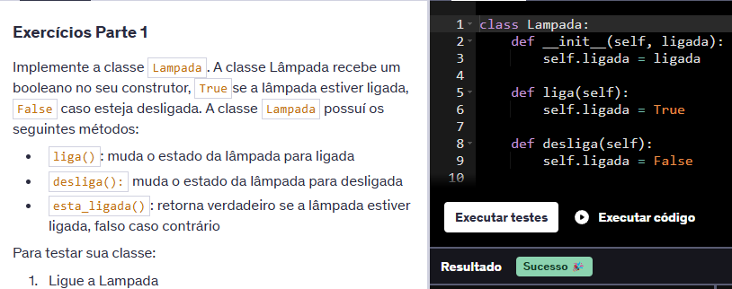

---

### Exercício 10

Neste exercício, escrevi uma função que recebe uma string de números separados por vírgula, soma todos os valores e imprime o resultado.

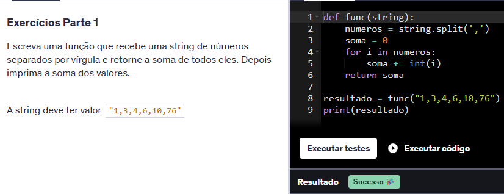

---

### Exercício 11

Neste exercício, criei uma função que divide uma lista em **3 partes iguais** e retorna essas 3 listas.

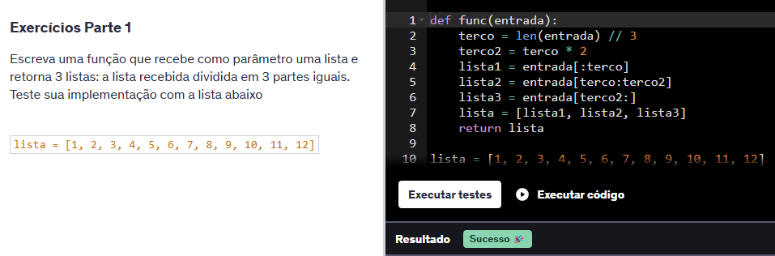

---

### Exercício 12

Neste exercício, criei uma lista com todos os **valores de um dicionário**, removendo os **duplicados**.

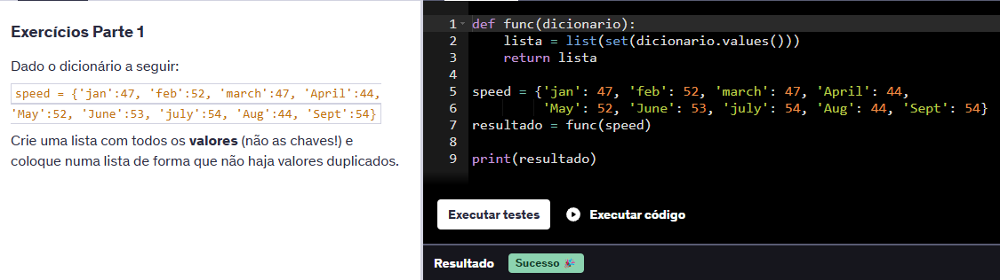

---

### Exercício 13

Neste exercício, calculei o **valor mínimo, máximo, médio e a mediana** de uma lista aleatória gerada com 50 números entre 0 e 500.

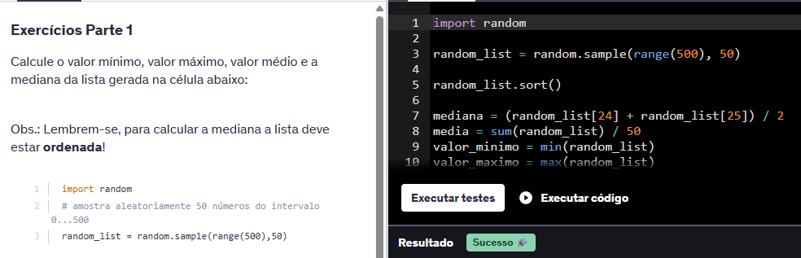

---

### Exercício 14

Neste exercício, imprimi uma lista de números **de trás para frente**.

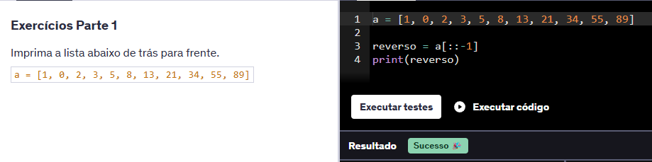

---

### Exercício 15

Neste exercício, implementei uma **superclasse `Passaro`** e criei duas subclasses: **`Pato`** e **`Pardal`**, cada uma com som diferente, mas ambas herdando a capacidade de voar.

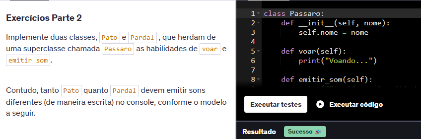

---

### Exercício 16

Neste exercício, criei a classe **`Pessoa`**, com um atributo privado **`__nome`**, acessado por meio de métodos (`getter` e `setter`) com `@property`.

---

### Exercício 17

Neste exercício, criei a classe **`Calculo`**, com métodos para **soma** e **subtração** de dois parâmetros.

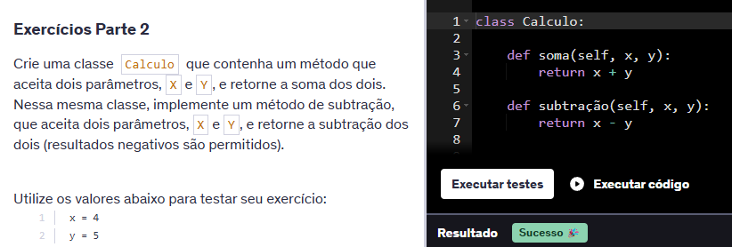

---

### Exercício 18

Neste exercício, criei a classe **`Ordenadora`**, que contém métodos para ordenar uma lista de forma crescente ou decrescente.

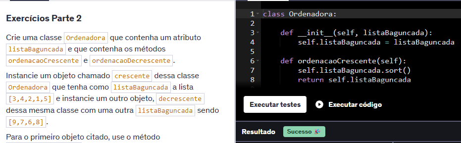

---

### Exercício 19

Neste exercício, criei a classe **`Aviao`**, com atributos definidos no construtor e um atributo de classe fixo, **`cor = 'azul'`**, compartilhado por todas as instâncias.

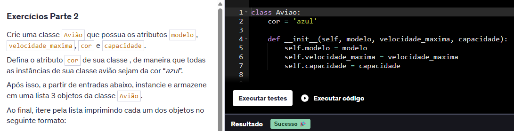

---

### Exercício 20

Neste exercício, utilizei **high order functions** para ler 10.000 números de um arquivo e apresentar os **5 maiores valores pares** e a **soma** desses valores.

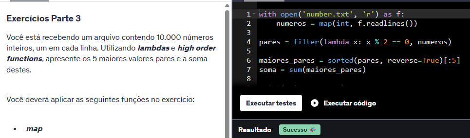

---

### Exercício 21

Neste exercício, implementei a função **`conta_vogais`** utilizando **lambda**, **filter** e **len** para contar as vogais de uma string.

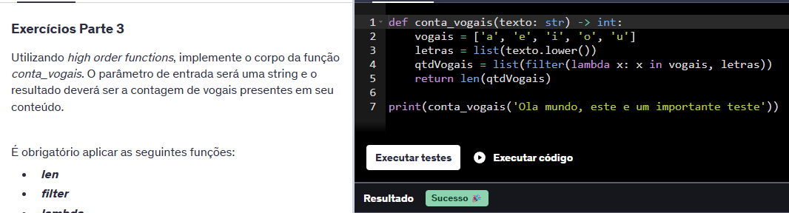

---

### Exercício 22

Neste exercício, desenvolvi a função **`calcula_saldo`** utilizando **map** e **reduce** para calcular o saldo de uma lista de lançamentos bancários.

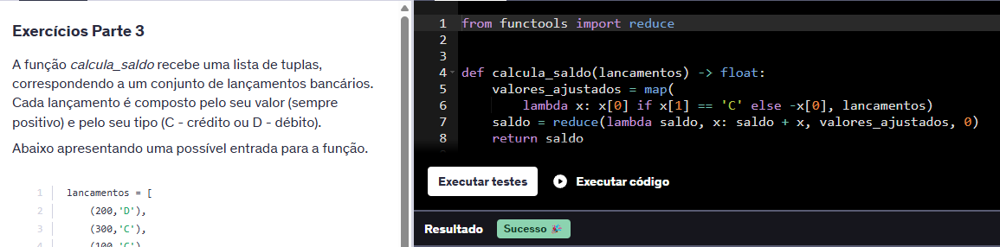

---

### Exercício 23

Neste exercício, implementei a função **`calcular_valor_maximo`** que aplica operadores matemáticos a operandos e retorna o maior valor.

---

### Exercício 24

Neste exercício li um arquivo csv com dados de estudantes e trouxe com resultado `Nome: <nome estudante> Notas: [n1, n2, n3] Média: <média>`

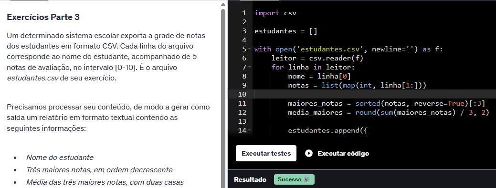

---

### Exercício 25

Neste exercício, filtrei um dicionário de produtos para obter aqueles com valor **acima da média**, utilizando manipulação com listas e dicionários.

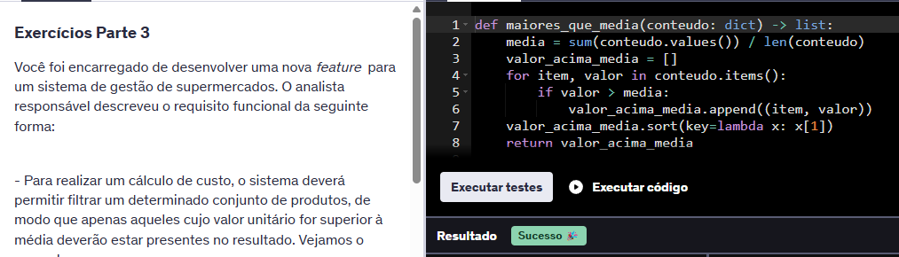

---

### Exercício 26

Neste exercício, desenvolvi uma função **generator** chamada **`pares_ate`** que gera todos os números pares dentro de um intervalo especificado.

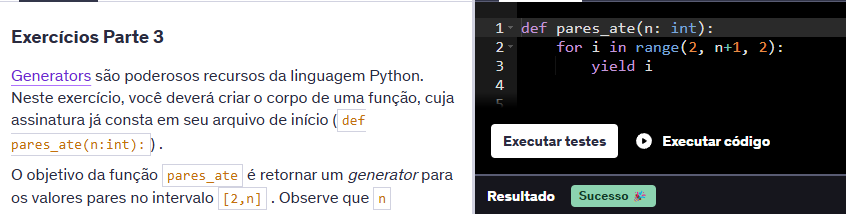

---

### [Link para pasta de Imagens Execucao](./Exercicios/Imagens_Execucao/)

##  Caminhos para as pastas da Sprint

- [ Certificados](./Certificados/)
- [ Desafio](./Desafio/)
- [ Evidências](./Evidencias/)
- [ Exercícios](./Exercicios/)

