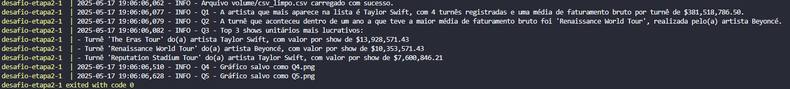

#  Objetivo do Desafio

O objetivo deste desafio é a prática de Docker e Python combinando conhecimentos adquiridos no PB

---
##  Etapas do Desafio

- **Etapa 1:** Realizar a limpeza e padronização dos dados (`etl.py`).
- **Etapa 2:** Realizar o processamento, responder questões analíticas e gerar gráficos (`job.py`).
- **Etapa 3:** Orquestrar as duas etapas via Docker Compose, conectando os containers.

---
##  Estrutura do Projeto

- **Dataset**: `concert_tours_by_women.csv`
- **Ferramentas Utilizadas**:
  - Python 3.11
  - Pandas
  - Matplotlib
  - Docker
  - Docker Compose

---

## Etapa 1

##  Passo a Passo do Código

###  Importação de Biblioteca

```python
import pandas as pd
```
- `pandas` é utilizado para manipulação de dados tabulares.

---

Função: limpar_coluna_numerica

```python
def limpar_coluna_numerica(df, *nomes_colunas):
    for nome_coluna in nomes_colunas:
        df[nome_coluna] = df[nome_coluna].astype(str).str.replace(
            r'[^0-9]', '', regex=True).replace('', '0').astype(float)
    return df
```
- Esta função recebe um DataFrame e as colunas numéricas que deseja limpar.
- Remove todos os caracteres não numéricos com regex e converte para float.

---

Função: limpar_coluna_texto

```python
def limpar_coluna_texto(df, *nomes_colunas):
    for nome_coluna in nomes_colunas:
        df[nome_coluna] = df[nome_coluna].str.replace(
            r'\[[^\]]*\]', '', regex=True).str.replace(r'[^a-zA-Z0-9 ]', '', regex=True)
    return df
```
- Esta função recebe um DataFrame e as colunas texto que deseja limpar.
- Remove colchetes com conteúdo e caracteres especiais, mantendo apenas letras, números e espaços.

---

Função: extrair_anos

```python
def extrair_anos(df, coluna_origem='Year(s)', col_inicio='Start year', col_fim='End year'):
    df[[col_inicio, col_fim]] = df[coluna_origem].str.split('-', expand=True)
    df[col_fim] = df[col_fim].fillna(df[col_inicio])
    df[col_inicio] = df[col_inicio].astype(int)
    df[col_fim] = df[col_fim].astype(int)
    return df
```
- Extrai os anos de início e fim de uma coluna com intervalo de anos.
- Exemplo de entrada: '2023-2024' ou '2023'
- Nas entradas que tem somente 1 ano, as colunas Star year e End year recebem o mesmo valor

--- 

Função: remover_colunas

```python
def remover_colunas(df, colunas):
    return df.drop(columns=[col for col in colunas if col in df.columns])
```
- Remove colunas especificas de um DataFrame, ignorando as que não existirem.

---

Função: salvar_csv

```python
def salvar_csv(df, caminho_arquivo, index=False):
    df.to_csv(caminho_arquivo, index=index)
```
- Rebece o DataFrame que deseja salvar, e recebe tambem o caminho que deseja salvar

---

Função `main()` - Etapa 1

```python
def main():
    url = 'concert_tours_by_women.csv'
    df = pd.read_csv(url)

    df = limpar_coluna_numerica(
        df, 'Actual gross', 'Adjustedgross (in 2022 dollars)', 'Average gross')

    df = limpar_coluna_texto(df, 'Tour title')

    df = extrair_anos(df)

    colunas_remover = ['Peak', 'All Time Peak', 'Ref.', 'Year(s)']
    df = remover_colunas(df, colunas_remover)

    salvar_csv(df, 'volume/csv_limpo.csv')

    print(df)

if __name__ == "__main__":
    main()
```
- **`url = 'concert_tours_by_women.csv'`**  
  Define o caminho do arquivo CSV original que será utilizado no processamento.

- **`df = pd.read_csv(url)`**  
  Carrega o CSV em um **DataFrame do pandas**, permitindo a manipulação dos dados tabulares.

- **`df = limpar_coluna_numerica(...)`**  
  Aplica a função `limpar_coluna_numerica` nas colunas `'Actual gross'`, `'Adjustedgross (in 2022 dollars)'` e `'Average gross'`. 

- **`df = limpar_coluna_texto(df, 'Tour title')`**  
  Aplica a função `limpar_coluna_texto` na coluna `'Tour title'`.

- **`df = extrair_anos(df)`**  
  Aplica a função `extrair_anos`, que divide a coluna `'Year(s)'` em duas novas colunas: `'Start year'` e `'End year'`. 

- **`colunas_remover = ['Peak', 'All Time Peak', 'Ref.', 'Year(s)']`**  
  Define uma lista com as colunas que não serão mais necessárias após o processamento.

- **`df = remover_colunas(df, colunas_remover)`**  
  Remove as colunas listadas acima, deixando o DataFrame mais limpo e focado apenas nos dados essenciais para a análise.

- **`salvar_csv(df, 'volume/csv_limpo.csv')`**  
  Salva o DataFrame limpo em um novo arquivo CSV dentro da pasta `volume`, garantindo que ele possa ser utilizado posteriormente na **Etapa 2** do pipeline.

- **`print(df)`**  
  Exibe no terminal o **DataFrame limpo** como saída
---
Dockerfile - Etapa 1

```Dockerfile
FROM python:3.11-slim
```
- Define a imagem base como o Python 3.11 em sua versão slim, uma versão enxuta e otimizada.
- Ideal para reduzir o tamanho da imagem final e melhorar a performance.

---
```Dockerfile
WORKDIR /app
```
- Define o diretório de trabalho dentro do container como /app.
- Todos os comandos seguintes e o script serão executados dentro deste diretório.

---
```Dockerfile
COPY etl.py .
COPY concert_tours_by_women.csv .
COPY requirements.txt .
```
- Copia o arquivo etl.py (responsável pela limpeza dos dados) da máquina host para dentro do diretório de trabalho do container.
- Copia o arquivo concert_tours_by_women.csv, que será processado pelo etl.py, para o container.
- Copia o arquivo `requirements.txt`, que contém as dependências necessárias para execução do script, para o container.
---

```Dockerfile
RUN pip install --no-cache-dir -r requirements.txt
```
- Instala todas as bibliotecas listadas no requirements.txt

---
```Dockerfile
CMD ["python", "etl.py"]
```
- Define o comando padrão que será executado quando o container iniciar.
- Executa o script etl.py com o interpretador Python, dando início ao processo de ETL.

---
conteúdo do `requirements.txt`
```txt
pandas==2.2.3
```
- pandas: Biblioteca utilizada para manipulação e análise de dados, facilitando operações em tabelas, limpeza e transformações.
---

###  Resultado Final do CSV Limpo

Após a execução sequencial de todas as funções apresentadas (`limpar_coluna_numerica`, `limpar_coluna_texto`, `extrair_anos`, `remover_colunas` e `salvar_csv`), foi gerado o **arquivo limpo [`csv_limpo.csv`](./volume/csv_limpo.csv)** localizado na pasta `volume`.

Este é o aspecto final do arquivo limpo, pronto para ser utilizado na próxima etapa do pipeline:


## Etapa 2

##  Passo a Passo do Código

###  Importação de Biblioteca

```python
import pandas as pd
import matplotlib.pyplot as plt
import logging
```
- `pandas` é utilizado para manipulação de dados tabulares.
- `matplotlib`: Utilizado para criação de gráficos.
- `logging`: Usado para registrar logs de execução, facilitando o rastreio e depuração do processo.
---

```python
logging.basicConfig(level=logging.INFO,
                    format='%(asctime)s - %(levelname)s - %(message)s')
```
- Configura o nível de log para INFO.
- Define o formato das mensagens de log.

---

### Q1 - Qual é a artista que mais aparece nessa lista e possui a maior média de seu faturamento bruto(Actual gross)

```python
def responder_q1(df: pd.DataFrame) -> str:
    agrupado_artista = df.groupby('Artist').agg({
        'Actual gross': ['count', 'mean']
    })

    agrupado_artista.columns = ['aparicoes', 'media_valor']
    agrupado_ordenado = agrupado_artista.sort_values(
        by=['aparicoes', 'media_valor'], ascending=[False, False])

    artista = agrupado_ordenado.head(1)
    nome = artista.index[0]
    aparicoes = artista['aparicoes'].values[0]
    media = artista['media_valor'].values[0]

    return (
        f"Q1 - A artista que mais aparece na lista é {nome}, com {aparicoes} turnês registradas e uma média de faturamento bruto por turnê de ${media:,.2f}."
    )
```
- Agrupa o DataFrame pelo campo Artist.
- Calcula a quantidade de aparições (count) e a média do faturamento bruto (mean).
- Ordena primeiro por aparições e depois pela média de faturamento, ambos de forma decrescente.
- Seleciona o primeiro resultado e formata a resposta com nome, aparições e média.

---

### Q2 - Das turnes que aconteceram dentro de um ano, qual a turne com a maior média de faturamento bruto(Average gross)

```python
def responder_q2(df: pd.DataFrame) -> str:
    maior_media_faturamento = df.loc[df['Start year'] == df['End year']].sort_values(
        'Average gross', ascending=False).head(1)
    titulo = maior_media_faturamento['Tour title'].values[0]
    artista = maior_media_faturamento['Artist'].values[0]
    return (
        f"Q2 - A turnê que aconteceu dentro de um ano a que teve a maior média de faturamento bruto foi '{titulo}', realizada pelo(a) artista {artista}."
    )
```
- Filtra o DataFrame para turnês com o mesmo ano de início e fim (`Start year == End year`).
- Ordena pelo campo `Average gross` (faturamento médio por show).
- Seleciona o primeiro resultado e retorna a resposta com o título da turnê e o nome do artista.

### Q3 - Quais são as 3 turnês que possuem o show(unitario) mais lucrativo?

```python
def responder_q3(df: pd.DataFrame) -> str:
    df['preco_por_show_actual'] = df['Adjustedgross (in 2022 dollars)'] / df['Shows']

    top3 = df[['Artist', 'Tour title', 'preco_por_show_actual']] \
        .sort_values('preco_por_show_actual', ascending=False).head(3)

    mensagens = []
    for i, row in top3.iterrows():
        artista = row['Artist']
        turne = row['Tour title']
        valor = row['preco_por_show_actual']
        mensagens.append(
            f"- Turnê '{turne}' do(a) artista {artista}, com valor por show de ${valor:,.2f}"
        )

    return "Q3 - Top 3 shows unitários mais lucrativos:\n" + "\n".join(mensagens)
```
- Cria a nova coluna `preco_por_show_actual` calculando o faturamento bruto ajustado `(Adjustedgross (in 2022 dollars))` dividido pelo número de shows `(Shows)`.
- Filtra as colunas `Artist`, `Tour title` e `preco_por_show_actual` para foco apenas nos dados relevantes.
- Ordena os dados pela nova coluna de valor por show em ordem decrescente.
- Seleciona as 3 primeiras linhas, que representam as turnês mais lucrativas por show.
- Itera sobre as 3 linhas resultantes e cria uma mensagem para cada uma, formatando o valor com separação de milhar e 2 casas decimais.

### Q4 - Para a artista que mais aparece nessa lista e que tenha o maior somatório de faturamento bruto, crie um grafcos de linhas que mostra o faturamento por ano da turnê.Apenas os anos com turnês

```python
def responder_q4(df: pd.DataFrame) -> str:
    agrupado_artista = df.groupby('Artist').agg({
        'Actual gross': ['count', 'sum']
    })
    agrupado_artista.columns = ['aparicoes', 'somatorio_faturamento']

    artista_top = agrupado_artista.sort_values(
        by=['aparicoes', 'somatorio_faturamento'], ascending=[False, False]).head(1)
    nome_artista = artista_top.index[0]

    df_artista = df[df['Artist'] == nome_artista]
    faturamento_ano = df_artista.groupby('Start year')['Actual gross'].sum()
    faturamento_ano = faturamento_ano / 1000000

    plt.figure(figsize=(10, 6))
    faturamento_ano.plot(kind='line', marker='o')
    plt.title(f'Faturamento Bruto Anual - {nome_artista}')
    plt.xlabel('Ano')
    plt.ylabel('Faturamento Bruto (USD)')
    plt.grid(True)
    ticks = [round(y, 1) for y in plt.yticks()[0]]
    plt.yticks(ticks, [f'{t}M' for t in ticks])
    plt.xticks(faturamento_ano.index)
    plt.tight_layout()
    plt.savefig(f'Q4.png')
    plt.close()

    return f"Q4 - Gráfico salvo como Q4.png"
```
- Agrupa por `Artist` para contar aparições e somar o faturamento.
- Identifica o artista com mais participações e maior faturamento.
- Filtra o `DataFrame` para esse artista.
- Agrupa por `Start year` e calcula o faturamento bruto.
- Converte o valor para milhões para facilitar a leitura.
- Cria e salva um gráfico de linha mostrando a evolução anual do faturamento.

### Q5 - Faça um grafico de colunas demonstrando as 5 artistas com mais shows na lista

```python
def responder_q5(df: pd.DataFrame) -> str:
    artistas_mais_shows = df[['Artist', 'Shows']] \
        .groupby('Artist').sum(numeric_only=True) \
        .sort_values(by='Shows', ascending=False) \
        .head(5).reset_index()

    plt.figure(figsize=(10, 6))
    plt.bar(artistas_mais_shows['Artist'], artistas_mais_shows['Shows'])
    plt.title('Q5 - Artistas com mais shows')
    plt.ylabel('Quantidade de Shows')
    plt.xlabel('Artista')
    plt.xticks(rotation=45)
    plt.tight_layout()
    plt.savefig('Q5.png')
    plt.close()

    return 'Q5 - Gráfico salvo como top_5_artistas_shows.png'
```
- Agrupa os dados por `Artist` e soma o número de shows.
- Ordena em ordem decrescente.
- Cria um gráfico de barras mostrando o total de shows por artista.
- Salva o gráfico como imagem.

Função `main()` - Etapa 2

```python
def main():

    url = 'volume/csv_limpo.csv'

    try:
        df = pd.read_csv(url)
        logging.info(f"Arquivo {url} carregado com sucesso.")
    except FileNotFoundError:
        logging.error(f"Arquivo {url} não encontrado.")
        return

    logging.info(responder_q1(df))
    logging.info(responder_q2(df))
    logging.info(responder_q3(df))
    logging.info(responder_q4(df))
    logging.info(responder_q5(df))


if __name__ == "__main__":
    main()
```
- **`url = 'volume/csv_limpo.csv`**  
  Define o caminho do arquivo CSV já limpo e salvo na Etapa 1, que será utilizado agora na etapa de análise.

- **`df = pd.read_csv(url)`** 
  Carrega o CSV em um DataFrame do pandas, permitindo a manipulação dos dados tabulares e dando início ao fluxo de análises.

- Bloco **`try...except`** 
  - Implementa tratamento de exceções para verificar se o arquivo existe:
  - Caso o arquivo seja carregado com sucesso, uma mensagem de confirmação será exibida no log (INFO).
  - Se o arquivo não for encontrado, uma mensagem de erro será exibida no log (ERROR), e a execução será interrompida.

- **`logging.info(responder_q1(df))`** 
  Executa e exibe a Q1, que retorna o artista com mais aparições e maior média de faturamento bruto.

- **`logging.info(responder_q2(df))`** 
  Executa e exibe a Q2, que identifica a turnê de maior faturamento médio que ocorreu em apenas um ano.

- **`logging.info(responder_q3(df))`** 
  Executa e exibe a Q3, que retorna uma lista formatada dos 3 shows mais lucrativos por show individual.

- **`logging.info(responder_q4(df))`** 
  Executa e exibe a Q4, que gera o gráfico de linha mostrando somente os anos com Start year, representando o faturamento bruto das turnês iniciadas nesses anos.

- **`logging.info(responder_q5(df))`** 
  Executa e exibe a Q5, que gera o gráfico de barras dos 5 artistas com maior número total de shows.

---

Dockerfile - Etapa 2

```Dockerfile
FROM python:3.11-slim
```
- Define a imagem base como o Python 3.11 em sua versão slim, uma versão enxuta e otimizada.
- Ideal para reduzir o tamanho da imagem final e melhorar a performance.

---
```Dockerfile
WORKDIR /app
```
- Define o diretório de trabalho dentro do container como /app.
- Todos os comandos seguintes e o script serão executados dentro deste diretório.

---
```Dockerfile
COPY job.py .
COPY requirements.txt .
```
- Copia o arquivo job.py (responsável por realizar as análises das questões Q1 a Q5) da máquina host para dentro do diretório de trabalho do container.
- Copia o arquivo `requirements.txt`, que contém as dependências necessárias para execução do script, para o container.
---

```Dockerfile
RUN pip install --no-cache-dir -r requirements.txt
```
- Instala todas as bibliotecas listadas no requirements.txt

---
```Dockerfile
CMD ["python", "job.py"]
```
- Define o comando padrão que será executado quando o container iniciar.
- Executa o script job.py com o interpretador Python, dando início ao processo de ETL.

---
Conteúdo do `requirements.txt`
```txt
pandas==2.2.3
matplotlib==3.10.1
```
- pandas: Biblioteca utilizada para manipulação e análise de dados, facilitando operações em tabelas, limpeza e transformações.
- matplotlib: Biblioteca usada para criação de gráficos e visualizações dos dados processados.

---

## Docker Compose - Orquestração das Etapas 1 e 2

```YAML
version: "3.8"
```
- Define a versão da especificação do Docker Compose.
---
```YAML
services:
  etapa1:
    build: ./etapa_1
    volumes:
      - ./volume:/app/volume
    working_dir: /app
    command: [ "python", "etl.py" ]
```
- Constrói a imagem a partir do Dockerfile localizado na pasta `etapa_1`.
- Mapeia a pasta local `./volume`para o diretório interno `/app/volume` dentro do container.
Isso garante que o arquivo `csv_limpo.csv` gerado na Etapa 1 seja salvo em uma pasta compartilhada, que será reutilizada pela Etapa 2.
- Define o diretório de trabalho no container como /app.
- Define o comando padrão que será executado ao iniciar o container:
- Executa o script etl.py, responsável pela limpeza e pré-processamento dos dados.

---

```YAML
 etapa2:
    build: ./etapa_2
    volumes:
      - ./volume:/app/volume
    working_dir: /app
    depends_on:
      - etapa1
    command: [ "python", "job.py" ]
```
- Constrói a imagem a partir do Dockerfile localizado na pasta `etapa_2`, que é responsável pela análise e geração dos gráficos (Job - Etapa 2).
- Mapeia a mesma pasta `./volume` usada pela `Etapa 1`.
- Garante que o arquivo `csv_limpo.csv` gerado pela `Etapa 1` esteja disponível para ser processado na `Etapa 2`.
- Define o diretório de trabalho no container como `/app`.
- Define que a `Etapa 2` só será iniciada após a `Etapa 1` estar pronta, garantindo a sequência correta do pipeline.
- Executa o script job.py, responsável pela execução das análises das questões Q1 a Q5 e geração dos gráficos.

## Executando o Pipeline Completo com Docker Compose

Após configurar o `docker-compose.yml`, utilizei o seguinte comando para executar toda a orquestração dos containers de forma automática e sequencial:

```bash
docker-compose up --build
```


## Build das imagens Docker

O docker-compose realizou o build das imagens conforme definido nos Dockerfiles das etapas 1 e 2:


## Execução dos containers

Ao iniciar o docker-compose, os containers foram criados e executados com sucesso:


## Resultado da Etapa 1(`etl.py`)

Durante a execução da Etapa 1, o script processou corretamente o CSV original, gerando o arquivo limpo com as transformações esperadas:


## Resultado da Etapa 2(`job.py`)

Na sequência, o container da Etapa 2 foi executado, processando os dados limpos e gerando as respostas das questões e gráficos solicitados:




## Respostas das Questões da Etapa 2
As respostas foram geradas automaticamente e estão no arquivo:
[respostas.txt](./etapa-2/respostas.txt)

### Q1 - Qual é a artista que mais aparece nessa lista e possui a maior média de seu faturamento bruto (Actual gross)?

---

### Q2 - Das turnês que aconteceram dentro de um ano, qual a turnê com a maior média de faturamento bruto (Average gross)?


---

### Q3 - Quais são as 3 turnês que possuem o show (unitário) mais lucrativo?


---

### Q4 - Para a artista que mais aparece nessa lista e que tenha o maior somatório de faturamento bruto, crie um grafcos de linhas que mostra o faturamento por ano da turnê.Apenas os anos com turnês


[Grafico da Q4](./etapa-2/Q4.png)
---

### Q5 - Faça um grafico de colunas demonstrando as 5 artistas com mais shows na lista


[Grafico da Q5](./etapa-2/Q5.png)
---
