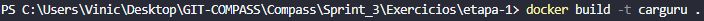
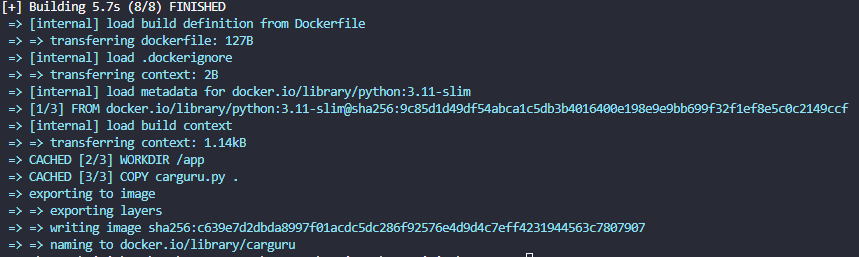
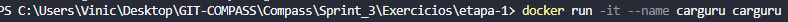
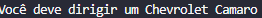
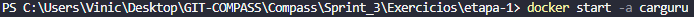
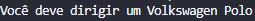
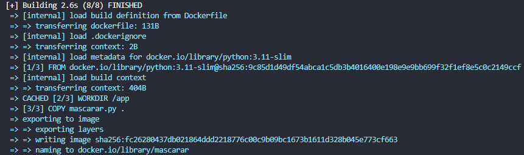
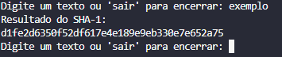
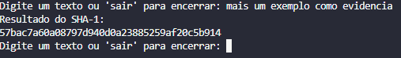
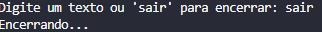

# Resumo da Sprint 3 - Docker & AWS Partner: Accreditation

Durante a Sprint 3, aprofundei meus conhecimentos em Docker, desde conceitos básicos até orquestração com Docker Swarm e Kubernetes. Além disso, explorei fundamentos de AWS Cloud, incluindo Cloud Adoption Framework (CAF), Well-Architected Framework e estratégias de migração para nuvem.

## Docker

- Conceitos de containers, imagens e registries.
- Criação de imagens com Dockerfile.
- Uso de volumes para persistência de dados.
- Gerenciamento de redes entre containers.
- Orquestração com Docker Compose e Swarm.
- Introdução ao Kubernetes para alta disponibilidade.

## AWS Partner: Accreditation


#  Desafio

- O arquivo desenvolvido e utilizado para a realização do desafio desta sprint está disponível na pasta Desafio, e a documentação completa pode ser consultada em seu respectivo `README.md`:
  - 📂 [Pasta Desafio](./Desafio/)
  - 📄 [README.md do Desafio](./Desafio/README.md)

# Exercícios

Nesta sprint, realizei dois exercícios práticos com Docker e Python, conforme as etapas propostas. Abaixo, estão os links dos códigos e arquivos Dockerfile utilizados.

## Etapa 1

**Objetivo:**  
Construir uma imagem Docker a partir de um `Dockerfile` que execute o código Python `carguru.py`.

### Arquivos:
- [Código Python - carguru.py](./Exercicios/etapa-1/carguru.py)
- [Dockerfile](./Exercicios/etapa-1/Dockerfile)

##  Etapa 2 

**Objetivo:**  
Criar um script Python que:
1. Receba uma string via input.
2. Gere o hash da string usando o algoritmo SHA-1.
3. Imprima o hash na tela.
4. Volte ao passo 1.

### Arquivos:
- [Código Python - mascarar.py](./Exercicios/etapa-2/mascarar.py)
- [Dockerfile](./Exercicios/etapa-2/Dockerfile)


# Evidências

## etapa 1

Para fazer o build da imagem utilizei o comando a seguir 

**Comando:**
```bash
docker build -t carguru .
```


Resultado do build com sucesso:



Após o build, executei o container criando o nome carguru com o comando:
```bash
docker run -it --name carguru carguru
```


Saida:


Para reutilizar o mesmo container já existente, utilizei o comando:

```bash
docker start -a carguru
```


Saida:


## etapa 2

Para fazer o build da imagem utilizei o comando a seguir 

**Comando:**
```bash
docker build -t mascarar .
```


Resultado do build com sucesso:



Após o build, executei o container criando o nome mascarar com o comando:
```bash
docker run -it --name mascarar mascarar
```


Saidas:







---

### [Link para pasta de Imagens Execucao](./Exercicios/Imagens_Execucao/)

##  Caminhos para as pastas da Sprint

- [ Certificados](./Certificados/)
- [ Desafio](./Desafio/)
- [ Evidências](./Evidencias/)
- [ Exercícios](./Exercicios/)


