#  Objetivo do Desafio

O objetivo deste desafio é a pratica utilizando serviços AWS

## Etapas do Desafio

- **Etapa 1:** Escolha e carregamento do dataset localmente, definição das perguntas analíticas e envio do arquivo para o bucket S3.

- **Etapa 2:** Leitura do arquivo diretamente do bucket S3, aplicação das análises solicitadas e geração de gráficos.

##  Estrutura do Projeto

- **Dataset**: `bolsa_familia_2024.csv`
- **Ferramentas Utilizadas**:
  - Python 
  - Pandas
  - Matplotlib
  - Boto3
  - io
  - seaborn

## Etapa 1

##  Passo a Passo do Código

###  Importação de Biblioteca

```python
import pandas as pd
import boto3
from botocore.exceptions import BotoCoreError, ProfileNotFound, NoCredentialsError
```
- `pandas` é utilizado para manipulação de dados tabulares.
- `boto3`: biblioteca oficial da AWS para acessar recursos como o S3.
- `botocore.exceptions`: tratamento de erros relacionados à autenticação e conexão com serviços AWS.


```python
df = pd.read_csv("C:/Users/Vinic/Downloads/bolsa_familia_2024.csv")
```
Carrega o CSV em um **DataFrame do pandas**, permitindo a manipulação dos dados tabulares.


```python
df.head()
```
- Visualização das primeiras linhas do DataFrame para ter uma noção dos dados.

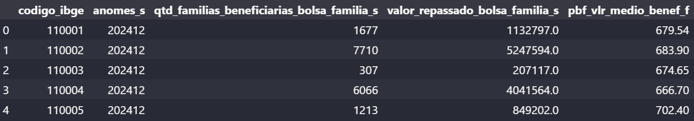


```python
df.info()
```
- Visualização da estrutura do DataFrame: Tipos de dados, valores e memoria utilizada

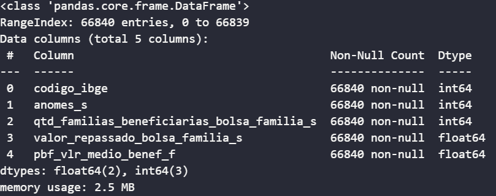

```python
df.describe()
```
- Gerar estatísticas resumidas de colunas numéricas do DataFrame

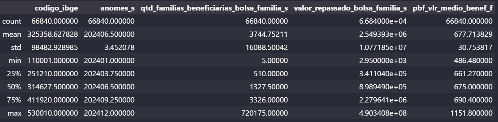

```python
df.isnull().sum()
```
- Conferir quantidade de dados nulos
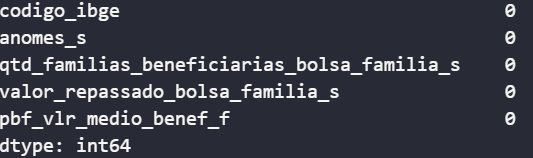

```python
df.duplicated(subset=["codigo_ibge", "anomes_s"]).sum()
```
- Conferir quantidades de dados duplicados

Fiz a criação do bucket no S3 via console do s3

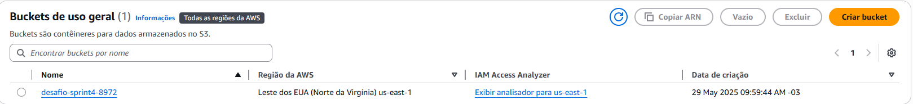


Conexão com AWS S3 via perfil SSO (configurado com `aws configure sso`)
```python
try:
    session = boto3.Session(profile_name='compass-sso')
    s3 = session.client('s3')
    print("Conexão com o S3 estabelecida com sucesso!")
except ProfileNotFound:
    print(" Erro: Perfil 'compass-sso' não encontrado. Verifique se o perfil está configurado com aws configure.")
except NoCredentialsError:
    print(" Erro: Credenciais não encontradas. Configure suas credenciais AWS.")
except BotoCoreError as e:
    print(f" Erro ao conectar com a AWS: {e}")

s3.upload_file('bolsa_familia_2024.csv', 'desafio-sprint4-8972', 'bolsa_familia_2024.csv')
```
- Tenta criar uma sessão com o perfil de credenciais compass-sso
- Instancia um cliente S3.
- Envia o arquivo local bolsa_familia_2024.csv para o bucket desafio-sprint4-8972.

Arquivo enviado para o bucket

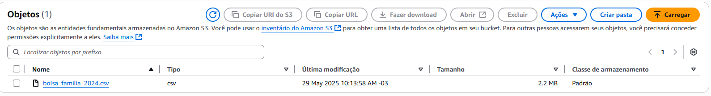

Foram definidas as seguintes perguntas analíticas:

- Q1 - Quais faixas de municípios concentram mais repasses acima da média nacional?
- Q2 - Como o valor médio do benefício evolui ao longo do tempo em diferentes faixas de demanda?
- Q3 - Qual a desigualdade interna em cada faixa de demanda em relação ao valor médio anual por família?

## Etapa 2


```python
import boto3
import pandas as pd
import io

import matplotlib.pyplot as plt
import seaborn as sns

from botocore.exceptions import BotoCoreError, ProfileNotFound, NoCredentialsError
```
- `boto3`: biblioteca oficial da AWS para acessar recursos como o S3.
- `pandas`: usado para manipulação e análise de dados tabulares.
- `io`: permite ler arquivos diretamente da memória (streaming do S3).
- `matplotlib.pyplot` e `seaborn`: utilizadas para criar gráficos e visualizações estatísticas.
- `botocore.exceptions`: tratamento de erros relacionados à autenticação e conexão com serviços AWS.

```python
try:
    session = boto3.Session(profile_name='compass-sso')
    s3 = session.client('s3')
    print("Conexão com o S3 estabelecida com sucesso!")
except ProfileNotFound:
    print(" Erro: Perfil 'compass-sso' não encontrado. Verifique se o perfil está configurado com aws configure.")
except NoCredentialsError:
    print(" Erro: Credenciais não encontradas. Configure suas credenciais AWS.")
except BotoCoreError as e:
    print(f" Erro ao conectar com a AWS: {e}")
```
- Inicia uma sessão autenticada com a AWS usando um perfil previamente configurado via `aws configure sso --profile compass-sso`.
- Cria um cliente para interagir com o serviço Amazon S3, permitindo ler, gravar e manipular objetos no bucket.

```python
bucket_name = 'desafio-sprint4-8972'
key = 'bolsa_familia_2024.csv'
```
- Define o nome do bucket e o caminho do arquivo no S3.

```python
try:
    obj = s3.get_object(Bucket=bucket_name, Key=key)
except Exception as e:
    print(f"Erro ao acessar o arquivo: {e}")
```
- Recupera o objeto CSV armazenado no bucket definido, usando os parâmetros `bucket_name` e `key`.

```python
df = pd.read_csv(io.BytesIO(obj['Body'].read()))
```
- Lê o conteúdo do objeto S3 e converte em um DataFrame utilizando `pandas`.

```python
df.columns = df.columns.str.strip().str.lower()

df = df.rename(columns={
    'codigo_ibge': 'codigo_ibge',
    'anomes_s': 'ano_mes',
    'qtd_familias_beneficiarias_bolsa_familia_s': 'qtd_familias',
    'valor_repassado_bolsa_familia_s': 'valor_total_repassado',
    'pbf_vlr_medio_benef_f': 'valor_medio_repassado'
})
```
- Renomeia as colunas para nomes mais curtos e semânticos, facilitando a leitura e manipulação do DataFrame.

```python
df["data"] = pd.to_datetime(df["ano_mes"].astype(str), format="%Y%m")
```
- Converte a coluna `ano_mes` para o tipo `datetime`, no formato `YYYYMM`, criando uma nova coluna chamada `data`.

```python
df = df.drop(columns=["ano_mes"])
```
- Remove a coluna `ano_mes`, que já foi convertida para `data` e não é mais necessária.

## IMPORTANTE

```python
q1 = df["qtd_familias"].quantile(0.25)
q3 = df["qtd_familias"].quantile(0.75)

df["categoria_demanda"] = "Não classificado"

df.loc[df["qtd_familias"] <= q1, "categoria_demanda"] = "Baixa demanda"
df.loc[(df["qtd_familias"] > q1) & (df["qtd_familias"] <= q3), "categoria_demanda"] = "Média demanda"
df.loc[df["qtd_familias"] > q3, "categoria_demanda"] = "Alta demanda"
```
A partir dos dados, realizei uma divisão estatística com base nos quartis da variável `qtd_familias`:

- **Baixa demanda**: até 510 famílias (abaixo do 25º percentil)
- **Média demanda**: entre 511 e 3.326 (entre os quartis 25% e 75%)
- **Alta demanda**: acima de 3.326 (acima do 75º percentil)

## Analises

## Q1 - Quais faixas de municípios concentram mais repasses acima da média nacional?

O objetivo foi identificar **quantos municípios em cada faixa de demanda** recebem **acima da média nacional de valor por família** (R$ 677,71).

- Calculei a quantidade total de municípios em cada faixa (nunique()) e quantos deles se destacam por receber acima da média nacional.
- Calculei a média nacional com base em todos os repasses (`mean()`).
- Agrupei os dados por município (`codigo_ibge`) e `categoria_demanda` para obter a média por município.
- Apliquei filtros com dois operadores lógicos (`&`) para cada faixa de demanda.
- Contei quantos municípios de cada categoria estão acima da média nacional.
- Por fim, construí um gráfico de barras para representar visualmente os resultados.

```python
baixa = df[df['categoria_demanda'] == 'Baixa demanda']
quantidade_baixa = baixa['codigo_ibge'].nunique()

media = df[df['categoria_demanda'] == 'Média demanda']
quantidade_media = media['codigo_ibge'].nunique()

alta = df[df['categoria_demanda'] == 'Alta demanda']
quantidade_alta = alta['codigo_ibge'].nunique()

media_nacional = df['valor_medio_repassado'].mean()
media_por_municipio = df.groupby(["codigo_ibge", "categoria_demanda"])[["qtd_familias", "valor_medio_repassado"]].mean().reset_index()

filtro_baixa = media_por_municipio[
    (media_por_municipio["categoria_demanda"] == "Baixa demanda") &
    (media_por_municipio["valor_medio_repassado"] > media_nacional)
]

filtro_media = media_por_municipio[
    (media_por_municipio["categoria_demanda"] == "Média demanda") &
    (media_por_municipio["valor_medio_repassado"] > media_nacional)
]

filtro_alta = media_por_municipio[
    (media_por_municipio["categoria_demanda"] == "Alta demanda") &
    (media_por_municipio["valor_medio_repassado"] > media_nacional)
]

print(f"🔵 Baixa demanda: {len(filtro_baixa)} municípios recebem acima da média nacional ({quantidade_baixa} registros).")
print(f"🟠 Média demanda: {len(filtro_media)} municípios recebem acima da média nacional ({quantidade_media} registros).")
print(f"🔴 Alta demanda: {len(filtro_alta)} municípios recebem acima da média nacional ({quantidade_alta} registros).")
```

Para plotar o grafico utilizei o codigo a seguir:

```python
categorias = ["Baixa", "Média", "Alta"]
valores = [len(filtro_baixa), len(filtro_media), len(filtro_alta)]
cores = ["royalblue", "orange", "red"]

plt.figure(figsize=(10, 8))
plt.bar(categorias, valores, color=cores)
plt.title("Municípios acima da média por faixa de demanda")
plt.xlabel("Faixa de demanda (nº de famílias)")
plt.ylabel(f"Qtd. de municípios com valor médio acima da média nacional (R$ {media_nacional:.2f})")
plt.grid(axis="y")
plt.show()
```

Resultado da analise:

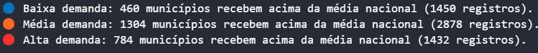
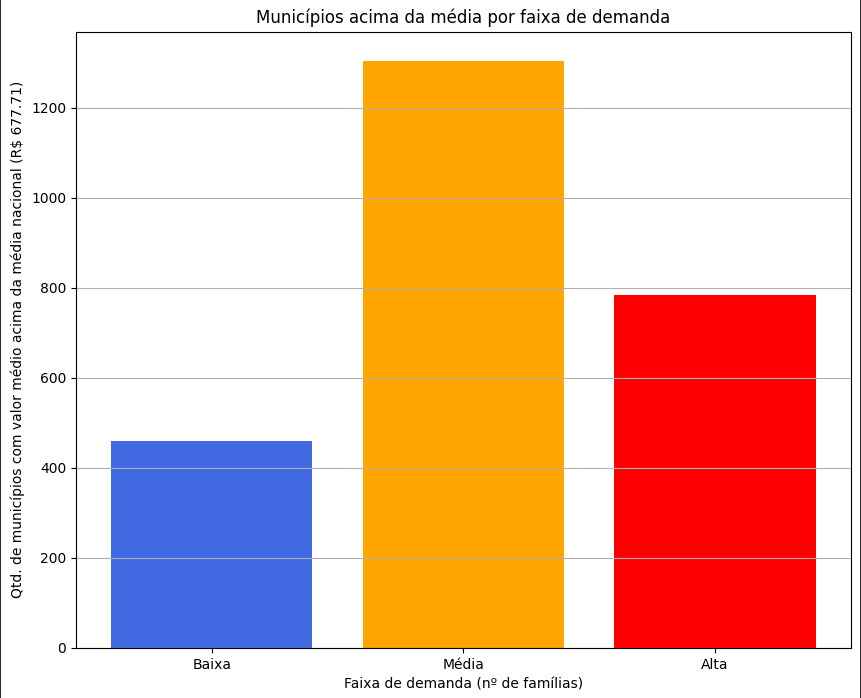

Observa-se que municípios com média demanda concentram a maior quantidade de casos com repasse acima da média nacional, seguidos pelos de alta demanda. Embora os municípios de baixa demanda também apareçam, são menos frequentes.

Isso sugere que, de forma geral, quanto maior a demanda no município, maior a probabilidade de ele receber valores acima da média nacional, ainda que essa tendência não seja absoluta.


## Q2 — Como o valor médio do benefício evolui ao longo do tempo em diferentes faixas de demanda?

Nesta etapa, o objetivo foi **analisar a evolução temporal** do valor médio do benefício por família ao longo do ano de 2024, segmentando os municípios por **faixa de demanda populacional**.

- Utilizei `groupby()` para calcular a **média mensal do valor repassado** por família para cada categoria.
- A média nacional (R$ 677,71) foi traçada como linha de referência no gráfico.
- O gráfico de linha permite **comparar a tendência mês a mês** entre as diferentes faixas de municípios.

```python
media_por_categoria = df.groupby(["data", "categoria_demanda"])["valor_medio_repassado"].mean().reset_index()
```

Para plotar o grafico utilizei a o codigo a seguir:

```python
plt.figure(figsize=(12, 6))
sns.lineplot(
    data=media_por_categoria,
    x="data",
    y="valor_medio_repassado",
    hue="categoria_demanda",
    marker="o",
    palette={"Baixa demanda": "royalblue", "Média demanda": "orange", "Alta demanda": "red"}
)
plt.axhline(media_nacional, color='black', linestyle='--', label=f"Média nacional: R$ {media_nacional:.2f}")

plt.title("Evolução do valor médio por faixa de demanda (2024)")
plt.xlabel("Data")
plt.ylabel("Valor médio por família (R$)")
plt.grid(True)
plt.tight_layout()
plt.legend(title="Demanda")
plt.show()
```

Resultado da analise:

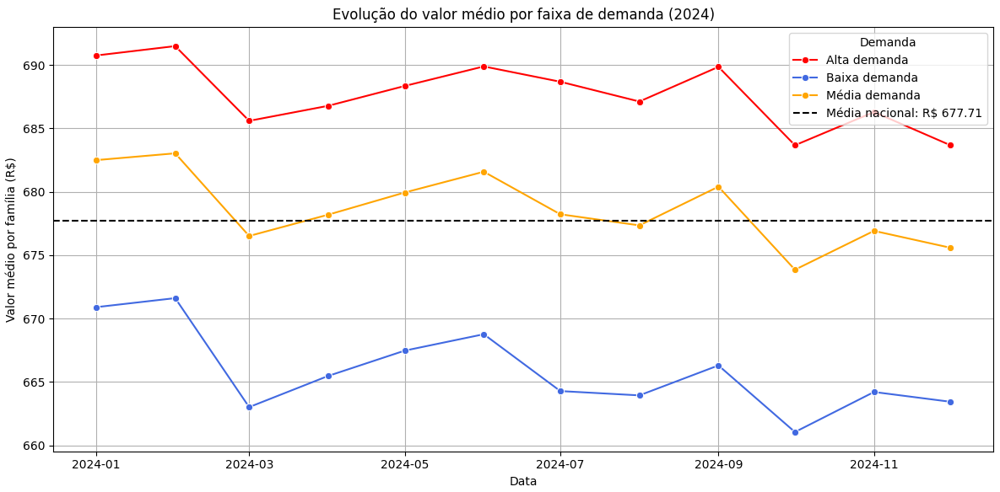

Ao longo de 2024, observa-se que os municípios de alta demanda mantêm, de forma consistente, um valor médio de repasse acima da média nacional (R$ 677,71), enquanto os de baixa demanda permanecem sempre abaixo.

A faixa de média demanda oscila ao redor da média nacional, com períodos acima e outros abaixo, indicando uma variação mais instável no valor médio por família.

Esse comportamento sugere que municípios com maior demanda tendem a receber valores médios mais altos ao longo do tempo, reforçando a hipótese de que há uma correlação leve entre demanda e repasse médio.


## Q3 — Qual a desigualdade interna em cada faixa de demanda em relação ao valor médio anual por família?

A intenção foi identificar como os repasses variam entre municípios de mesma faixa, revelando possíveis disparidades mesmo entre grupos semelhantes em termos de demanda.

- Utilizei um laço for passando por todo o df media_por_municipio, para obter o valor maximo e minimo repassado por categoria de demanda 
- Criei um grafico comparando o valor maximo e minio repassado por categoria de demanda

```python
faixas = ['Baixa demanda', 'Média demanda', 'Alta demanda']
dados = []

for faixa in faixas:
    grupo = media_por_municipio[media_por_municipio['categoria_demanda'] == faixa]
    max_valor = grupo['valor_medio_repassado'].max()
    min_valor = grupo['valor_medio_repassado'].min()

    dados.append({
        'Faixa de Demanda': faixa,
        'Máximo': round(max_valor, 2),
        'Mínimo': round(min_valor, 2),
    })

df_extremos = pd.DataFrame(dados)
```

Para plotar o grafico utilizei a o codigo a seguir:

```python
plt.figure(figsize=(10, 6))
bar_width = 0.35
x = range(len(df_extremos))

plt.bar(x, df_extremos['Máximo'], width=bar_width, label='Máximo (R$)')
plt.bar([i + bar_width for i in x], df_extremos['Mínimo'], width=bar_width, label='Mínimo (R$)')

plt.xticks([i + bar_width/2 for i in x], df_extremos['Faixa de Demanda'])
plt.ylabel("Valor médio anual por família (R$)")
plt.title("Diferença entre o maior e o menor repasse por faixa de demanda")
plt.legend()
plt.grid(axis='y', linestyle='--', alpha=0.5)
plt.tight_layout()
plt.show()
```

Resultado da analise:

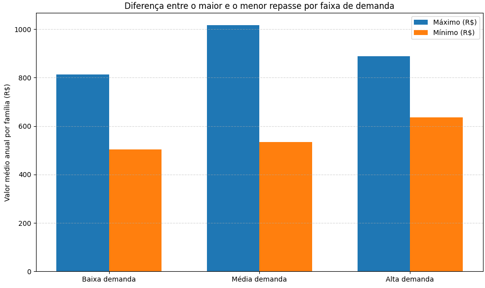

A diferença entre os valores máximos e mínimos de repasse por faixa de demanda revela desigualdade interna significativa em todas as categorias.

A `média demanda` apresenta a maior disparidade, com municípios variando de cerca de R$ 530 até mais de R$ 1.000 por família.

A `alta demanda` também mostra uma diferença expressiva, embora um pouco menor.

Já a `baixa demanda`, apesar de apresentar valores mais baixos, também exibe uma desigualdade considerável entre os municípios.

Esses dados indicam que, mesmo entre municípios com perfis de demanda semelhantes, há forte variação no valor médio de repasse por família,principalmente nos municipios de `média demanda` ,evidenciando possíveis desigualdades na distribuição dos recursos.


## Pós analise
- Após a analise salvei o arquivo csv limpo no bucket do s3 novamente.

- Cria um buffer em memória (como se fosse um arquivo) para armazenar o conteúdo CSV como string.
- Converte o DataFrame df para CSV e grava no buffer, sem incluir o índice.
- Envia o conteúdo do buffer como um novo objeto CSV para o bucket S3, com o nome

```python
csv_buffer = io.StringIO()
df.to_csv(csv_buffer, index=False)

s3.put_object(Bucket=bucket_name, Key="bolsa_familia_2024_limpo.csv", Body=csv_buffer.getvalue())
```
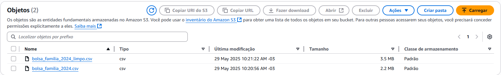