# Resumo da Sprint 4 – AWS Cloud Economics, Sales Accreditation & Cloud Quest

Nesta Sprint 4, aprofundei meus conhecimentos sobre os impactos financeiros e estratégicos da computação em nuvem com foco na AWS. Realizei cursos voltados para **economia em nuvem**, **acreditação de vendas** e uma imersão prática no jogo **AWS Cloud Quest**, consolidando fundamentos essenciais para atuação como profissional de cloud computing.

---

##  AWS Partner: Cloud Economics (Português)

- Compreensão dos principais benefícios econômicos da AWS: pagamento sob demanda, elasticidade, economia de escala.
- Redução de custos operacionais e substituição de gastos de capital por operacionais.
- Cálculo e análise de **TCO (Total Cost of Ownership)** em comparação com ambientes on-premises.
- Avaliação do impacto financeiro da adoção da nuvem nos negócios dos clientes.
- Otimização de recursos e aumento da agilidade por meio da modernização de infraestrutura.

---

##  AWS Partner: Sales Accreditation (Business) – Português

- Desenvolvimento de habilidades de vendas consultivas para soluções AWS.
- Entendimento do ciclo de decisão dos clientes e como alinhar soluções com objetivos de negócio.
- Técnicas para identificar **drivers de negócios**, **desafios de TI** e **critérios de sucesso** dos clientes.
- Aplicação do **AWS Cloud Adoption Framework (CAF)** no discurso comercial.
- Uso de casos de sucesso e benefícios tangíveis para apresentar propostas de valor em nuvem.

---

##  AWS Cloud Quest: Cloud Practitioner

- Experiência gamificada de aprendizado prático em um ambiente 3D interativo.
- Missões que envolvem cenários reais, focando em computação, redes, armazenamento, bancos de dados, segurança e billing.
- Aplicação prática de serviços como **Amazon EC2, S3, IAM, RDS** e **CloudWatch**.
- Consolidação de boas práticas em arquitetura, segurança e gerenciamento de custos na AWS.
- Fortalecimento dos conceitos essenciais para a certificação **AWS Certified Cloud Practitioner**.

#  Desafio

- O arquivo desenvolvido e utilizado para a realização do desafio desta sprint está disponível na pasta Desafio, e a documentação completa pode ser consultada em seu respectivo `README.md`:
  - 📂 [Pasta Desafio](./Desafio/)
  - 📄 [README.md do Desafio](./Desafio/README.md)

# Exercícios

Nesta Sprint, realizei 4 laboratórios práticos com serviços da AWS, reforçando a aplicação dos conceitos estudados em Cloud Economics, Cloud Practitioner e Sales Accreditation. Abaixo estão os exercícios realizados:

- **Lab AWS S3** 
- **Lab AWS Athena** 
- **Lab AWS Lambda** 
- **Lab AWS – Limpeza de recursos** 

## Lab AWS S3

###  Lab AWS S3 – Hospedagem de Site Estático

Neste laboratório, configurei um bucket S3 para hospedar um site estático com HTML e arquivos CSV. O objetivo foi compreender, na prática, como disponibilizar conteúdo publicamente por meio da AWS, configurando permissões, políticas e documentos de erro.

**Etapas realizadas:**

- Criação de bucket na região `us-east-1`.
- Habilitação da opção "Static website hosting".
- Definição de `index.html` como documento principal e `404.html` como documento de erro.
- Desbloqueio do acesso público ao bucket.
- Criação de política de bucket para permitir acesso de leitura público.
- Upload do arquivo `index.html` com link para download de um CSV.
- Upload de conteúdo adicional em uma pasta `dados/`.
- Teste do endpoint do site público gerado pelo S3.

### Arquivos:
- [index](./Exercicios/S3/index.html)
- [404](./Exercicios/S3/404.html)
- O CSV utilizado não foi carregado pelo quantidade de MB dele.

##  Lab AWS Athena

Neste laboratório, explorei o serviço **AWS Athena** para consultar dados diretamente no Amazon S3 utilizando SQL, sem necessidade de servidores. O objetivo foi criar um banco de dados e uma tabela externa com base em um arquivo CSV, configurar o local de resultados e realizar consultas analíticas.

**Etapas realizadas:**

- Upload do arquivo `nomes.csv` no bucket criado anteriormente.
- Criação de uma pasta chamada `queries/` no S3 para armazenar os resultados das consultas.
- Configuração do local de saída das queries no editor do Athena.
- Criação do banco de dados `meubanco`.
- Criação de uma tabela externa a partir do CSV, utilizando o SerDe apropriado (`LazySimpleSerDe`) e definindo os campos com seus respectivos tipos de dados
- Execução de consultas SQL para explorar os dados
- Criação de uma consulta que lista os 3 nomes mais usados por década desde 1950.

### Arquivos:
- [Consulta SQL](./Exercicios/Athena/consulta.sql)

## Lab AWS Lambda

Neste laboratório, criei uma **função AWS Lambda** para processar dados de um arquivo CSV armazenado no Amazon S3, utilizando as bibliotecas **Pandas** e **NumPy**. O objetivo foi automatizar a leitura e contagem de linhas do dataset de forma serverless.

**Etapas realizadas:**

####  Etapa 1: Criação da função Lambda

- Criação da função no console AWS Lambda, com runtime Python 3.9.
- Nomeação da função e geração do arquivo `lambda_function.py`.

####  Etapa 2: Codificação da função

Substituí o código padrão pelo script dado

#### Etapa 3: Criação de uma Layer com Pandas

Como o ambiente Lambda não possui Pandas por padrão, criei uma Lambda Layer personalizada, seguindo os passos:

- Criação de uma imagem Docker baseada em amazonlinux:2023.
- Instalação do Python 3.9, pip3, zip e criação da estrutura layer_dir/python/.
- Instalação da biblioteca Pandas dentro da pasta python/ 
- Compactação da pasta como minha-camada-pandas.zip.
- Upload do arquivo .zip para um bucket S3.
- Criação da camada Lambda no console, referenciando a URL do arquivo no S3.
- Configuração da camada para Python 3.9 com arquitetura x86_64.

#### Etapa 4: Vinculando a Layer à função Lambda

- Adição da Custom Layer à função Lambda.
- Ajuste das configurações de timeout e memória (para suportar a carga de dados).
- Execução do teste com retorno esperado:

### Arquivos:
- [Docker](./Exercicios/Lambda/Dockerfile/Dockerfile)

# Evidências

## Lab AWS S3

#### Criação do bucket no S3
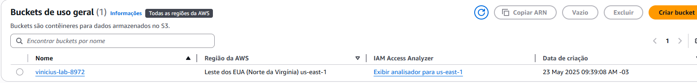
---

#### Arquivos inseridos no bucket do S3
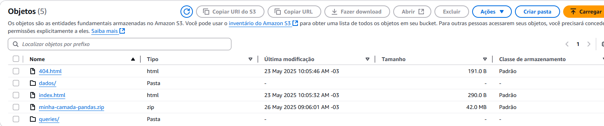
---

#### Site estatico rodando
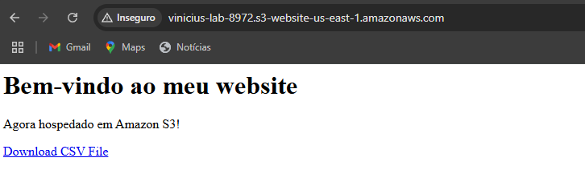
---

## Lab AWS Athena

#### SQL utilizado para criação do meuBanco
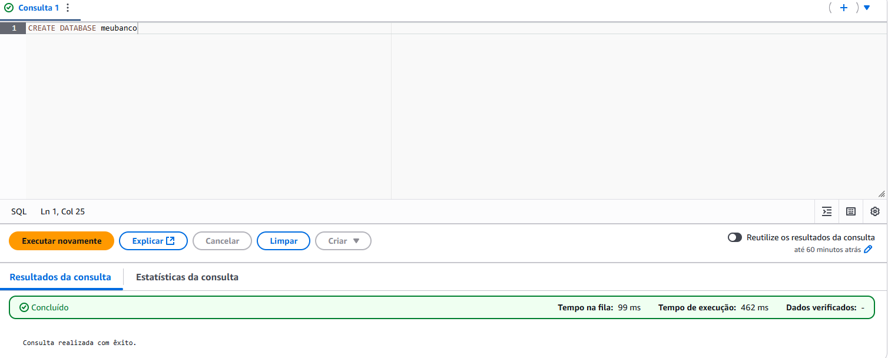
---
#### Consulta SQL para criação da tabela externa no Athena
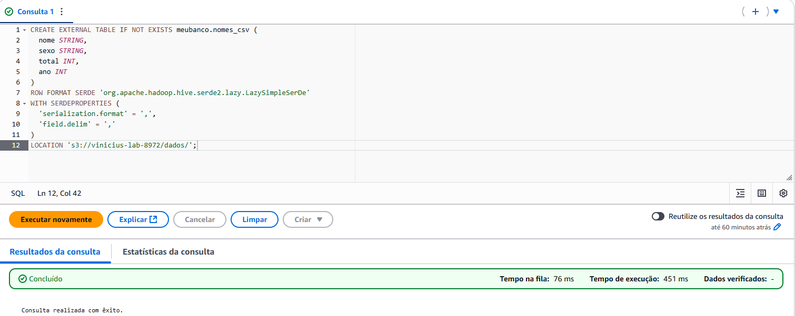
---
#### Consulta SQL para nomes mais usados em 1999
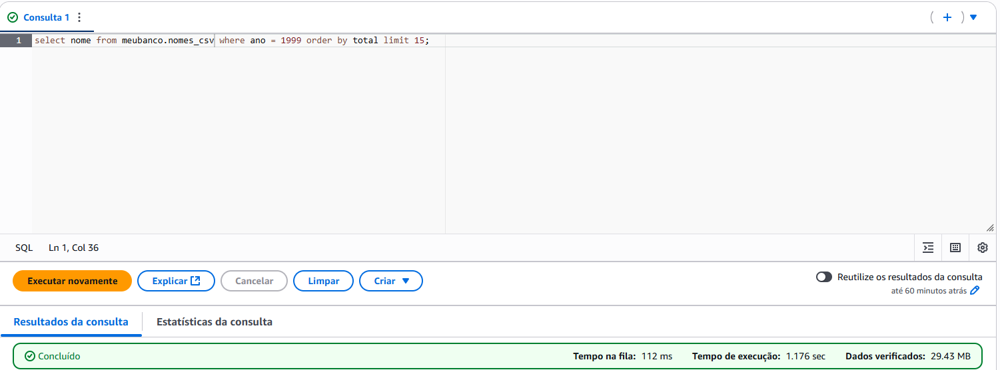
---
#### Consulta SQL para os 3 nomes mais usados por década desde 1950
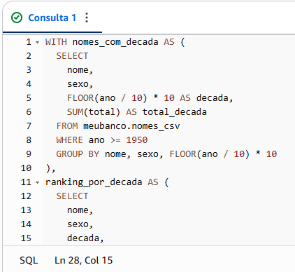
---
#### Resultado do SQL acima
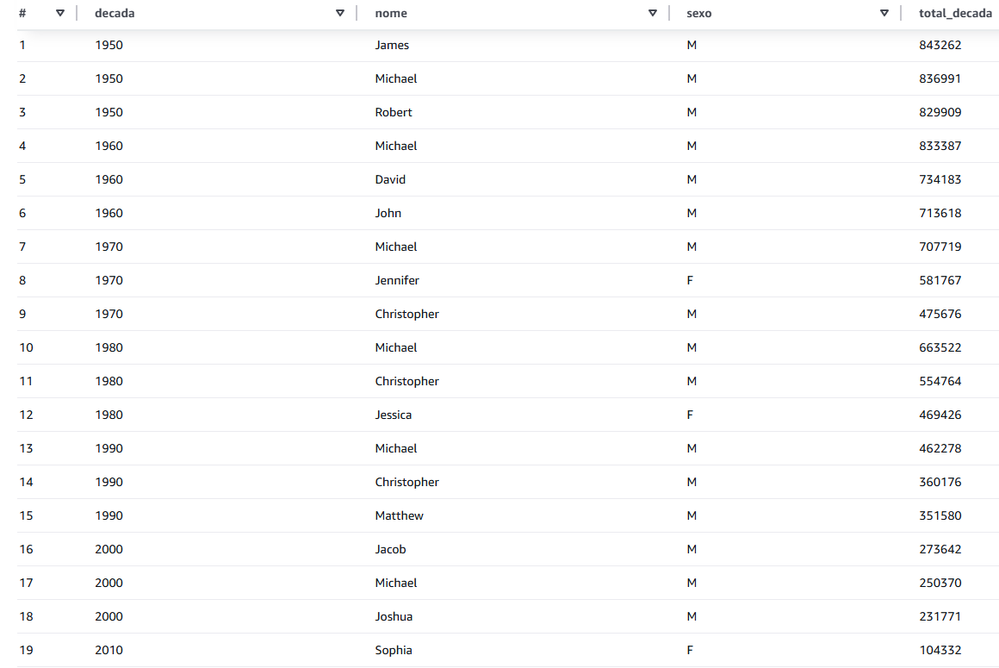
---

## Lab AWS Lambda

#### Evidência do código no console Lambda:
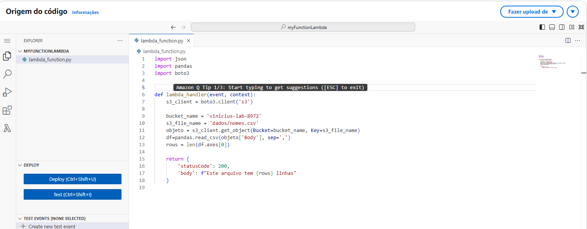
---
#### Evidência dos arquivos Dockerfile e da camada
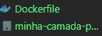
---

#### Execução bem-sucedida da função Lambda
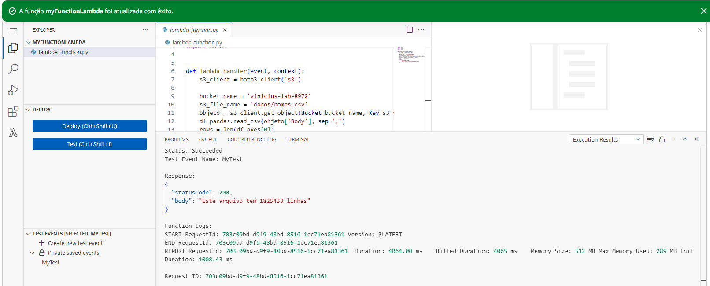
---

### [Link para pasta de Imagens Execucao](./Exercicios/Imagens_Execucao/)

##  Caminhos para as pastas da Sprint

- [ Certificados](./Certificados/)
- [ Desafio](./Desafio/)
- [ Evidências](./Evidencias/)
- [ Exercícios](./Exercicios/)

