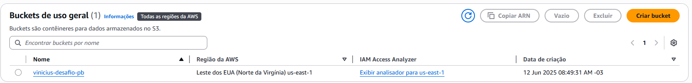
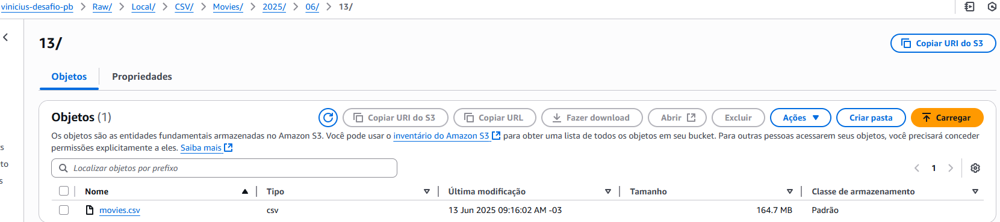
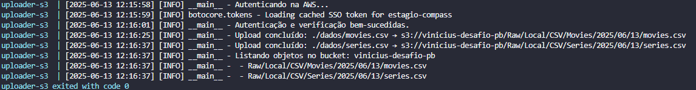
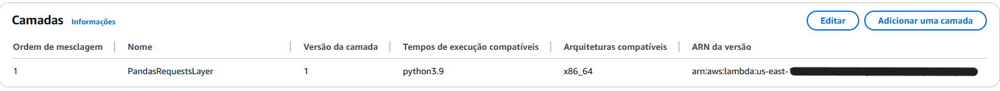
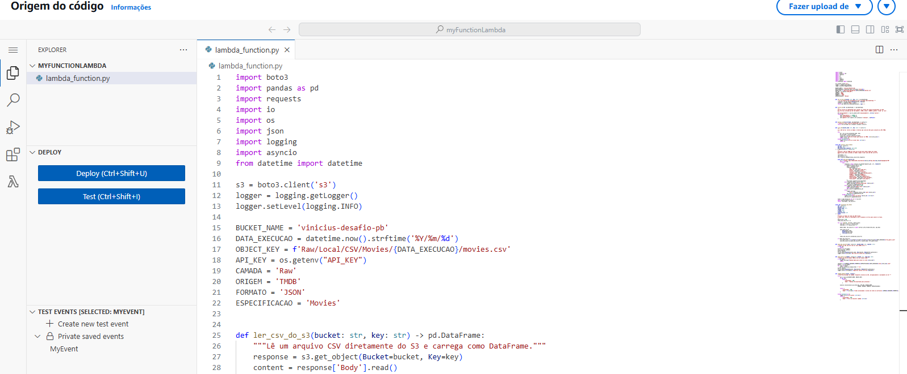
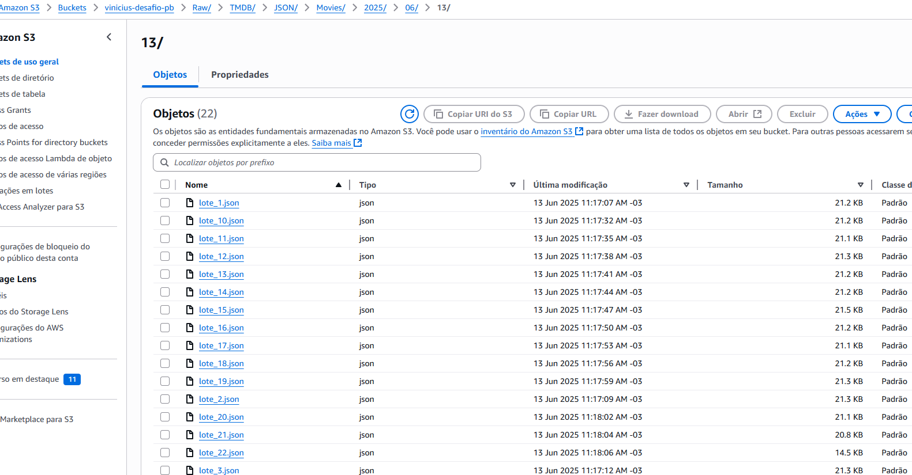
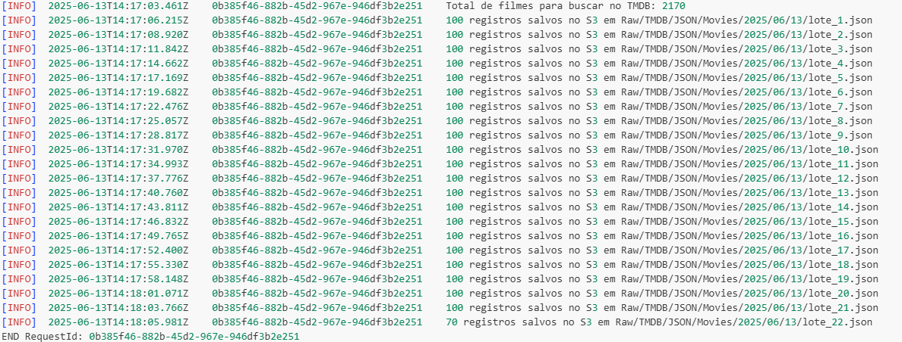

#  Desafio final PB

O desafio final está divido em 5 entregas. Nesta etapa será realizada a entrega 1 e 2.

Esse desafio tem como objetivo a construção de um Data Lake, com etapas de ingestão, armazenamento, processamento e consumo.

Serão construidas 2 ingestões:

- Com base em arquivos no formato **CSV**
- Com base em dados de **API do TMDB**

## Questoes que quero descobrir 

### 1. Qual foi o Retorno sobre Orçamento (ROI) dos filmes?
**Objetivo:** Avaliar a eficiência financeira dos filmes, medindo o retorno em relação ao investimento.

### 2. Como a rentabilidade dos filmes se comportou ao longo das décadas?
**Objetivo:** Analisar a média de ROI por década para entender variações históricas.

### 3. Os filmes com maior orçamento realmente geram maior receita?
**Objetivo:** Observar a relação entre o valor investido e a arrecadação bruta.

### 4. Quais artistas aparecem com mais frequência e geram melhores resultados?
**Objetivo:** Cruzar recorrência com métricas como nota média, receita e popularidade.

### 5. A opinião da crítica é coerente com a popularidade entre o público?
**Objetivo:** Comparar nota média (`vote_average`) com popularidade (`popularity`).

### 6. Existe uma sazonalidade nos lançamentos mais bem-sucedidos?
**Objetivo:** Identificar os meses com maior volume de lançamentos de sucesso.

### 7. Existem filmes pouco votados, mas com ROI muito alto?
**Objetivo:** Descobrir “Hidden Gems” — filmes com alta eficiência financeira, porém pouco conhecidos.

## Objetivo do desafio

O objetivo é praticar a combinação de conhecimentos vistos no Programa, fazer um mix de tudo que já foi feito

## Etapas do Desafio

- **Etapa 1:** Ingestão dos arquivos **CSV** em um bucket Amazon S3 RAW Zone

- **Etapa 2:** Ingestão dos dados da **API do TMDB** no Bucket do Amazon S3 RAW Zone

##  Estrutura do Projeto

- **Dataset**: 
  - Foram utilizados **2 arquivos CSV** fornecidos localmente, contendo informações iniciais sobre filmes.
  - Cada arquivo foi carregado a partir da pasta `./dados` e armazenado no Amazon S3, estruturado por data de execução.

- **API Utilizada**:
  - [TMDB - The Movie Database](https://developer.themoviedb.org/reference/movie-details)
  - Endpoint utilizado: `https://api.themoviedb.org/3/movie/{movie_id}?api_key={api_key}&language=pt-BR`
  - A resposta dessa API retorna dados detalhados sobre filmes, como:
    - `title` (Título)
    - `overview` (Resumo)
    - `release_date` (Data de lançamento)
    - `genres` (Gêneros)
    - `vote_average` (Nota média)
    - `runtime` (Duração)
    - `original_language` (Idioma original)
    - Entre outros.

- **Ferramentas Utilizadas**:
  - Python 
  - Pandas
  - Boto3
  - io
  - Logging
  - OS
  - Botocore Exceptions
  - Docker
  - Docker-compose

## Etapa 1 — Ingestão de Arquivos CSV no S3

O principal objetivo desta etapa foi **automatizar o envio de arquivos CSV locais para um bucket no Amazon S3**, estruturando-os conforme boas práticas de organização em Data Lakes (por camada, origem, formato e data de execução).

###  Passo a passo da implementação

1. **Criação do bucket no S3**
   - Nome escolhido: `vinicius-desafio-pb`

*Bucket criado com sucesso:*


2. **Autenticação com AWS via boto3**
   - Foi utilizada a biblioteca `boto3` com `Session(profile_name)` para utilizar credenciais locais via `~/.aws/credentials`.

3. **Estruturação da key no S3**
   - O caminho de armazenamento dos arquivos segue o padrão:
     ```
     <camada>/<origem>/<formato>/<especificacao>/<ano>/<mes>/<dia>/<arquivo>
     ```
4. **Validação antes do upload**
   - O script verifica se o arquivo já existe no bucket (via `head_object`) para **evitar duplicação ou sobrescrita indevida**.

5. **Upload automático de múltiplos arquivos .csv**
   - Todos os arquivos dentro da pasta `./dados` são identificados e enviados automaticamente.

*Upload concluído com sucesso:*


6. **Listagem final dos objetos no bucket**
   - Após o processo, os objetos presentes no bucket são listados via log para verificação.

*Log da execução listando arquivos no S3:*


##  Passo a Passo do Código

###  Importação de Biblioteca

```python
import logging
import boto3
import os
from datetime import datetime
from botocore.exceptions import (
    ProfileNotFound,
    NoCredentialsError,
    BotoCoreError,
    EndpointConnectionError,
    ClientError,
    PartialCredentialsError
)
```
- `logging` utilizado para registrar mensagens de log em diferentes níveis (info, warning, error), permitindo o monitoramento do processo de execução do script.

- `boto3`: biblioteca oficial da AWS para acessar recursos como o S3.

- `os`: permite interações com o sistema operacional, como leitura de arquivos e diretórios.

- `datetime`:utilizado para capturar o timestamp atual e formatar datas, útil para versionamento e organização dos dados no S3.

- `botocore.exceptions`: tratamento de erros relacionados à autenticação e conexão com serviços AWS.
---

### Autenticação com a AWS via perfil local
```python
def s3_auth(profile_name: str) -> boto3.client:
    logger.info('Autenticando na AWS...')
    try:
        session = boto3.Session(profile_name=profile_name)
        s3 = session.client('s3')
        s3.get_bucket_acl(Bucket=BUCKET_NAME)
        logger.info('Autenticação e verificação bem-sucedidas.')
        return s3
    except (ProfileNotFound, NoCredentialsError, PartialCredentialsError):
        logger.exception(" Problema com perfil ou credenciais AWS.")
    except EndpointConnectionError:
        logger.exception("Erro de conexão com o endpoint da AWS.")
    except ClientError as e:
        logger.exception(f"Erro do cliente AWS: {e}")
    except BotoCoreError as e:
        logger.exception(f"Erro geral da AWS: {e}")
    except Exception as e:
        logger.exception(f" Erro inesperado: {e}")
```

- Tenta criar uma sessão autenticada com a AWS usando o nome do perfil configurado via `aws configure sso`.

- Instancia um cliente para o serviço S3.

- Realiza uma chamada de verificação (`get_bucket_acl`) para validar se a autenticação está correta e o bucket é acessível.

- Se a autenticação for bem-sucedida, retorna o cliente S3 para uso nas demais funções.

- Em caso de falha, trata diferentes tipos de exceções

---
### Geração de chave (key) para salvar arquivos no S3
```python
def gerar_key_s3(nome_arquivo: str) -> str:
    nome_sem_extensao = os.path.splitext(os.path.basename(nome_arquivo))[0]
    especificacao = nome_sem_extensao.capitalize()
    formato = os.path.splitext(nome_arquivo)[1][1:].upper()

    key = f"{CAMADA}/{ORIGEM}/{formato}/{especificacao}/{DATA_EXECUCAO.year}/{DATA_EXECUCAO.month:02d}/{DATA_EXECUCAO.day:02d}/{nome_arquivo}"
    return key
```
- Extrai o nome base do arquivo (sem extensão) para definir a especificação.

- Extrai e formata a extensão do arquivo (ex: CSV) para definir o formato.

- Usa variáveis globais (`CAMADA`, `ORIGEM`, `DATA_EXECUCAO`) para compor o caminho de upload no `S3`.

- Gera uma key estruturada no seguinte padrão: `<camada>/<origem>/<formato>/<especificacao>/<ano>/<mes>/<dia>/<arquivo>`

- Essa estrutura facilita a organização, versionamento e localização dos arquivos no S3 de forma escalável e padronizada.

--- 

### Verificação da existência de um objeto no S3

```python
def objeto_existe(s3: boto3.client, bucket_name: str, key: str) -> bool:
    try:
        s3.head_object(Bucket=bucket_name, Key=key)
        return True
    except ClientError as e:
        if e.response['Error']['Code'] == "404":
            return False
        else:
            logger.exception("Erro ao verificar existência do objeto.")
            raise
```
- Utiliza o método `head_object` da AWS para verificar a existência do objeto (arquivo) no bucket S3.

- Se o objeto existir, retorna `True`.

- Se o objeto não existir, a AWS retorna um erro com código `404`, e a função retorna `False`.

- Para qualquer outro erro (ex: problema de permissão ou conexão), registra a exceção no log e relança o erro para não mascarar problemas inesperados.

- Com essa função Evita sobrescrita de arquivos já existentes no bucket.

---

### Upload de Arquivo Local para o Amazon S3

```python
def upload_arquivo(s3: boto3.client, bucket_name: str, caminho_arquivo: str, key: str) -> None:
    try:
        s3.upload_file(caminho_arquivo, bucket_name, key)
        logger.info(
            f"Upload concluído: {caminho_arquivo} → s3://{bucket_name}/{key}")
    except FileNotFoundError:
        logger.error(f" Arquivo local '{caminho_arquivo}' não encontrado.")
    except ClientError as e:
        logger.error(f" Erro do cliente AWS: {e.response['Error']['Message']}")
    except Exception as e:
        logger.exception(f" Erro inesperado durante upload: {e}")
```

- Utiliza o método `upload_file` da biblioteca `boto3` para realizar o envio de um arquivo local para o Amazon S3.

- Se o upload for bem-sucedido, um log de confirmação é emitido com o caminho completo do objeto no S3.

- Trata possíveis exceções em caso de erro

--- 

### Listagem de Objetos em um Bucket S3

```python
def listar_objetos_bucket(s3: boto3.client, bucket_name: str) -> None:
    logger.info(f"Listando objetos no bucket: {bucket_name}")
    try:
        response = s3.list_objects_v2(Bucket=bucket_name)
        if 'Contents' in response:
            for obj in response['Contents']:
                logger.info(f" - {obj['Key']}")
        else:
            logger.info("Bucket está vazio.")
    except Exception as e:
        logger.exception("Erro ao listar objetos do bucket.")
```

- Lista todos os arquivos (objetos) existentes dentro de um bucket S3.

- Utiliza o método `list_objects_v2` da AWS para obter os metadados dos objetos armazenados.

- Se existirem objetos, percorre cada item do campo `Contents` e registra as `keys` encontradas no log.

- Caso o bucket esteja vazio, informa isso ao usuário via log.

- Se ocorrer qualquer erro durante a requisição, ele é capturado e registrado como exceção.

--- 

### Execução Principal da Pipeline

```python
def main() -> None:
    s3 = s3_auth(PROFILE_NAME)
    if s3 is None:
        logger.error("Erro na autenticação. Encerrando execução.")
        return

    arquivos = [f for f in os.listdir(
        DIRETORIO_ARQUIVOS) if f.endswith('.csv')]
    if not arquivos:
        logger.warning("Nenhum arquivo .csv encontrado para upload.")
        return

    for arquivo in arquivos:
        caminho = os.path.join(DIRETORIO_ARQUIVOS, arquivo)
        key = gerar_key_s3(arquivo)

        if objeto_existe(s3, BUCKET_NAME, key):
            logger.warning(
                f"Arquivo já existe no bucket: {key}. Upload ignorado.")
            continue
        upload_arquivo(s3, BUCKET_NAME, caminho, key)

    listar_objetos_bucket(s3, BUCKET_NAME)
```

- Representa o ponto de entrada da aplicação.

- Inicia o processo autenticando na AWS com o perfil fornecido.
  - Se a autenticação falhar, o processo é encerrado imediatamente.

- Procura arquivos .csv no diretório configurado (DIRETORIO_ARQUIVOS).
  - Se não houver arquivos, a execução termina com um aviso.

- Para cada arquivo .csv encontrado:
  - Gera a key S3 com base no nome e data de execução.
  - Verifica se já existe um objeto com essa key no bucket.
    - Se já existir, o upload é ignorado para evitar sobrescrita.
    - Se não existir, o arquivo é enviado ao bucket.

- Após processar todos os arquivos, lista os objetos presentes no bucket para conferência.

--- 

### Execução com Docker

```docker
FROM python:3.10-slim

WORKDIR /app

COPY main.py .            
COPY requirements.txt .    

RUN pip install --no-cache-dir -r requirements.txt

CMD ["python", "main.py"]
```
- `FROM python:3.10-slim`: imagem base leve do Python 3.10.

- `WORKDIR /app`: define o diretório de trabalho dentro do contêiner.

- `COPY`: copia os arquivos `main.py` e `requirements.txt` para o contêiner.

- `RUN pip install`: instala as dependências listadas no requirements.txt.

- `CMD`: executa o script principal (main.py) quando o contêiner iniciar.

--- 

### Execução com Docker Compose

```docker-compose
version: '3.8'

services:
  uploader:
    build: .
    container_name: uploader-s3
    volumes:
      - ~/.aws:/root/.aws         
      - ../dados:/app/dados         
    working_dir: /app
    command: python main.py
```

- `build: .`: constrói a imagem Docker a partir do Dockerfile presente no diretório atual.

- `container_name: uploader-s3:` nome customizado para o contêiner.

- `volumes:`

  - `~/.aws:/root/.aws`: compartilha suas credenciais locais da AWS com o contêiner.

  - `../dados:/app/dados`: compartilha a pasta onde estão seus arquivos .csv com o contêiner.

- `working_dir: /app:` define o diretório de trabalho onde o script será executado.

- `command: python main.py:` executa o script principal (main.py) assim que o contêiner for iniciado.

#### Como executar

```bash
docker-compose up --build
```
- Constroi a imagem Docker.
- Monta os volumes.
- Executa o script Python no contêiner com as configurações apropriadas.


### Conclusão da Etapa 1

A ingestão de arquivos locais em formato `.csv` para o bucket no Amazon S3 foi concluída com sucesso.  
Todos os arquivos foram organizados de forma padronizada, com controle de duplicações e estrutura ideal para pipelines em Data Lakes.  

## Etapa 2 – Ingestão de Dados via API (TMDB)

### Objetivo

Enriquecer os dados de filmes já carregados na Etapa 1, consumindo informações adicionais a partir da **API pública do TMDB**.  
Esses dados foram utilizados para complementar o conteúdo do arquivo `movies.csv` armazenado na RAW Zone do S3.

As novas informações foram extraídas a partir dos **IDs TMDB presentes no CSV**, e os dados enriquecidos foram novamente salvos no **Amazon S3 em formato `.json`**, respeitando a estrutura de pastas padronizada para Data Lakes.

---
### Critérios de Filtro Aplicados

Para garantir qualidade e performance das chamadas à API, os seguintes filtros foram adotados:

- **Gênero**: Apenas filmes que pertencem aos gêneros `crime` ou `war`;
- **Popularidade**: Apenas filmes com **mais de 10000 votos**, evitando filmes muito obscuros;
- **Ano de Lançamento**: Filmes **posteriores a 1960**, para manter dados mais atuais e relevantes.

---

###  Campos Recuperados da API

```python
filme_detalhado = {
    "id": data.get("id"),
    "imdb_id": data.get("imdb_id"),
    "title": data.get("title"),
    "runtime": data.get("runtime"),
    "release_date": data.get("release_date"),
    "budget": data.get("budget"),
    "revenue": data.get("revenue"),
    "popularity": data.get("popularity"),
    "vote_average": data.get("vote_average"),
    "vote_count": data.get("vote_count"),
}
```
`id`:	ID do TMDB — serve como chave primária do filme.
`imdb_id`:	Permite fazer junções futuras com o CSV original.
`title`:	Preenche títulos ausentes ou confirma possíveis divergências no CSV.
`runtime`:	Enriquece o dataset com a duração exata do filme (Alguns não disponíveis no CSV).
`release_date`:	Fornece a data completa de lançamento (CSV original só contém o ano).
`budget`:	Utilizado para cálculo de ROI e análises financeiras.
`revenue`:	Utilizado para entender a rentabilidade bruta do filme.
`popularity`:	Métrica de interesse do público na plataforma TMDB.
`vote_average`:	Nota média recebida — usada para análises de qualidade/percepção.
`vote_count`:	Volume de votos — indicador de popularidade e confiabilidade da média.

---
Para que o código funcionasse corretamente na AWS Lambda, foi necessário criar uma **Layer personalizada** contendo as bibliotecas externas utilizadas:

- [`pandas`](https://pandas.pydata.org/)
- [`requests`](https://docs.python-requests.org/)

Essas bibliotecas não estão disponíveis por padrão no ambiente do Lambda, por isso foram incluídas manualmente em um `.zip` e vinculadas como uma camada (Layer) na configuração da função Lambda.



---
###  Passo a passo da implementação

1. **Leitura do arquivo CSV a partir do S3**
   - Utiliza a função `ler_csv_do_s3()` com boto3 para carregar o CSV salvo na Etapa 1.

*Leitura do arquivo movies.csv a partir do S3:*


2. **Aplicação de filtros nos dados**
   - São aplicados critérios para limitar os filmes que serão consultados via API:

3. **Extração de IDs válidos**
   - A função `extrair_ids()` coleta os `id`s únicos dos filmes filtrados.
   - Esses IDs serão utilizados para as requisições à API do TMDB.

4. **Requisições assíncronas à API do TMDB**
   - A função `extrair_info_filmes()` consulta os filmes via API de forma paralela, com controle de concorrência (semáforo).
   - São tratados os seguintes casos:
     - Sucesso (200): dados extraídos
     - Não encontrado (404): logado e ignorado
     - Rate limit (429): espera 2 segundos e continua
     - Erros diversos: logados e armazenados

5. **Processamento em lotes**
   - A função `processar_em_lotes()` divide os filmes em lotes de 100 IDs.
   - A cada lote:
     - Os dados enriquecidos são salvos no S3 (`save_lote_to_s3`)
     - Os IDs com erro são acumulados

6. **Salvamento dos dados no S3**
   - Os arquivos JSON são salvos no padrão:
     ```
     Raw/TMDB/JSON/Movies/YYYY/MM/DD/lote_N.json
     ```
   - Também é salvo um arquivo `erros_geral.json` com os IDs que apresentaram erro.

*Arquivos JSON salvos no S3 por lote:*


7. **Execução com Lambda**
   - A função `lambda_handler()` orquestra todo o processo:
     - Lê os IDs
     - Chama `processar_em_lotes()`
     - Retorna o status da execução com logs e mensagens

*Função lambda concluida com sucesso:*


8. **Tratamento de erros e logging**
   - O código possui logs informativos e tratamento para:
     - Falhas de leitura do CSV
     - Erros nas chamadas HTTP
     - Problemas no salvamento no S3

##  Passo a Passo do Código

### Importação de Bibliotecas

```python
import boto3
import pandas as pd
import requests
import io
import os
import json
import logging
import asyncio
from datetime import datetime
```
- `boto3`: biblioteca oficial da AWS usada para interações com serviços como S3.
- `pandas`: leitura e manipulação de arquivos CSV diretamente como DataFrame.
- `requests`: utilizada para fazer requisições HTTP à API do TMDB.
- `io`: manipulação de buffers em memória (como arquivos JSON ou CSV).
- `os`: leitura de variáveis de ambiente, como a API_KEY.
- `json`: serialização dos dados recebidos da API em formato JSON.
- `logging`: registro e controle de mensagens de log para monitoramento.
- `asyncio`: permite o uso de chamadas assíncronas para otimizar requisições paralelas à API do TMDB.
- `datetime`: usado para registrar data de execução e estruturar o caminho dos arquivos no S3.
---
### Leitura do CSV diretamente do S3

```python
def ler_csv_do_s3(bucket: str, key: str) -> pd.DataFrame:
    response = s3.get_object(Bucket=bucket, Key=key)
    content = response['Body'].read()
    return pd.read_csv(io.BytesIO(content), sep='|')
```
- Lê um arquivo CSV diretamente do S3 como bytes e carrega em um DataFrame do pandas.
- Usa separador `|` por conta do padrão do arquivo da Etapa 1.
- Utiliza `io.BytesIO` para tratar o conteúdo lido da AWS.
---

### Filtragem dos dados

```python
def filtrar_df(df: pd.DataFrame) -> pd.DataFrame:
    df['anoLancamento'] = pd.to_numeric(df['anoLancamento'], errors='coerce')
    return df[
        (df['numeroVotos'] > 10000) &
        (df['anoLancamento'] > 1960) &
        (df['genero'].str.lower().str.contains('crime|war', na=False))
    ]
```
- Aplica critérios de qualidade para reduzir filmes irrelevantes ou com dados escassos:
    - Mais de 10000 votos
    - Após o ano de 1960
    - Gênero contendo `crime` ou `war`
- Utiliza `.str.contains` com `na=False` para evitar erros com valores nulos.

---
### Extração dos IDs
```python
def extrair_ids(df_filtrado: pd.DataFrame) -> list[str]:
    return df_filtrado['id'].dropna().unique().tolist()
```
- Extrai os IDs únicos dos filmes filtrados, removendo nulos.
- O resultado é usado para buscar cada filme na API do TMDB.
---

### Pipeline de listagem de IDs

```python
def list_ids(bucket_name: str, key: str) -> list[str]:
    try:
        df = ler_csv_do_s3(bucket_name, key)
        df_filtrado = filtrar_df(df)
        lista_ids = extrair_ids(df_filtrado)
        logger.info(f'Total de filmes para buscar no TMDB: {len(lista_ids)}')
        return lista_ids
    except Exception as e:
        logger.error(f'Erro ao listar IDs: {str(e)}')
        return []
```
- Orquestra leitura do CSV, aplicação de filtro e extração dos IDs.
- Centraliza o processo para facilitar reuso no handler principal.

---

### Consulta assíncrona à API TMDB

```python
async def extrair_info_filmes(
    id_list: list[str],
    api_key: str,
    max_concurrent_requests: int = 50
) -> tuple[list[dict], list[str]]:

    resultados = []
    ids_com_erro = []
    sem = asyncio.Semaphore(max_concurrent_requests)

    async def get_movie(movie_id):
        url = f"https://api.themoviedb.org/3/movie/{movie_id}?api_key={api_key}&language=pt-BR"
        async with sem:
            try:
                response = await asyncio.to_thread(requests.get, url, timeout=5)
                if response.status_code == 200:
                    data = response.json()
                    filme_detalhado = {
                        "id": data.get("id"),
                        "imdb_id": data.get("imdb_id"),
                        "title": data.get("title"),
                        "runtime": data.get("runtime"),
                        "release_date": data.get("release_date"),
                        "budget": data.get("budget"),
                        "revenue": data.get("revenue"),
                        "popularity": data.get("popularity"),
                        "vote_average": data.get("vote_average"),
                        "vote_count": data.get("vote_count"),
                        "production_companies": data.get("production_companies"),
                    }
                    resultados.append(filme_detalhado)
                elif response.status_code == 404:
                    logger.warning(f"ID não encontrado: {movie_id}")
                    ids_com_erro.append(movie_id)
                elif response.status_code == 429:
                    logger.warning(f"Rate limit: {movie_id}")
                    await asyncio.sleep(2)
                    ids_com_erro.append(movie_id)
                else:
                    logger.warning(
                        f"Erro {response.status_code} para {movie_id}")
                    ids_com_erro.append(movie_id)
            except Exception as e:
                logger.error(f"Erro ao buscar {movie_id}: {str(e)}")
                ids_com_erro.append(movie_id)

    tasks = [get_movie(id) for id in id_list]
    await asyncio.gather(*tasks)
    return resultados, ids_com_erro
```
- `async def extrair_info_filmes(...)`: define uma função assíncrona que recebe uma lista de IDs de filmes e retorna os dados coletados da API do TMDB.
- `Semaphore (sem)`: controla a quantidade máxima de requisições concorrentes para evitar sobrecarga ou bloqueio da API (`rate limit`).

- Função interna `get_movie(movie_id)`:
    - Constrói a URL da API com a chave (`api_key`) e o ID do filme.
    - Usa `asyncio.to_thread()` para executar `requests.get()` de forma não bloqueante.
    - Verifica o status da resposta:
        - `200`: sucesso → extrai dados relevantes do JSON da API.
        - `404`: filme não encontrado → adiciona o ID à lista de erro.
        - `429`: excesso de requisições → aguarda e marca o ID como erro.
        - Outros: adiciona o ID a ids_com_erro e registra o código de erro.

    - Se ocorrer qualquer exceção (`timeout`, `rede`, etc), ela também é capturada.
- `tasks = [get_movie(id) for id in id_list]`:
    - Cria uma lista de tarefas assíncronas para cada ID de filme.
- `await asyncio.gather(*tasks)`:
    - Executa todas as requisições em paralelo, respeitando o limite definido pelo semáforo.

- Retorno final:
    - resultados: filmes consultados com sucesso
    - ids_com_erro: filmes que apresentaram falha e que podem ser reprocessados ou auditados depois
---
### Processamento e salvamento em lotes no S3

```python
async def processar_em_lotes(
    ids: list[str],
    api_key: str,
    bucket_name: str,
    camada: str,
    origem: str,
    formato: str,
    especificacao: str
) -> None:
    batch_size = 100
    todos_ids_com_erro = []

    for i in range(0, len(ids), batch_size):
        lote_ids = ids[i:i + batch_size]
        lote_num = i // batch_size + 1

        dados_tmdb, ids_com_erro = await extrair_info_filmes(lote_ids, api_key)

        save_lote_to_s3(
            dados=dados_tmdb,
            bucket=bucket_name,
            lote_num=lote_num
        )

        todos_ids_com_erro.extend(ids_com_erro)

    if todos_ids_com_erro:
        erro_path_final = f"{camada}/{origem}/{formato}/{especificacao}/{DATA_EXECUCAO}/erros_geral.json"
        save_ids_com_erro(todos_ids_com_erro, bucket_name, erro_path_final)
```
- Divide a lista de IDs em lotes de 100.
- `lote_num` é usado para nomear os arquivos: lote_1.json, lote_2.json, etc.
- Isso evita arquivos grandes demais e facilita reprocessamentos.
- Para cada lote, chama `extrair_info_filmes()` para buscar os dados da API.
- Os resultados são salvos no `S3` pela função `save_lote_to_s3()`.
- Os erros retornados são acumulados na lista todos_ids_com_erro
- Ao final, se houver IDs com erro, eles são salvos em um único arquivo `erros_geral.json` na mesma estrutura de pastas do projeto.
- Isso permite auditar, reprocessar ou ignorar esses casos de forma controlada.
---
### Salvamento dos IDs com erro no S3

```python
def save_ids_com_erro(ids: list[int], bucket_name: str, caminho: str):
    if not ids:
        return
    buffer = io.StringIO()
    json.dump(ids, buffer)
    buffer.seek(0)
    s3.put_object(Bucket=bucket_name, Key=caminho, Body=buffer.getvalue())
    logger.info(f"{len(ids)} IDs com erro salvos em {caminho}")
```
- Verifica se a lista de erros está vazia. Se sim, não faz nada para evitar escrever arquivos vazios desnecessariamente.
- Cria um buffer de texto em memória `(StringIO)` para armazenar os dados serializados.
- Envia o conteúdo do `buffer` diretamente para o `S3` como um arquivo .json
---
### Salvamento de lote de dados no S3

```python
def save_lote_to_s3(dados: list[dict], bucket: str, lote_num: int):
    if not dados:
        logger.warning(f"Nenhum dado para salvar no lote {lote_num}")
        return

    caminho = f"{CAMADA}/{ORIGEM}/{FORMATO}/{ESPECIFICACAO}/{DATA_EXECUCAO}/lote_{lote_num}.json"
    buffer = io.StringIO()
    for item in dados:
        buffer.write(json.dumps(item) + "\n")
    buffer.seek(0)
    s3.put_object(Bucket=bucket, Key=caminho, Body=buffer.getvalue())
    logger.info(f"{len(dados)} registros salvos no S3 em {caminho}")
```
- Recebe um lote de filmes (dados), o nome do bucket e o número do lote.
- Gera um caminho no padrão especificado `(Raw/TMDB/JSON/Movies/ano/mês/dia/lote_X.json)`.
- Salva o conteúdo como JSON no S3.
- Se o lote estiver vazio, apenas registra um aviso e não realiza upload
---

### Função principal do AWS Lambda

```python
def lambda_handler(event, context):
    try:
        ids = list_ids(BUCKET_NAME, OBJECT_KEY)
        if not ids:
            return {
                'statusCode': 200,
                'body': 'Nenhum ID encontrado para processar.'
            }

        asyncio.run(processar_em_lotes(ids, API_KEY, BUCKET_NAME,
                                       CAMADA, ORIGEM, FORMATO, ESPECIFICACAO))

        return {
            'statusCode': 200,
            'body': f'{len(ids)} filmes processados e salvos em lotes na estrutura {CAMADA}/{ORIGEM}/{FORMATO}/...'
        }

    except Exception as e:
        logger.error(f'Erro geral: {str(e)}')
        return {
            'statusCode': 500,
            'body': f'Erro ao executar Lambda: {str(e)}'
        }
```
- Função de entrada da `AWS Lambda`.
- Inicia a extração de IDs a partir de um CSV já existente no S3.
- Se encontrar IDs válidos, dispara o processamento e salvamento em lotes com processar_em_lotes().
- Executa a rotina assíncrona com asyncio.run().
- Retorna mensagens e status HTTP conforme o resultado:
    - 200 OK com mensagem descritiva.
    - 500 Internal Server Error com o erro capturado em caso de falha.

###  Conclusão da Etapa 2

A segunda etapa do desafio foi concluída com sucesso, realizando a ingestão e enriquecimento dos dados de filmes a partir da **API pública do TMDB**. Os dados foram lidos diretamente do bucket S3 (resultado da Etapa 1), filtrados com base em critérios estratégicos (gênero, popularidade e ano) e enriquecidos com atributos adicionais como `runtime`, `budget`, `revenue` e `vote_average`.

As informações foram processadas em **lotes assíncronos**, respeitando limites de concorrência e com tratamento completo de erros, garantindo robustez no processo. Os dados enriquecidos foram armazenados no S3 em formato **JSON delimitado por linha (NDJSON)**, seguindo uma estrutura organizada por data e categoria no padrão de um Data Lake moderno.

Além disso, o código está pronto para produção, com execução encapsulada em uma função `lambda_handler`, podendo ser facilmente implantado como uma **função Lambda na AWS**, com uso de **camada personalizada (Layer)** para dependências externas.
