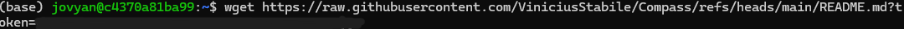
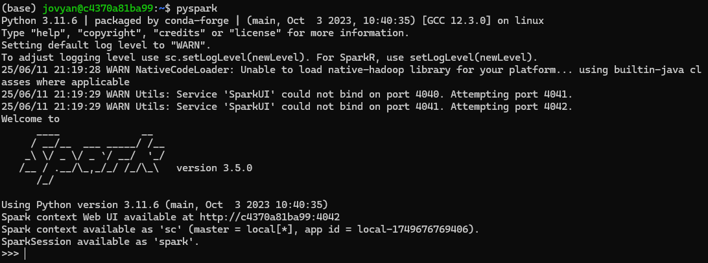
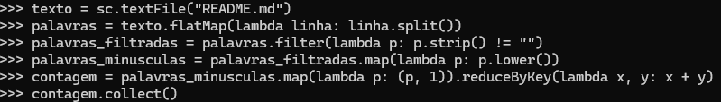
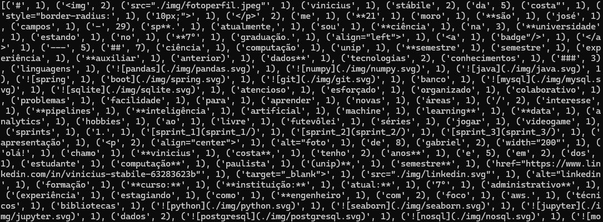
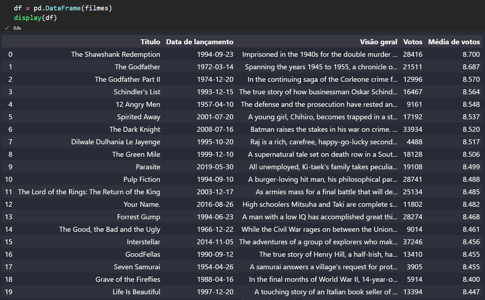

# Resumo da Sprint 5 – Big Data com Spark e Analytics na AWS

Nesta Sprint 5, aprofundei meus conhecimentos em **processamento distribuído com Apache Spark** e em **soluções de analytics na AWS**, fortalecendo competências essenciais para atuar em projetos de engenharia de dados em larga escala. Estudei a fundo o uso do **PySpark** para manipulação de dados em cluster e explorei serviços como **Amazon Athena**, **analytics serverless** e os fundamentos do ecossistema de dados da AWS.

---

## Formação Spark com PySpark: O Curso Completo

- Fundamentos do Apache Spark e arquitetura de cluster.
- Comparações entre RDDs e DataFrames com foco em desempenho.
- Manipulação e transformação de dados com PySpark.
- Consultas com **Spark SQL**, integração com arquivos CSV, JSON e Parquet.
- Desenvolvimento de aplicações analíticas e boas práticas de otimização de jobs Spark.
- Exploração de tópicos avançados, como **tuning de performance**, **persistência de dados** e **particionamento**.

---

## AWS Skill Builder: Fundamentals of Analytics on AWS – Part 1

- Introdução aos conceitos de analytics na nuvem e aos **5 Vs do Big Data**.
- Mapeamento dos serviços de analytics da AWS para desafios reais de negócio.
- Visão geral sobre coleta, armazenamento, processamento e visualização de dados.
- Base para continuar a trilha de aprendizado em analytics com a AWS.

---

##  AWS Skill Builder: Introduction to Amazon Athena

- Visão geral do **Amazon Athena**, serviço serverless de consulta SQL sobre dados no S3.
- Demonstração prática da criação de banco de dados e execução de queries diretamente na AWS.
- Aplicações práticas em análises exploratórias e integração com pipelines de dados.

## AWS Skill Builder: Serverless Analytics

- Abordagem moderna de analytics usando serviços serverless para escalabilidade e eficiência.
- Importância da análise de dados em tempo real e em múltiplos formatos.
- Demonstrações práticas do uso de serviços como **Amazon S3, Glue, Athena e QuickSight**.

#  Desafio

- O arquivo desenvolvido e utilizado para a realização do desafio desta sprint está disponível na pasta Desafio, e a documentação completa pode ser consultada em seu respectivo `README.md`:
  - 📂 [Pasta Desafio](./Desafio/)
  - 📄 [README.md do Desafio](./Desafio/README.md)

# Exercícios

Nesta Sprint, realizei o exercício **Contador de Palavras com Apache Spark**, onde recebemos a imagem Docker `jupyter/all-spark-notebook` para realizar a atividade dentro de um container. 

Tambem realizei o exercicio do **TMDB** onde aprendemos a fazer uma requisição na api do **TMDB**

##  Etapas Realizadas exercicio 1 

1. Realizei o pull da imagem `jupyter/all-spark-notebook`.
2. Criei um container interativo com o Spark e o Jupyter Lab.
3. Acessei o terminal do container com docker exec -it <container_id> /bin/bash.
4. Utilizei wget com token de autenticação para baixar o arquivo README.md de um repositório privado do GitHub.
5. Executei o PySpark no terminal com o comando pyspark.
6. Desenvolvi e executei os comandos em PySpark no terminal interativo para contar a ocorrência de cada palavra do arquivo README.md.

### Código Desenvolvido

O código responsável por realizar a contagem de palavras pode ser encontrado no seguinte arquivo:

 [`contador_palavras.pyspark`](./Exercicios/exercicio_1/codigo.py)
 [`Resultado`](./Exercicios/exercicio_1/resultado.txt)

## Exercicio 2

1. Fiz importação da bibliotecas necessarias
2. Configurei o projeto para carregar  chave da api sem expô-la no código
3. Consumi a API do TMDB para obter dados dos filmes mais bem avaliados.
4. Estruturei os dados em um DataFrame

O código completo esta em 
[`notebook`](./Exercicios/exercicio_2/api.ipynb)
---
##  Evidências exercicio 1

###  Container Spark em execução

---

###  Download do arquivo README.md com autenticação

---

###  Inicialização do PySpark no container

---

###  Comandos PySpark para contagem de palavras

---

###  Resultado da contagem de palavras no README.md

---
##  Evidência exercicio 2

### Retorno da api

---

### [Link para pasta de Imagens Execucao](./Exercicios/Imagens_Execucao)

##  Caminhos para as pastas da Sprint

- [ Certificados](./Certificados/)
- [ Desafio](./Desafio/)
- [ Evidências](./Evidencias/)
- [ Exercícios](./Exercicios/)

