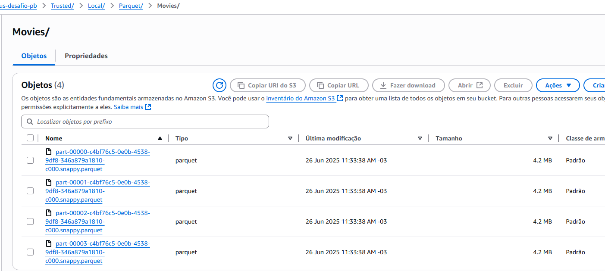

#  Desafio Final PB

O desafio final está dividido em **5 entregas**. Esta etapa corresponde à **Entrega 3**, focada na fase de **processamento dos dados brutos** previamente ingeridos no Data Lake.

O desafio tem como objetivo a construção de um **Data Lake completo**, passando por todas as etapas: ingestão, armazenamento, processamento e consumo de dados.

## Objetivo do desafio

O objetivo é praticar a combinação de conhecimentos vistos no Programa, fazer um mix de tudo que já foi feito

## Etapa 3 – Processamento

Este repositório contém a entrega referente ao **processamento dos dados** que foram armazenados na camada **RAW Zone do Amazon S3**, tanto no formato CSV quanto JSON.


##  Estrutura das Entregas 

- **`processamento_csv`**: processamento dos arquivos **CSV** armazenados no S3.
- **`processamento_json`**: processamento dos dados obtidos da **API do TMDB** e armazenados em formato JSON no S3

## **Ferramentas Utilizadas**

- AWS Glue
- Apache Spark (PySpark)
- Amazon S3
- Formatos: CSV, JSON, Parquet

## **`processamento_csv`**

O principal objetivo desta etapa foi **processar os arquivos CSV previamente armazenados no bucket do Amazon S3 (camada RAW)**. 

Foram aplicadas as seguintes transformações e regras de qualidade:

- Correção de nomes de colunas (ex: `tituloPincipal` → `tituloPrincipal`)
- Exclusão de registros duplicados e nulos
- Escrita dos dados em **formato Parquet**.

##  Passo a Passo do Código

###  Importação de Biblioteca

```python
import sys
from awsglue.utils import getResolvedOptions
from pyspark.context import SparkContext
from pyspark.sql import functions as F
from pyspark.sql.types import StructType, StructField, StringType, IntegerType, DoubleType
from awsglue.context import GlueContext
from awsglue.job import Job
```
- Estas são as bibliotecas padrão utilizadas em scripts PySpark para inicialização de jobs no AWS Glue
---

### Parâmetros do job
```python
args = getResolvedOptions(
    sys.argv, ['JOB_NAME', 'S3_INPUT_PATH', 'S3_TARGET_PATH'])
```

- `JOB_NAME` Nome do job em execução, usado para inicializar e registrar o job.

- `S3_INPUT_PATH `Caminho de entrada no Amazon S3 onde estão os dados brutos (camada RAW).

- `S3_TARGET_PATH`Caminho de saída no S3 onde os dados processados serão salvos (camada curated ou trusted)


---
### Inicialização do Spark e Glue
```python
sc = SparkContext()
glueContext = GlueContext(sc)
spark = glueContext.spark_session
job = Job(glueContext)
job.init(args['JOB_NAME'], args)
```
- Inicialização basica do spark e do glue

--- 

### Caminhos de entrada e saída

```python
source_file = args['S3_INPUT_PATH']
output_path = args['S3_TARGET_PATH']
```
- Os caminhos de entrada e saida de dados.

---

### Schema explícito dos dados CSV

```python
schema = StructType([
    StructField("id", StringType(), True),
    StructField("tituloPincipal", StringType(), True),
    StructField("tituloOriginal", StringType(), True),
    StructField("anoLancamento", IntegerType(), True),
    StructField("tempoMinutos", IntegerType(), True),
    StructField("genero", StringType(), True),
    StructField("notaMedia", DoubleType(), True),
    StructField("numeroVotos", IntegerType(), True),
    StructField("generoArtista", StringType(), True),
    StructField("personagem", StringType(), True),  
    StructField("nomeArtista", StringType(), True),
    StructField("anoNascimento", IntegerType(), True),
    StructField("anoFalecimento", IntegerType(), True),
    StructField("profissao", StringType(), True),
    StructField("titulosMaisConhecidos", StringType(), True)
])
```
- Definir um schema explícito ao ler arquivos CSV com o Spark evita erros de inferência automática de tipos e garante que os dados sejam lidos de forma estruturada e consistente.

--- 

### Leitura do arquivo CSV

```python
df = spark.read.option("encoding", "UTF-8") \
    .csv(source_file, schema=schema, sep="|", header=True)
```

- Essa linha realiza a leitura do arquivo CSV armazenado no Amazon S3

- `.option("encoding", "UTF-8")`: Define a codificação dos caracteres do arquivo para UTF-8, garantindo que acentos e caracteres especiais sejam interpretados corretamente

- `schema=schema`: Aplica o schema previamente definido

- `header=True`: Indica que a primeira linha do arquivo contém os nomes das colunas

--- 

### Corrige coluna com nome errado

```python
df = df.withColumnRenamed("tituloPincipal", "tituloPrincipal")
```
- Corrige o nome da coluna que estava errado no CSV

--- 

### Remoção de duplicatas e valores nulos

```python
df = df.dropDuplicates().dropna()
```

### Escrita dos Dados Processados

```python
df.write.mode("overwrite").parquet(output_path)

job.commit()
```
- Realizam a etapa final do processamento, gravando os dados limpos e transformados no Amazon S3 em formato otimizado e finalizando o job corretamente.

- `df.write.mode("overwrite").parquet(...)`: Escreve o DataFrame em formato Parquet.

- `job.commit()`: Finaliza o Glue Job, sinalizando que o processamento foi concluído com sucesso


### Conclusão da Etapa processamento csv

O processamento do arquivo .csv armazenados na RAW Zone foi concluído com sucesso, e agora os dados estão salvos na camada trusted no formato .parquet

## **`processamento_json`**

O principal objetivo desta etapa foi processar os dados em formato JSON provenientes da API do TMDB, previamente armazenados na camada RAW do Amazon S3.

Foram aplicadas as seguintes transformações:

- Conversão da coluna release_date de string para tipo date
- Remoção de valores duplicados e nulos
- Extração da data (ano, mês, dia) a partir do caminho S3
- Adição de  coluna de data de extração para rastreabilidade e particionamento

##  Passo a Passo do Código

###  Importação de Biblioteca

```python
import sys
from awsglue.utils import getResolvedOptions
from pyspark.context import SparkContext
from pyspark.sql import functions as F
from awsglue.context import GlueContext
from awsglue.job import Job
from datetime import datetime
```
- Estas são as bibliotecas padrão utilizadas em scripts PySpark para inicialização de jobs no AWS Glue
---

### Parâmetros do job
```python
args = getResolvedOptions(
    sys.argv, ['JOB_NAME', 'S3_INPUT_PATH', 'S3_TARGET_PATH'])
```

- `JOB_NAME` Nome do job em execução, usado para inicializar e registrar o job.

- `S3_INPUT_PATH `Caminho de entrada no Amazon S3 onde estão os dados brutos (camada RAW).

- `S3_TARGET_PATH`Caminho de saída no S3 onde os dados processados serão salvos (camada curated ou trusted)

---
### Inicialização do Spark e Glue
```python
sc = SparkContext()
glueContext = GlueContext(sc)
spark = glueContext.spark_session
job = Job(glueContext)
job.init(args['JOB_NAME'], args)
```
- Inicialização basica do spark e do glue
---

### Caminhos de entrada e saída

```python
source_file = args['S3_INPUT_PATH']
output_path = args['S3_TARGET_PATH']
```
- Os caminhos de entrada e saida de dados.

### Leitura do arquivo JSON

```python
df = spark.read.option("encoding", "UTF-8").json(source_file)
```

- Essa linha realiza a leitura do arquivo JSON armazenado no Amazon S3

- `.option("encoding", "UTF-8")`: Define a codificação dos caracteres do arquivo para UTF-8, garantindo que acentos e caracteres especiais sejam interpretados corretamente

### Conversão da coluna de data de string para tipo date

```python
df = df.withColumn('release_date', F.to_date(F.col("release_date"), 'yyyy-MM-dd'))
```

- Essa linha converte a coluna release_date, originalmente no formato string, para o tipo date

- O método `F.to_date()` transforma a string no formato 'yyyy-MM-dd' (ex: "2025-06-13") em um objeto de data reconhecido pelo Spark.

### Remoção de duplicatas por ID e registros com valores nulos

```python
df = df.dropDuplicates(subset=["id"]).dropna()
```

### Extração da data (ano, mês, dia) a partir do caminho S3

```python
data_separada = source_file.strip("/").split("/")
ano = data_separada[-3]
mes = data_separada[-2]
dia = data_separada[-1]
```

- Esse trecho extrai a data de ingestão dos dados diretamente do caminho do arquivo no S3

- `Source_file.strip("/").split("/")` retira os três últimos elementos do caminho, que representam o ano, mês e dia

### Novas colunas

```python
df = (
    df.withColumn("ano", F.lit(ano))
      .withColumn("mes", F.lit(mes))
      .withColumn("dia", F.lit(dia))
)
```
- Adiciona colunas de ano, mes e dia para  particionamento

### Escrita dos Dados Processados

```python
df.write.partitionBy("ano", "mes", "dia").parquet(output_path)

job.commit()
```
- Realizam a etapa final do processamento, gravando os dados limpos e transformados no Amazon S3 em formato otimizado e finalizando o job corretamente.

- `df.write.partitionBy("ano", "mes", "dia").parquet(output_path)`: Escreve o DataFrame em formato Parquet, particionando pela data de extração.

- `job.commit()`: Finaliza o Glue Job, sinalizando que o processamento foi concluído com sucesso

### Conclusão da Etapa processamento json

O processamento dos arquivos .json armazenados na RAW Zone foi concluído com sucesso, e agora os dados estão salvos na camada trusted no formato .parquet particionados pela data de extração.


## Conclusão Geral da Etapa 3 – Processamento

Com os scripts `processamento_csv` e `processamento_json`, os dados anteriormente brutos da RAW Zone foram transformados, padronizados e gravados no formato Parquet na camada Trusted.

###  Jobs Criados 


###  Execução dos Jobs com Sucesso


### Dados CSV processados e armazenados em formato Parquet


### Dados TMDB processados e particionados no S3 


### Banco de Dados Criado com Sucesso


### Crawlers Criados com Sucesso


### Tabelas Catalogadas no Glue Data Catalog


### Consulta SQL na Tabela `tmdb_movies`


### Consulta SQL na Tabela `local_movies`
