# Resumo da Sprint 6 – Continuação de Analytics na AWS e Glue Getting Started

Nesta etapa da formação, avancei no domínio de soluções analíticas serverless da AWS com foco em **governança de dados, arquitetura Lake House** e **pipelines ETL com AWS Glue**. Os cursos realizados nesta sprint fortaleceram minha capacidade de criar fluxos de dados escaláveis e bem estruturados na nuvem.

---

## AWS Skill Builder: Fundamentals of Analytics on AWS – Part 2 (Português)

- Fundamentos de **data lakes** e **data warehouses**, seus benefícios e arquiteturas.
- Criação de data lakes com **AWS Lake Formation**, com foco em governança e segurança.
- Vantagens do **Amazon Redshift** para data warehousing moderno (serverless, ETL zero, ML).
- Pilares da arquitetura de dados moderna: escalabilidade, acesso unificado, governança e custo-benefício.
- Conceitos de **data mesh**, **dados como produto** e uso do **Amazon DataZone**.
- Casos de uso reais de analytics por setor e arquiteturas de referência com serviços da AWS.

---

## AWS Glue Getting Started (Português)

- Introdução ao **AWS Glue**, sua arquitetura e casos de uso.
- Criação de bucket no **Amazon S3** e carregamento de dados de amostra.
- Uso do **Glue Studio** para criar crawlers, catalogar dados e executar jobs ETL com PySpark.
- Uso do **Glue DataBrew** para carregar dados, criar perfis, projetos e fórmulas de transformação.
- Demonstração prática de exclusão de recursos e boas práticas operacionais.

---

#  Desafio

- O arquivo desenvolvido e utilizado para a realização do desafio desta sprint está disponível na pasta Desafio, e a documentação completa pode ser consultada em seu respectivo `README.md`:
  - 📂 [Pasta Desafio](./Desafio/)
  - 📄 [README.md do Desafio](./Desafio/README.md)

# Exercícios

Nesta Sprint, realizei os exercícios **Geração e massa de dados**

Tambem realizei um  **Lab AWS GLUE**

##  Etapas Realizadas exercicio 1 - parte 1 

1. Fiz um script python, onde declarei e inicializei uma lista contendo 250 numeros interios obtidos de forma aleatoria.
2. Fiz um script python, onde declarei uma lista com nomes de 20 animais. Ordenei essa lista em ordem crescente e depois salvei a lista em um arquivo de texto
3. Elaborei um codigo python, para gerar um dataset de nomes de pessoas.

### Código Desenvolvido

O código responsável por realizar o exercicio **Geração e massa de dados** esta em:

 [`codigo`](./Exercicios/exercicio_1/parte_1.ipynb)
 [`Resultado_animais`](./Exercicios/exercicio_1/animais.txt)
 [`Resultado_nomes`](./Exercicios/exercicio_1/nomes_aleatorios.txt)

---

## Etapas Realizadas Exercicio 1 - parte 2 

1. Fiz a leitura do arquivo `nomes_aleatorios.txt` e fiz um print das 5 primeiras linhas.
2. Fiz o print do schema do arquivo e renomeei a coluna para `nomes`.
3. Adicionei uma coluna chamada `Escolaridade` e atribui 3 valores de forma aleatoria.
4. Adicionei uma nova coluna chamada `Pais` e atribui o nome de um dos 13 paises da América do Sul, de forma aleatória.
5. Adicione uma nova coluna chamda `AnoNascimento` e atribui para cada linha um valor aleatório entre 1945 e 2010.
6. Usando o método SELECT, selecionei as pessoas que nasceram neste século e mostrei 10 nomes.
7. Fiz o mesmo processo da etapa 6 mas usando `Spark SQL`
8. Utilizei o método filter para ver o número total de pessoas que são da geração Millennials(1980 ate 1994)
9. Fiz o mesmo processo da etapa 8 mas com `Spark SQL`
10. Usando `Spark SQL` obtive a quantidade de pessoas de cada pais para cada uma das seguintes gerações(`Baby Boomers`,`Geração X`,`Millennials`,`Geração Z`)

O código completo esta em 
[`notebook`](./Exercicios/exercicio_2/parte_2.ipynb)

---

## Lab AWS GLUE

1. Criei uma IAM Role para os jobs
2. Configurei minha conta para rodar o glue 
3. Fiz a leitura do arquivo nomes.csv no S3
4. Imrpimi o schema do dataframe gerado no passo anterior
5. Alterei a caixa dos valores da coluna nome para MAISCULO
6. Imprimi a contagem de linhas presente no DF
7. Imrpimi a contagem de nomes,agrupando os dados pelas colunas ano e sexo.
8. Mostrei o nome feminino com mais registros e o ano em que ocorreu.
9. Mostrei o nome masculino com mais registros e o ano em que ocorreu.
10. Apresentei o total de registros (masculinos e femininos) para cada ano presente no dataframe.
11. Salvei o arquivo no s3 novamente.
12. Criei um Crawler.
13. Fiz um Select no athena.

o codigo utilizado esta em [`script`](./Exercicios/Lab%20Glue/lab.py)
---
##  Evidências exercicio 1 - parte 1

###  Resultado numeros aleatorios
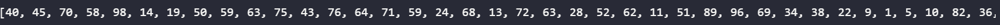

---
###  Print lista animais
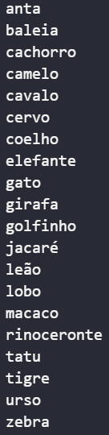

--- 

###  Nomes gerado com sucesso

---
##  Evidências exercicio 1 - parte 2

###  Etapa 1  - Leitura do arquivo 

---
###  Etapa 2  - Renomeando coluna 
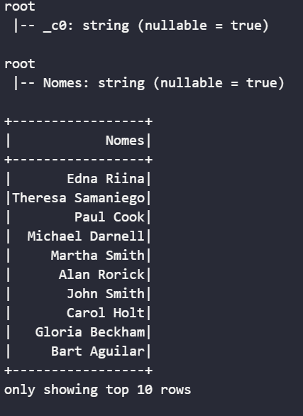
---
###  Etapa 3 - Adição da coluna "Escolaridade"
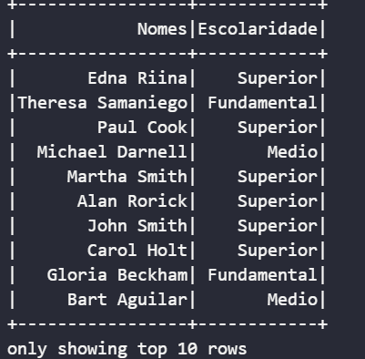
---
###  Etapa 4 - Adição da coluna "Pais"

---
###  Etapa 5 - Adição da coluna "AnoNascimento"
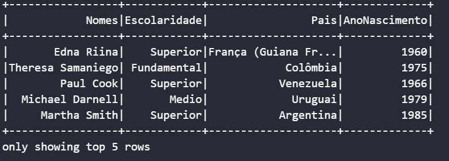
---
###  Etapa 6 - Filtro de pessoas nascidas a partir de 2001
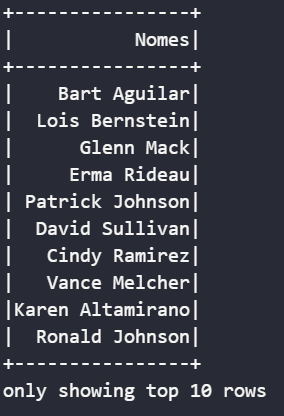
---
###  Etapa 7 - Mesmo filtro utilizando Spark SQL

---
###  Etapa 8 - Contagem de Millennials com `.filter()`
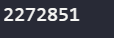
---
###  Etapa 9 - Contagem de Millennials com Spark SQL
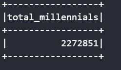
---
###  Etapa 10 - Agrupamento por Geração e País com Spark SQL
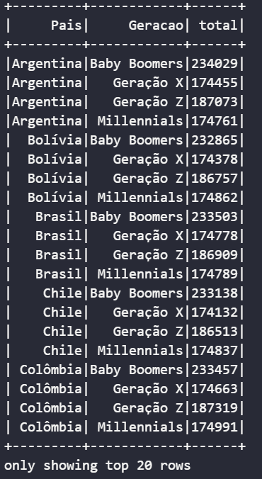

---
##  Evidências Lab

###  CSV nomes no bucket do S3
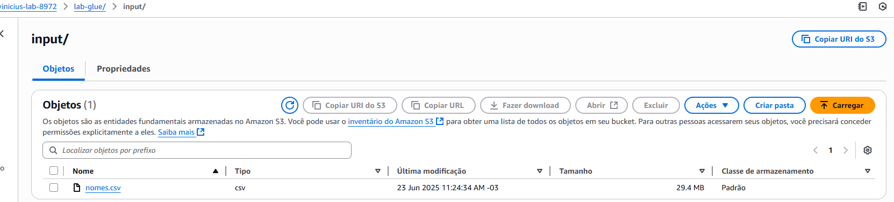

---
###  Impressão do schema do DataFrame
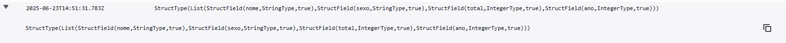

---
###  Total de registros no S3
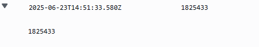

---
###  Agrupamento por ano e sexo (ordem decrescente de ano)
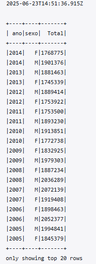

---
### Nome feminino com maior número de registros
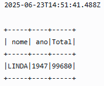

---
### Nome Masculino com maior número de registros
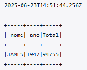

---
### Total de registros (masculinos e femininos) por ano - Top 10
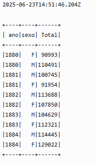

---
### Job executado com sucesso
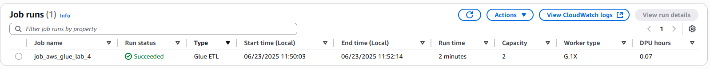

---
### Pastas separada por sexo
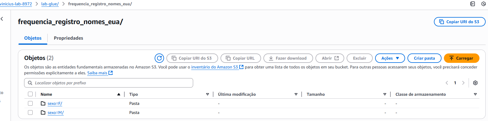

---
### Pastas feminina
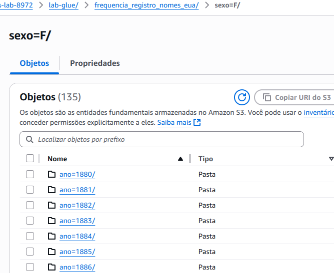

---
### Pastas masculina
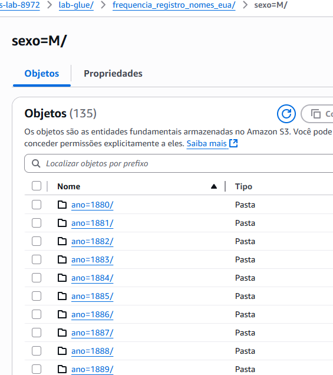

---
### Crawler criado
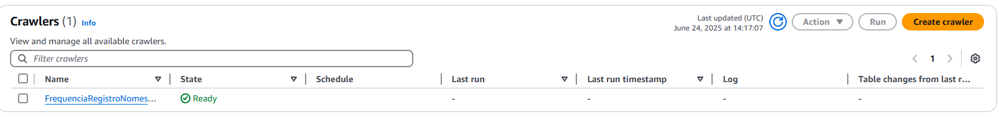

---
### Crawler executado com sucesso
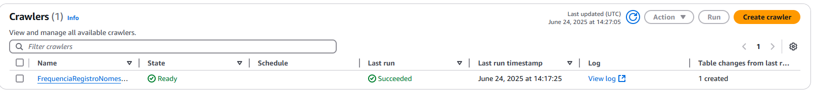

---
### Consulta no athena
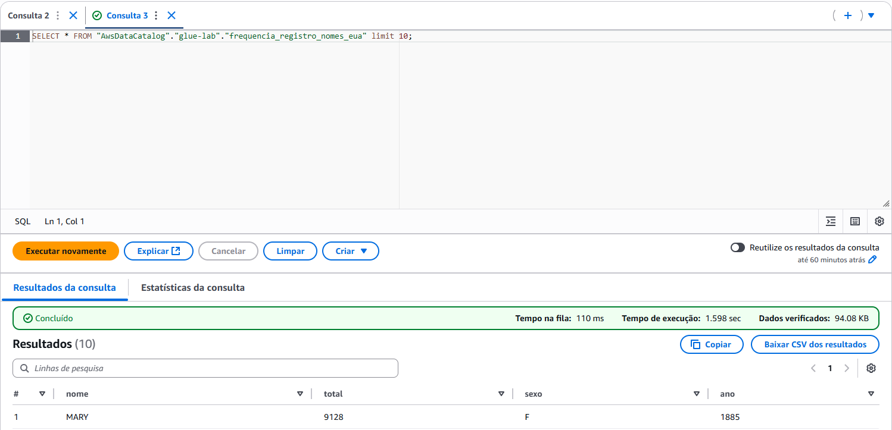

---
### [Link para pasta de Imagens Execucao](./Exercicios/Imagens_Execucao)

##  Caminhos para as pastas da Sprint

- [ Certificados](./Certificados/)
- [ Desafio](./Desafio/)
- [ Evidências](./Evidencias/)
- [ Exercícios](./Exercicios/)

