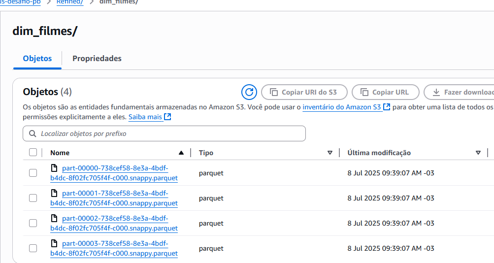

#  Desafio Final PB

O desafio final está dividido em **5 entregas**. Esta etapa corresponde à **Entrega 4**, focada na fase de **modelagem e processamento da camada Refined** no Data Lake, estruturando os dados com base nos princípios de modelagem dimensional.

O desafio tem como objetivo a construção de um **Data Lake completo**, passando por todas as etapas: ingestão, armazenamento, processamento e consumo de dados.

## Objetivo do desafio

O objetivo é praticar a combinação de conhecimentos vistos no Programa, fazer um mix de tudo que já foi feito

## Questoes que quero descobrir 

### 1. Qual foi o Retorno sobre Orçamento (ROI) dos filmes?
**Objetivo:** Avaliar a eficiência financeira dos filmes, medindo o retorno em relação ao investimento.

### 2. Como a rentabilidade dos filmes se comportou ao longo das décadas?
**Objetivo:** Analisar a média de ROI por década para entender variações históricas.

### 3. Os filmes com maior orçamento realmente geram maior receita?
**Objetivo:** Observar a relação entre o valor investido e a arrecadação bruta.

### 4. Quais artistas aparecem com mais frequência e geram melhores resultados?
**Objetivo:** Cruzar recorrência com métricas como nota média, receita e popularidade.

### 5. Filmes bem avaliados são também os mais populares e lucrativos?
**Objetivo:** Investigar a correlação entre a nota média (`vote_average`), a popularidade (`popularity`) e o `ROI` para entender se uma boa avaliação crítica coincide com sucesso financeiro e engajamento do público..

### 6. Existe uma sazonalidade nos lançamentos mais bem-sucedidos?
**Objetivo:** Identificar os meses com maior volume de lançamentos de sucesso.

### 7. Existem filmes pouco votados, mas com ROI muito alto?
**Objetivo:** Descobrir “Hidden Gems” — filmes com alta eficiência financeira, porém pouco conhecidos.

## Objetivo da Sprint

Criar a **camada Refined** a partir dos dados da camada **Trusted**, estruturando-os em **dimensões** e **fato**, aplicando regras de enriquecimento, filtros e transformação para uso posterior em ferramentas analíticas como o Amazon QuickSight.

##  Estrutura do desafio

- `modelagem de dados`:  modelagem dimensional no formato estrela
- `refined_job.py`: script desenvolvido em PySpark utilizando AWS Glue.
- `dim_artista`: tabela dimensional com os artistas únicos.
- `dim_data`: tabela dimensional com datas formatadas.
- `dim_filmes`: tabela dimensional com metadados dos filmes.
- `fato`: tabela fato contendo métricas de análise como receita, orçamento, ROI, popularidade, etc.

## Tecnologias Utilizadas

- AWS Glue (Spark Script Editor)
- Apache Spark (PySpark)
- Amazon S3
- AWS Glue Data Catalog
- Parquet Format

## Modelagem de Dados da Camada Refined

Nesta etapa, foi desenvolvida a **modelagem dimensional** da camada Refined com o objetivo de organizar os dados de maneira otimizada para análises analíticas (OLAP). O modelo segue o formato **estrela**, com uma **tabela fato central** e três **tabelas dimensão**.

### Tabela Fato: `fato_desempenho_filmes`

Contém as principais **métricas quantitativas** do projeto, como:

- `orcamento`, `receita`, `roi` (indicadores financeiros)
- `nota_media_tmdb`, `nota_media_imdb` (avaliações críticas)
- `qtd_votos_tmdb`, `qtd_votos_imdb`, `popularidade` (indicadores de engajamento)
- `data_lancamento` (data em que o filme foi lancado)

Cada linha da fato representa um filme vinculado a um artista em uma data de lançamento específica, permitindo análises cruzadas por tempo, artista ou título.

---

### Tabelas Dimensão

#### 1. `dim_artista`

Contém informações únicas dos artistas (atores/atrizes), com os seguintes campos:

- `id_artista`
- `nome_artista`

Permite análises como: "Quais artistas aparecem com mais frequência em filmes rentáveis?"

#### 2. `dim_data`

Dimensão temporal enriquecida com atributos derivados da data de lançamento, contendo:

- `id_data`
- `data_lancamento`
- `ano`, `mes`, `dia`
- `trimestre`
- `decada`

Esses atributos permitem análises históricas e sazonais, como ROI médio por década ou mês com mais lançamentos bem-sucedidos.

#### 3. `dim_filme`

Armazena os metadados principais de cada filme:

- `id_filme`
- `id_imdb`
- `titulo_original`

É útil para exibir corretamente os títulos nas ferramentas de visualização e relatórios.

---

### Diagrama do Modelo Dimensional

Abaixo está a representação gráfica da modelagem de dados criada para a camada Refined:


## Lógica do Processamento

### 1. **Leitura dos Dados**
Os dados da camada **Trusted** (IMDb e TMDB) foram lidos diretamente do S3 no formato Parquet.

### 2. **Aplicação de Filtros**
- Foram mantidos apenas registros com valores positivos para `revenue`, `budget`, `vote_count`, `popularity` e `release_date > 1970`.
- Aplicado filtro de **percentil 20%** (aproximado) para cada métrica, mantendo apenas os registros que estão **acima** deste limiar.
- Cálculo do **ROI**(Retorno sobre investimento) com fórmula: (receita - orçamento) / orçamento
- Mantidos apenas registros com ROI > 0.

### 3. **Join TMDB + IMDb**
- Realizado o join entre TMDB e IMDb com base no campo `imdb_id`.

### 4. **Criação das Dimensões**

#### `dim_artista`
- Artistas distintos presentes no dataset.
- Atribuído um `id_artista` gerado com `monotonically_increasing_id()`.

#### `dim_data`
- Datas distintas de lançamento dos filmes.
- Criadas colunas derivadas: `ano`, `mês`, `dia`, `trimestre`.
- Gerado `id_data`.

####  `dim_filmes`
- Dados únicos por filme contendo: `id_tmdb`, `imdb_id`, `titulo_no_brasil`, `titulo_principal`, `titulo_original`.

### 5. **Criação da Tabela Fato**
- Métricas financeiras e de popularidade: `orcamento`, `receita`, `roi`, `nota_media`, `qtd_votos`, `popularidade`.
- Join com `dim_data` e `dim_artista` para geração de chaves estrangeiras.

---

##  Escrita dos Dados no S3

Os dados transformados foram salvos no S3 na camada Refined, em formato **Parquet**.

##  Passo a Passo do Código

###  Importação de Biblioteca

```python
import sys
from awsglue.utils import getResolvedOptions
from pyspark.context import SparkContext
from pyspark.sql import functions as F
from pyspark.sql.types import StructType, StructField, StringType, IntegerType, DoubleType
from awsglue.context import GlueContext
from awsglue.job import Job
```
- Estas são as bibliotecas padrão utilizadas em scripts PySpark para inicialização de jobs no AWS Glue
---

### Parâmetros do job
```python
args = getResolvedOptions(
    sys.argv, ['JOB_NAME', 'TMDB_INPUT_PATH', 'LOCAL_INPUT_PATH', 'S3_TARGET_PATH'])
```

- `JOB_NAME` Nome do job em execução, usado para inicializar e registrar o job.

- `TMDB_INPUT_PATH`Caminho dos dados TMDB (parquet).

- `LOCAL_INPUT_PATH`Caminho dos dados local(parquet)

- `S3_TARGET_PATH`Caminho onde os dados Refined serão salvos


---
### Inicialização do Spark e Glue
```python
sc = SparkContext()
glueContext = GlueContext(sc)
spark = glueContext.spark_session
job = Job(glueContext)
job.init(args['JOB_NAME'], args)
```
- Inicialização basica do spark e do glue

--- 

### Caminhos de entrada e saída

```python
source_file_local = args['LOCAL_INPUT_PATH']
source_file_tmdb = args['TMDB_INPUT_PATH']
output_path = args['S3_TARGET_PATH']

```
- Os caminhos de entrada e saida de dados.

---

### Leitura dos dados da camada Trusted

```python
df_tmdb = spark.read.parquet(source_file_tmdb)
df_local = spark.read.parquet(source_file_local)

```
- Lê os arquivos parquet das camadas Trusted contendo dados do TMDB e IMDb(local)

--- 

### Filtro de registros válidos

```python
df_tmdb = df_tmdb.filter(
    (F.col("revenue") > 0) &
    (F.col("budget") > 0) &
    (F.col("vote_count") > 0) &
    (F.col("popularity") > 0) &
    (F.col("release_date") > F.lit("1970-01-01").cast("date"))
)

```
- Filtra registros com valores positivos e datas a partir de 1970 para garantir consistência e relevância

--- 

### Cálculo do percentil 20%

```python
campos = ["revenue", "budget", "vote_count", "popularity"]
valores = {}
for campo in campos:
    valor = df_tmdb.approxQuantile(campo, [0.2], 0.01)[0]
    valores[campo] = valor

```
- Calcula o valor do percentil 20% para cada métrica, armazenando os valores mínimos desejados.

--- 

### Filtro com base no percentil 20% e cálculo de ROI

```python
df_tmdb = df_tmdb.filter(
    (F.col("revenue") >= valores["revenue"]) &
    (F.col("budget") >= valores["budget"]) &
    (F.col("vote_count") >= valores["vote_count"]) &
    (F.col("popularity") >= valores["popularity"])
).withColumn("roi", F.round((F.col("revenue") - F.col("budget")) / F.col("budget"), 1)) \
 .filter("roi > 0")

```
- Aplica os filtros com base nos percentis e calcula o ROI (Return on Investment), mantendo apenas filmes rentáveis.

### Join entre dados TMDB e IMDb(local)

```python
df_tmdb = df_tmdb.withColumnRenamed("id", "id_filme")
df_geral = df_tmdb.join(df_local, df_tmdb.imdb_id == df_local.id, "inner")
```
- Realiza o join entre os dois datasets com base na coluna imdb_id, unificando as informações.

### Seleção e padronização de colunas

```python
df_geral = df_geral.select(
    F.col("id_filme"),
    F.col("imdb_id"),
    F.col("tituloPrincipal").alias("titulo_principal"),
    F.col("release_date").alias("data_lancamento"),
    F.col("numeroVotos").alias("qtd_votos_imdb"),
    F.col("notaMedia").alias("nota_media_imdb"),
    F.col("vote_count").alias("qtd_votos_tmdb"),
    F.col("vote_average").alias("nota_media_tmdb"),
    F.col("popularity").alias("popularidade"),
    F.col("budget").alias("orcamento"),
    F.col("revenue").alias("receita"),
    F.col("roi"),
    F.col("nomeArtista").alias("nome_artista")
)
```
- Seleciona e renomeia colunas para padronizar os nomes e facilitar a modelagem dimensional.

### Criação da dimensão Artista

```python
df_artista = df_geral.select("nome_artista").distinct() \
    .withColumn("id_artista", F.monotonically_increasing_id()) \
    .select("id_artista", "nome_artista")
```
- Cria a dimensão dim_artista com IDs únicos para cada artista.

### Criação da dimensão Data

```python
df_data = df_geral.select(F.col("data_lancamento")).distinct()
df_data = df_data.withColumn("ano", F.year("data_lancamento")) \
    .withColumn("mes", F.month("data_lancamento")) \
    .withColumn("dia", F.dayofmonth("data_lancamento")) \
    .withColumn("trimestre", F.when(F.col("mes").isin([1, 2, 3]), "T1")
                .when(F.col("mes").isin([4, 5, 6]), "T2")
                .when(F.col("mes").isin([7, 8, 9]), "T3")
                .otherwise("T4")) \
    .withColumn("decada", (F.col("ano") / 10).cast("int") * 10) \
    .withColumn("id_data",(F.date_format("data_lancamento", "yyyyMMdd")).cast("int")) \
    .select("id_data","data_lancamento", "ano", "mes", "dia", "trimestre", "decada")
```
- Cria a dimensão dim_data extraindo ano, mês, dia , trimestre e decada da data de lançamento.


### Criação da dimensão Filmes

```python
df_filmes = df_geral.select(
    "id_filme", "imdb_id","titulo_principal"
).distinct()
```
- Gera a dimensão dim_filmes com os principais identificadores e títulos dos filmes.

### Criação da Tabela Fato

```python
df_fato = df_geral.select(
    "id_filme", "orcamento", "receita", "roi",
    F.round("nota_media_tmdb", 1).alias("nota_media_tmdb"),
    F.round("nota_media_imdb", 1).alias("nota_media_imdb"),
    "qtd_votos_tmdb", "qtd_votos_imdb", "popularidade",
    "data_lancamento", "nome_artista"
)

df_fato = df_fato.join(df_artista, "nome_artista", "inner")

df_fato = df_fato.select(
    "id_filme",  "id_artista","data_lancamento",
    "orcamento", "receita", "roi",
    "nota_media_tmdb", "nota_media_imdb",
    "qtd_votos_tmdb", "qtd_votos_imdb", "popularidade"
)

```

- Criação da tabela fato, selecionando somente as métricas principais
- Realiza join com as dimensao `dim_artista` para obter `id_artista` 
- Seleciono somente as colunas relevantes com as métricas e chaves para o modelo dimensional. 


### Escrita dos dados no S3 (Refined) e finalização do job

```python
df_fato.write.mode("overwrite").parquet(f"{output_path}/fato_desempenho_filmes")
df_data.write.mode("overwrite").parquet(f"{output_path}/dim_data")
df_artista.write.mode("overwrite").parquet(f"{output_path}/dim_artista")
df_filmes.write.mode("overwrite").parquet(f"{output_path}/dim_filmes")

job.commit()
```
- Os dados são gravados no S3 em formato Parquet, separados por diretório para cada dimensão e fato.
- Finalização do job

## Registro no Glue Data Catalog

Após a execução do job e gravação no S3, foi criado um **único crawler** no AWS Glue apontando para: `s3://vinicius-desafio-pb/Refined/`

Esse crawler escaneou todas as subpastas (`dim_data`, `dim_filmes`, `dim_artista`, `fato_filmes_artista`) e criou as tabelas automaticamente no **Glue Data Catalog**.

Essas tabelas podem ser acessadas diretamente via **Amazon Athena** ou utilizadas em **Amazon QuickSight** para visualização de dados e geração de insights.


## Evidências da Execução no AWS Glue, S3, Glue Catalog e Athena

### Execução do Job no AWS Glue

  
*Job `refined-job` criado corretamente com 2 workers do tipo `G.1X` no Glue Script Editor.*

.png)  
*Execuções do `refined-job`. A tentativa inicial falhou, mas foi corrigida com sucesso.*

---

### Crawler no Glue Catalog

  
*Crawler `crawler-refined-zone` criado para varrer a camada Refined.*

  
*Crawler executado com sucesso, atualizando as 4 tabelas da Refined no Glue Catalog.*

---

### Estrutura da Camada Refined no S3

  
*Pasta `Refined/` no S3 com as subpastas `dim_artista/`, `dim_data/`, `dim_filmes/`, `fato_filmes_artista/`.*


#### Arquivos `.parquet` nas tabelas:

- **Fato - `fato_filmes_artista`**

    
  *Arquivo Parquet gerado com compressão Snappy.*

- **Dimensão Artista**

  

- **Dimensão Data**

  

- **Dimensão Filmes**

  

---

### Tabelas Criadas no Glue Catalog

  
*As 4 tabelas da Refined foram criadas com sucesso no Glue Catalog após execução do crawler.*

---

## Consultas de Validação no Athena

### Tabela `dim_artista`

- **Contagem total de registros:**
  
  

- **Exemplo de registros:**
  
  

---

### Tabela `dim_data`

- **Contagem total de registros:**

  

- **Exemplo de registros:**

  

---

### Tabela `dim_filmes`

- **Contagem total de registros:**

  

- **Exemplo de registros:**

  

---

### Tabela `fato_filmes_artista`

- **Contagem total de registros:**

  

- **Exemplo de registros:**

  .png)