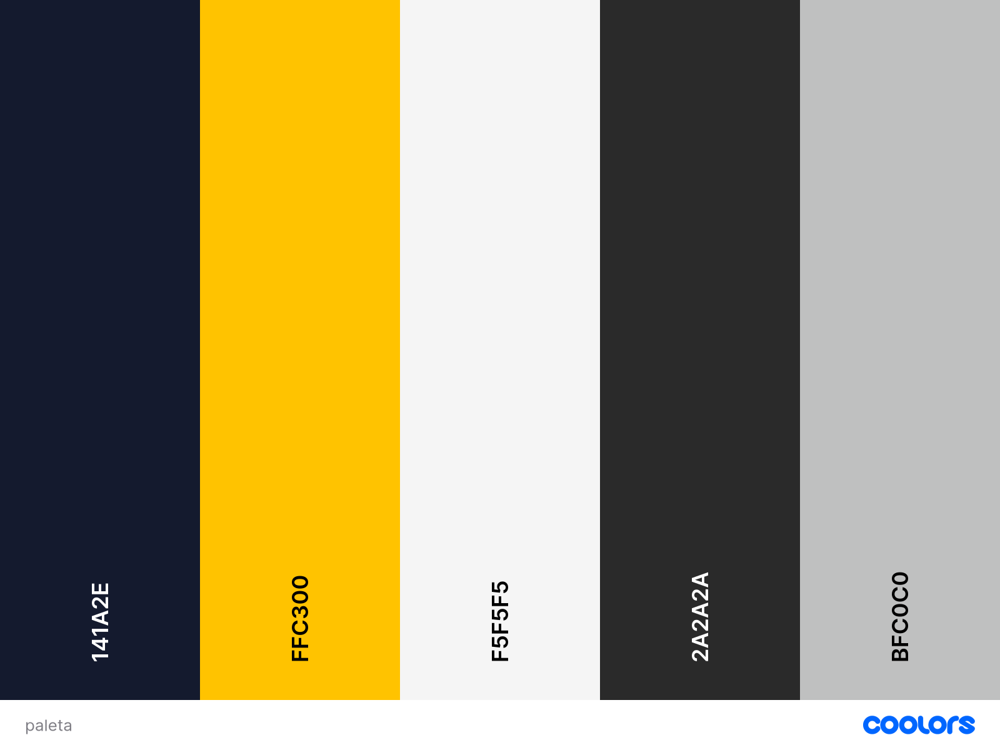
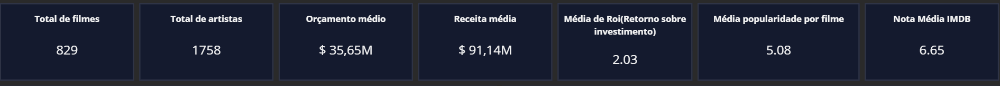
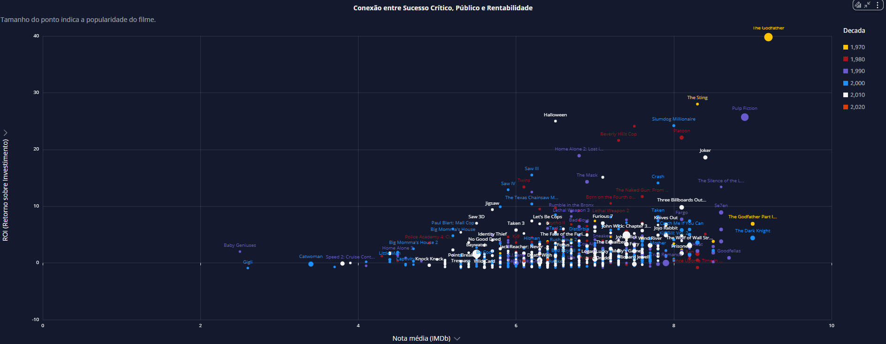
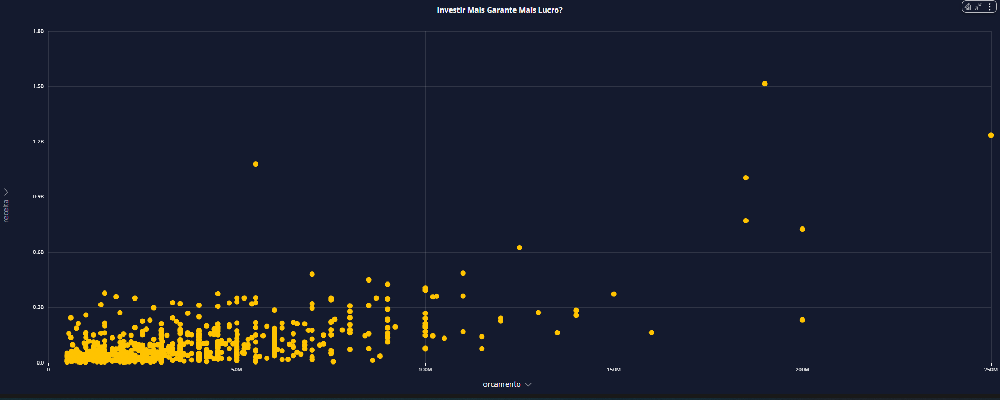
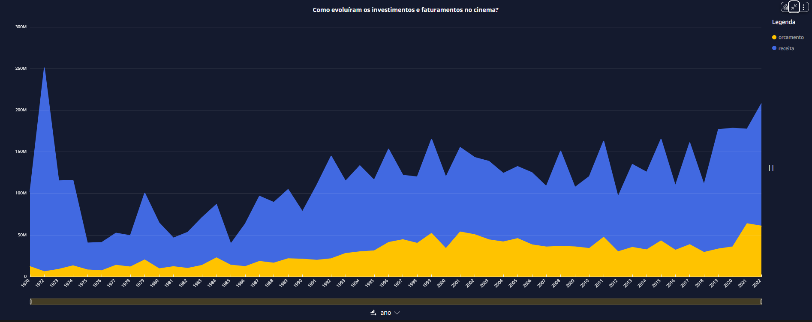
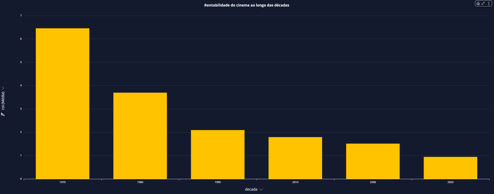
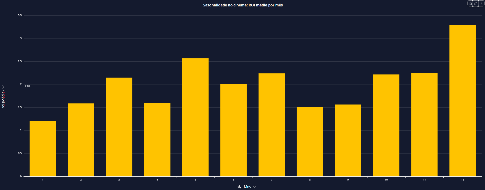
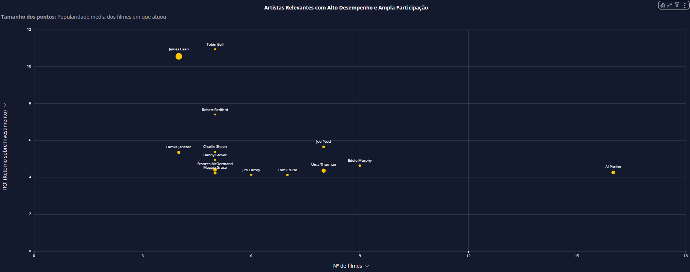
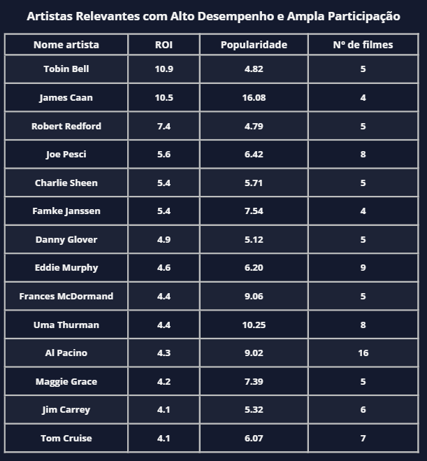

#  Desafio Final PB

O desafio final está dividido em **5 entregas**. Esta etapa corresponde à **Entrega 5**, focada na fase de **Consumo dos dados**.

O desafio tem como objetivo a construção de um **Data Lake completo**, passando por todas as etapas: ingestão, armazenamento, processamento e consumo de dados.

## Objetivo do desafio

O objetivo é praticar a combinação de conhecimentos vistos no Programa, fazer um mix de tudo que já foi feito

##  Questões que quero descobrir

### 1. Qual foi o Retorno sobre Orçamento (ROI) dos filmes?
**Objetivo:** Avaliar a eficiência financeira dos filmes, identificando os títulos com maior retorno proporcional em relação ao investimento feito.

### 2. Existe uma relação entre avaliação crítica, popularidade e retorno financeiro dos filmes?
**Objetivo:** Analisar se filmes com nota média mais alta (IMDB), maior popularidade e de diferentes décadas tendem a apresentar ROI mais elevado — identificando se o sucesso crítico está alinhado com sucesso comercial e engajamento do público.

### 3. Os filmes com maior orçamento realmente geram maior receita?
**Objetivo:** Observar a relação entre o valor investido (orçamento) e a arrecadação bruta (receita), validando se altos investimentos garantem alta rentabilidade.

### 4. Como orçamento e receita evoluíram ao longo dos anos?
**Objetivo:** Visualizar a tendência temporal de **investimento** e **faturamento** da indústria ao longo do tempo, revelando padrões históricos e momentos de crescimento ou retração.

### 5. Como a rentabilidade dos filmes se comportou ao longo das décadas?
**Objetivo:** Observar a média de ROI por década, identificando períodos mais lucrativos para o setor cinematográfico.

### 6. Existe uma sazonalidade nos lançamentos mais lucrativos?
**Objetivo:** Verificar se há meses com **ROI médio mais elevado**, indicando melhores épocas para lançamento de filmes com foco em rentabilidade.

### 7. Quais artistas combinam recorrência no mercado com alto desempenho?
**Objetivo:** Descobrir artistas com presença frequente (nº de filmes) que também entregam bom ROI e popularidade — destacando nomes estratégicos para produções financeiramente eficazes.

## Objetivo da Sprint

Criar um dashboard no **Amazon QuickSight**, utilizando como fonte de dados exclusiva as tabelas da **camada Refined**, previamente modeladas e processadas.

## Tecnologias Utilizadas

- Amazon S3   
- Amazon Athena (conector dos dados Refined com o QuickSight)  
- Amazon QuickSight (ferramenta de visualização)

### Análises implementadas:

- ROI médio por década
- Dispersão de Orçamento vs Receita
- Gráfico de bolhas com popularidade, ROI e número de filmes por artista
- Relação entre avaliação, ROI e popularidade
- Sazonalidade de lançamentos de sucesso
- Receita e orçamento ao longo dos anos

## Analise Dashboard

### Paleta cores

### Cabeçalho

#### **O Que Define o Sucesso no Cinema?**  
**Uma Análise de ROI, Receita e Popularidade**

### KPIs Principais

- **Total de filmes:** `829`  
  A base é composta por 829 filmes, oferecendo uma amostra robusta e variada de diferentes épocas, orçamentos e desempenhos. Isso garante maior confiabilidade estatística nas análises.

- **Total de artistas:** `1.758`  
  Reflete a diversidade do elenco presente nos filmes analisados. Essa variedade permite também mapear quais artistas são mais recorrentes e quais entregam melhor retorno, como foi feito na análise de desempenho individual.

- **Orçamento médio:** `US$ 35,65 milhões`  
  Um valor considerável, mas que esconde contrastes: filmes altamente rentáveis como *Halloween* e *The Godfather* operaram com orçamentos bem abaixo da média, enquanto produções modernas costumam ultrapassar os US$ 100 milhões.

- **Receita média:** `US$ 91,14 milhões`  
  Embora a receita média seja quase o triplo do orçamento médio, isso não necessariamente se traduz em alta rentabilidade para todos os títulos — especialmente quando consideramos o ROI em detalhe.

- **ROI médio:** `2,03`  
  Ou seja, em média, cada dólar investido gerou US$ 2,03 de retorno bruto. Embora positivo, o número reflete uma indústria com margens apertadas, especialmente considerando os riscos envolvidos. O valor também mostra que a eficiência dos investimentos diminuiu em décadas mais recentes, como analisado nas seções anteriores.

- **Popularidade média por filme:** `5,08`

- **Nota média IMDb:** `6,65`

###  1. Qual foi o Retorno sobre Orçamento (ROI) dos filmes?

####  Gráfico de Barras

O gráfico que apresenta o **Top 10 filmes com maior ROI** revela como certos títulos alcançaram resultados financeiros extraordinários mesmo com orçamentos modestos. Clássicos como *The Godfather*, *The Sting* e *Pulp Fiction* conseguiram multiplicar seus investimentos por mais de **25 vezes**, demonstrando que o sucesso financeiro pode estar mais ligado à eficiência do investimento do que ao valor absoluto gasto.

Um destaque curioso é *Halloween*, que mesmo com **nota abaixo da média (IMDb 6.5)**, gerou um ROI de **25** — evidenciando que filmes de nicho, com apelo cultural e baixo custo, podem ser extremamente lucrativos.

Por outro lado, temos também casos como *Joker*, que teve um orçamento significativamente maior (**US$ 55 milhões**), mas que ainda assim atingiu um **ROI altíssimo** e ultrapassou **US$ 1 bilhão de receita**, provando que é possível aliar alto investimento a grande rentabilidade quando há forte conexão com o público e execução estratégica.

####  Tabela Detalhada

---

###  2. Existe uma relação entre avaliação crítica, popularidade e retorno financeiro dos filmes?

O gráfico de dispersão cruza três dimensões fundamentais: **nota média (IMDb)**, **popularidade (tamanho do ponto)** e **ROI**. Ele nos ajuda a entender que o sucesso no cinema não depende de um único fator, mas da combinação entre **custo**, **qualidade** e **apelo de mercado**.

Filmes como *The Godfather* e *Joker* se destacam como exemplos positivos — **bem avaliados**, **populares** e **altamente rentáveis**. Já o caso de *Baywatch* mostra o oposto: um filme extremamente popular, com grande visibilidade, mas que **fracassou em crítica e não teve retorno esperado**.

Outro ponto interessante é a **concentração de filmes das décadas de 70 e 80** nas regiões superiores do gráfico (identificados pelas cores), o que reforça a ideia de que produções mais enxutas e focadas em boas histórias entregavam ROI mais eficiente. Essas décadas representam um **período de ouro** em termos de retorno financeiro proporcional.

Entre os destaques negativos está *True Romance*: **nota crítica sólida**, **boa popularidade**, mas mesmo assim **não teve lucro**. Isso nos leva a uma reflexão importante: obras com forte valor artístico podem não performar bem financeiramente por fatores como **má distribuição**, **erro de timing**, **concorrência intensa** ou **falhas de marketing**.

---

###  3. Os filmes com maior orçamento realmente geram maior receita?

O gráfico de dispersão entre **orçamento** e **receita** mostra uma **correlação visível**: quanto maior o investimento, maior o potencial de receita. Contudo, essa relação está longe de ser garantida. Há diversos filmes com orçamentos **acima de US$ 150 milhões** que renderam pouco, enquanto títulos mais enxutos tiveram performances excepcionais.

Isso sugere que o valor investido **amplia as chances de faturamento**, mas **não elimina os riscos**. Filmes **bem planejados**, com **roteiros sólidos** e **estratégias de marketing eficazes** continuam sendo determinantes para o sucesso — independentemente do tamanho do orçamento.

---

###  4. Como orçamento e receita evoluíram ao longo dos anos?

Ao observarmos a **evolução temporal** de orçamento e receita, percebemos que **ambas cresceram de forma constante** desde 1980, com **picos expressivos** em 2001. No entanto, há um detalhe importante: o orçamento cresce, em diversos momentos, mais rapidamente que a receita.

Esse descompasso indica que o **custo das produções está aumentando**, mas o retorno nem sempre acompanha na mesma proporção, o que reduz a **margem de lucro**. Esse fenômeno pode estar ligado à:
- **Saturação do gênero** (Crime/guerra),
- **Competição com o streaming**,
- E ao **cansaço do público com fórmulas repetitivas**.

---

###  5. Como a rentabilidade dos filmes se comportou ao longo das décadas?

O gráfico de **ROI médio por década** mostra uma **queda acentuada** ao longo do tempo. A década de **1970 apresenta ROI médio acima de 6**, enquanto a década de **2020 nçao consegue ultrapassar 1**. Essa queda reflete o aumento dos **custos**, aliado à **dificuldade crescente** de transformar grandes investimentos em retornos proporcionais.

Essa análise se conecta diretamente com o gráfico de orçamento vs. receita ao longo do tempo. Nos anos **70 e 80**, mesmo com **orçamentos mais baixos**, a receita era suficiente para gerar ROI elevado. Já nos anos 2000 em diante, os custos cresceram **mais do que os lucros acompanharam**, pressionando a eficiência financeira das produções.

---

###  6. Existe uma sazonalidade nos lançamentos mais lucrativos?

Sim, e ela é **bastante evidente**. O gráfico de **ROI médio por mês** revela que os meses de **maio**, **julho**, **novembro** e **dezembro** concentram os **maiores retornos** — o que faz sentido, já que são períodos de **férias**, **feriados prolongados** e **grande movimentação nos cinemas**.

Por outro lado, **janeiro**, **abril** e **agosto** apresentam os **piores desempenhos**. São meses que coincidem com o **período pós-férias**, onde há **menos interesse do público** em gastar com entretenimento, o que reforça a importância de um **calendário de lançamentos estratégico**.

---

###  7. Quais artistas combinam recorrência no mercado com alto desempenho?

####  Gráfico de Dispersão

A análise de **ROI por artista** considera também a **popularidade média dos filmes** e o **número de participações**.

- **Maiores destaques em ROI:**  
  - Tobin Bell (`10.9`)  
  - James Caan (`10.5`)  
  - Robert Redford (`7.4`)  
  Todos com histórico **enxuto**, mas **extremamente rentável**.

- **Entre os mais recorrentes:**  
  - Al Pacino — `16 filmes`, ROI `4.3`  
  - Eddie Murphy — `9 filmes`, ROI `4.6`  
  Ambos mostram **consistência de mercado** e **alto desempenho**, mantendo presença frequente nas telonas com bons retornos.

- **Mais populares:**  
  - Uma Thurman — Popularidade `10.25`  
  - James Caan — Popularidade `16.08`  
  - Frances McDormand — Popularidade `9.06`  

Esses nomes entregaram **rentabilidade acima da média**, sendo valiosos para **investidores e produtores**.

#### Tabela de Destaques

---

##  Conclusão Geral

A análise dos dados revela um **cenário complexo e em constante transformação** na indústria cinematográfica. Embora os valores absolutos de **investimento** e **receita** tenham crescido, a **eficiência financeira caiu**, com o **ROI médio diminuindo década após década**.

Títulos com ROI elevado mostram que **histórias bem contadas** e **produção enxuta** ainda são poderosas, mesmo em um mercado competitivo. O cruzamento entre **nota crítica**, **popularidade** e **retorno financeiro** reforça que o sucesso está na **combinação de múltiplos fatores** — qualidade, timing, marketing e apelo cultural.

**Artistas com histórico positivo** e **períodos estratégicos de lançamento** também se mostram peças-chave na **maximização de resultados**.

**No fim das contas**, essa análise destaca que o verdadeiro valor de um filme está não apenas no que ele **custa** ou **arrecada**, mas na **eficiência com que converte investimento em impacto**.
