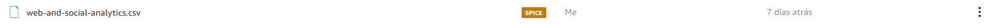
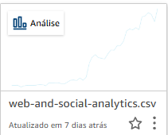
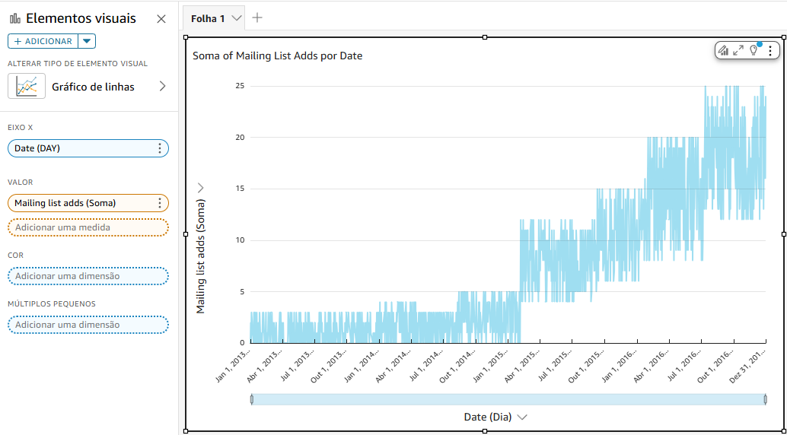
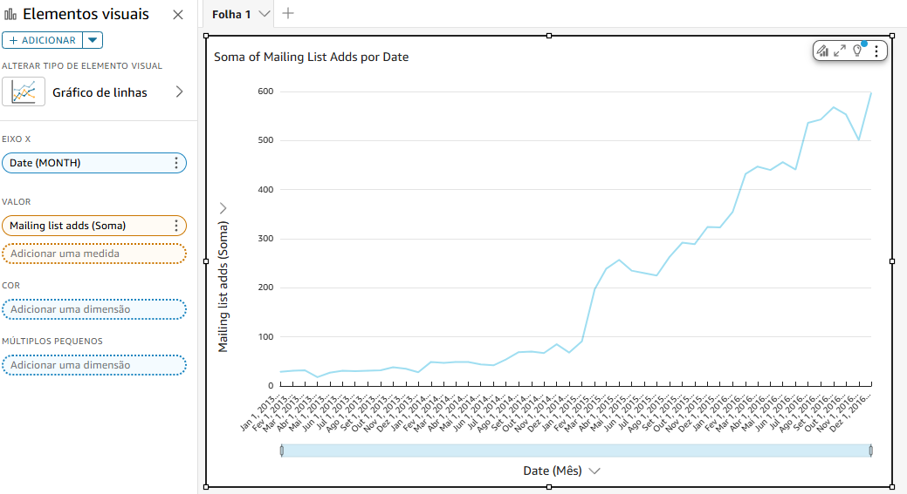

# 📊 Resumo da Sprint 8 – Visual Analytics com Amazon QuickSight

Nesta sprint, aprofundei meu conhecimento na ferramenta de **BI na nuvem da AWS, o Amazon QuickSight**, explorando desde os conceitos iniciais até a construção de dashboards completos, KPIs e análises responsivas. Essa capacitação é essencial para **engenheiros de dados** que desejam **democratizar o acesso à informação**, criando relatórios visuais acessíveis, dinâmicos e seguros.

---

## Amazon QuickSight – Getting Started & Complete Introduction

- Introdução à ferramenta de BI da AWS, seus recursos e arquitetura.
- Criação de conjuntos de dados, análises, KPIs e painéis interativos.
- Aplicação de filtros, colunas calculadas, controles e relacionamentos entre tabelas.
- Construção de dashboards responsivos e publicação segura de insights.
- Exploração de perguntas em linguagem natural com o **QuickSight Q**.

---

#  Desafio

- O arquivo desenvolvido e utilizado para a realização do desafio desta sprint está disponível na pasta Desafio, e a documentação completa pode ser consultada em seu respectivo `README.md`:
  - 📂 [Pasta Desafio](./Desafio/)
  - 📄 [README.md do Desafio](./Desafio/README.md)

# Exercícios

Nesta Sprint, houve um Lab a ser feito, onde criei uma análise baseada no conjunto de dados de amostra Web and Social Media Analytics.

### Etapas executadas:

1. Fiz upload do arquivo de amostra `web-and-social-analytics.csv` no QuickSight.
2. Criei uma nova análise a partir do conjunto de dados.
3. No painel **Fields list**, selecionei os campos:
   - `Date` como eixo X
   - `Mailing list adds (Sum)` como valor
4. Ajustei a agregação da data para **Month**, permitindo visualizar a evolução mensal.
5. Expandi o painel **Field wells** para ajustar e conferir os parâmetros da visualização.
6. O QuickSight utilizou o recurso **AutoGraph** para gerar automaticamente um gráfico de linhas compatível com os dados.
7. O gráfico foi ajustado para exibir a **soma mensal** das adições à lista de e-mails.

## Evidências Lab QuickSight

### 1. Conjunto de dados carregado

---

### 2. Análise criada no QuickSight

---

### 3. Gráfico de linhas com granularidade diária

---

### 4. Gráfico de linhas com agregação mensal

##  Caminhos para as pastas da Sprint

- [ Certificados](./Certificados/)
- [ Desafio](./Desafio/)
- [ Evidências](./Evidencias/)
- [ Exercícios](./Exercicios/)

